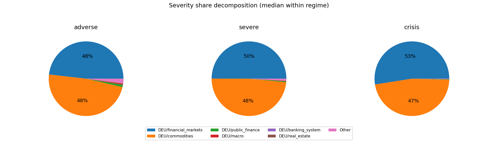
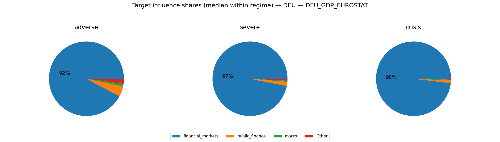
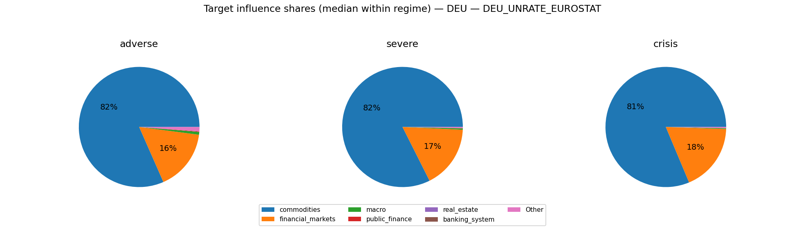
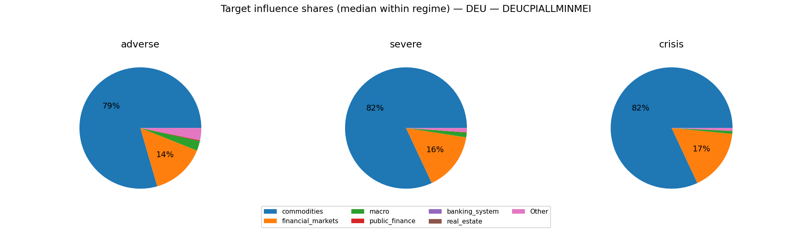
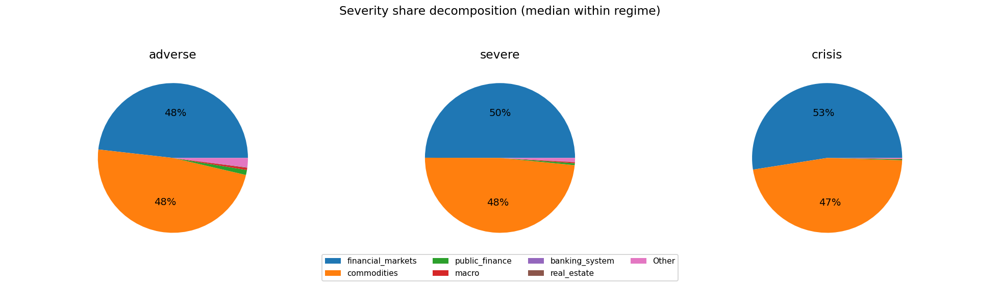

# MC Block Comovements & Regimes — latest

This note summarizes how block aggregates co-move across Monte Carlo draws, and groups draws into coarse regime labels.

## Regime construction (simple, explainable)
- For each draw we compute each block’s **terminal cumulative block aggregate** (sigmas; z-space).
- We compute an economy-level severity score per draw: $S_{L2}=\sqrt{\sum_b (\text{cum}_b(T))^2}$. 
- Regimes are defined by severity quantiles: **baseline** (0–50%), **adverse** (50–80%), **severe** (80–95%), **crisis** (95–100%).

## All ISOs combined

Regime counts (draws):
- baseline: 2500
- adverse: 1500
- severe: 750
- crisis: 250

Top ISO/block columns by cross-draw variability:
- DEU/financial_markets, DEU/commodities, DEU/public_finance, DEU/macro, DEU/banking_system, DEU/real_estate

### Typical terminal cumulative (median with q10/q90; sigmas)

**baseline**
- DEU/commodities: +0.12 [-11.93, +12.10]
- DEU/public_finance: -0.04 [-4.48, +4.28]
- DEU/financial_markets: +0.04 [-11.76, +11.84]
- DEU/macro: -0.03 [-3.01, +3.19]
- DEU/banking_system: +0.02 [-1.11, +1.08]
- DEU/real_estate: +0.02 [-1.11, +1.08]
**adverse**
- DEU/commodities: -1.38 [-21.39, +21.35]
- DEU/public_finance: +0.15 [-4.46, +4.69]
- DEU/real_estate: -0.03 [-1.14, +1.08]
- DEU/banking_system: -0.03 [-1.14, +1.08]
- DEU/financial_markets: +0.01 [-21.29, +20.89]
- DEU/macro: +0.01 [-2.94, +3.10]
**severe**
- DEU/financial_markets: +1.78 [-29.85, +30.63]
- DEU/commodities: -1.04 [-29.94, +30.29]
- DEU/public_finance: -0.14 [-4.41, +4.17]
- DEU/banking_system: -0.03 [-1.13, +1.04]
- DEU/real_estate: -0.03 [-1.13, +1.04]
- DEU/macro: +0.00 [-2.90, +2.99]
**crisis**
- DEU/commodities: +5.83 [-41.37, +40.04]
- DEU/financial_markets: -4.23 [-42.10, +41.43]
- DEU/macro: +0.54 [-3.03, +3.52]
- DEU/public_finance: -0.45 [-4.55, +4.46]
- DEU/banking_system: -0.13 [-1.06, +0.86]
- DEU/real_estate: -0.13 [-1.06, +0.86]

### Severity share decomposition ("cake" slices; All ISOs combined)
Shares are fractions of $S_{L2}^2$ attributable to each block (using squared terminal cumulatives).
Interpretation: a large share means the block contributes more to the **simulation severity metric** used here.
This can happen because the block has larger tail dispersion / higher volatility / stronger cumulative drift over the horizon.
It does **not** by itself prove the block has larger causal impact on GDP/PD/LGD; for that, compute shares in propagated target space.
Reported as median share with quantile band q10/q90 within each regime.

**adverse**
- DEU/financial_markets:  48.2% [  1.9%,  93.3%]
- DEU/commodities:  48.1% [  3.4%,  93.4%]
- DEU/public_finance:   1.1% [  0.0%,   6.7%]
- DEU/macro:   0.5% [  0.0%,   3.0%]
- DEU/banking_system:   0.1% [  0.0%,   0.4%]
- DEU/real_estate:   0.1% [  0.0%,   0.4%]

**severe**
- DEU/financial_markets:  50.0% [  3.8%,  94.8%]
- DEU/commodities:  48.5% [  3.3%,  94.7%]
- DEU/public_finance:   0.4% [  0.0%,   2.8%]
- DEU/macro:   0.2% [  0.0%,   1.4%]
- DEU/banking_system:   0.0% [  0.0%,   0.2%]
- DEU/real_estate:   0.0% [  0.0%,   0.2%]

**crisis**
- DEU/financial_markets:  52.5% [  6.1%,  91.7%]
- DEU/commodities:  47.0% [  7.0%,  92.9%]
- DEU/public_finance:   0.2% [  0.0%,   1.5%]
- DEU/macro:   0.1% [  0.0%,   0.8%]
- DEU/banking_system:   0.0% [  0.0%,   0.1%]
- DEU/real_estate:   0.0% [  0.0%,   0.1%]

## DEU

Regime counts (draws):
- baseline: 2500
- adverse: 1500
- severe: 750
- crisis: 250

Top blocks by cross-draw variability (used for comovement summaries):
- financial_markets, commodities, public_finance, macro, banking_system, real_estate

### Typical block terminal cumulative (median with q10/q90; sigmas)
(Signs depend on factor definitions; focus on magnitude + co-movement patterns.)

**baseline**
- commodities: +0.12 [-11.93, +12.10]
- public_finance: -0.04 [-4.48, +4.28]
- financial_markets: +0.04 [-11.76, +11.84]
- macro: -0.03 [-3.01, +3.19]
- banking_system: +0.02 [-1.11, +1.08]
- real_estate: +0.02 [-1.11, +1.08]
**adverse**
- commodities: -1.38 [-21.39, +21.35]
- public_finance: +0.15 [-4.46, +4.69]
- real_estate: -0.03 [-1.14, +1.08]
- banking_system: -0.03 [-1.14, +1.08]
- financial_markets: +0.01 [-21.29, +20.89]
- macro: +0.01 [-2.94, +3.10]
**severe**
- financial_markets: +1.78 [-29.85, +30.63]
- commodities: -1.04 [-29.94, +30.29]
- public_finance: -0.14 [-4.41, +4.17]
- banking_system: -0.03 [-1.13, +1.04]
- real_estate: -0.03 [-1.13, +1.04]
- macro: +0.00 [-2.90, +2.99]
**crisis**
- commodities: +5.83 [-41.37, +40.04]
- financial_markets: -4.23 [-42.10, +41.43]
- macro: +0.54 [-3.03, +3.52]
- public_finance: -0.45 [-4.55, +4.46]
- banking_system: -0.13 [-1.06, +0.86]
- real_estate: -0.13 [-1.06, +0.86]

### Outcome-space influence proxy (Step 4 targets)
This section projects simulated factor shocks into Step 4 targets using the stored linear coefficients.
Important: this is a **proxy** because Step 4 feature scaling may differ from the Step 12 simulation shock units.
We use **terminal cumulative standardized shocks** (sum of daily/monthly $z$ shocks) and ignore AR target lags when they are not simulated.

#### DEU_GDP_EUROSTAT
- transform=yoy_log_pct; features=daily_shortlist; test_r2=-0.155; coef_coverage≈56.6%
- WARNING: Low test $R^2$: treat regime/attribution patterns as low confidence.
- Ignored non-simulated features (often AR lags): DEU_GDP_EUROSTAT_lag1, DEU_GDP_EUROSTAT_lag3, DEU_GDP_EUROSTAT_lag2

Typical projected target impact (median with q10/q90; arbitrary units)
- baseline: -0.051 [-5.079, +5.020]
- adverse: +0.024 [-8.450, +8.798]
- severe: -0.907 [-12.263, +11.613]
- crisis: +0.930 [-15.746, +16.156]

Influence share decomposition by block (median share with q10/q90 within regime)
**adverse**
- financial_markets:  92.2% [ 36.3%,  99.2%]
- public_finance:   4.5% [  0.2%,  47.5%]
- macro:   1.1% [  0.0%,  11.8%]

**severe**
- financial_markets:  96.8% [ 62.6%,  99.6%]
- public_finance:   1.8% [  0.0%,  25.3%]
- macro:   0.5% [  0.0%,   6.6%]

**crisis**
- financial_markets:  98.1% [ 85.6%,  99.8%]
- public_finance:   1.1% [  0.0%,   9.4%]
- macro:   0.4% [  0.0%,   4.2%]

#### DEU_UNRATE_EUROSTAT
- transform=level; features=daily_shortlist; test_r2=0.869; coef_coverage≈8.7%
- Ignored non-simulated features (often AR lags): DEU_UNRATE_EUROSTAT_lag1

Typical projected target impact (median with q10/q90; arbitrary units)
- baseline: +0.000 [-0.495, +0.473]
- adverse: +0.020 [-0.878, +0.869]
- severe: +0.039 [-1.279, +1.251]
- crisis: -0.141 [-1.831, +1.757]

Influence share decomposition by block (median share with q10/q90 within regime)
**adverse**
- commodities:  81.6% [ 14.5%,  98.5%]
- financial_markets:  16.4% [  0.4%,  80.2%]
- macro:   0.8% [  0.0%,   5.6%]
- public_finance:   0.1% [  0.0%,   0.9%]
- real_estate:   0.0% [  0.0%,   0.0%]
- banking_system:   0.0% [  0.0%,   0.0%]

**severe**
- commodities:  82.4% [ 14.7%,  98.5%]
- financial_markets:  16.9% [  0.8%,  83.0%]
- macro:   0.4% [  0.0%,   2.6%]
- public_finance:   0.1% [  0.0%,   0.4%]
- real_estate:   0.0% [  0.0%,   0.0%]
- banking_system:   0.0% [  0.0%,   0.0%]

**crisis**
- commodities:  81.3% [ 27.5%,  98.3%]
- financial_markets:  18.1% [  1.3%,  70.3%]
- macro:   0.2% [  0.0%,   1.4%]
- public_finance:   0.0% [  0.0%,   0.2%]
- real_estate:   0.0% [  0.0%,   0.0%]
- banking_system:   0.0% [  0.0%,   0.0%]

#### DEUCPIALLMINMEI
- transform=yoy_log_pct; features=daily_shortlist; test_r2=0.694; coef_coverage≈46.0%
- Ignored non-simulated features (often AR lags): DEUCPIALLMINMEI_lag1, DEUCPIALLMINMEI_lag2

Typical projected target impact (median with q10/q90; arbitrary units)
- baseline: +0.014 [-1.933, +2.054]
- adverse: -0.080 [-3.548, +3.622]
- severe: -0.215 [-5.153, +5.198]
- crisis: +0.730 [-7.113, +7.444]

Influence share decomposition by block (median share with q10/q90 within regime)
**adverse**
- commodities:  79.5% [ 14.0%,  97.2%]
- financial_markets:  14.5% [  0.4%,  73.1%]
- macro:   2.6% [  0.1%,  17.5%]
- public_finance:   0.2% [  0.0%,   1.7%]
- banking_system:   0.0% [  0.0%,   0.3%]
- real_estate:   0.0% [  0.0%,   0.3%]

**severe**
- commodities:  81.9% [ 14.2%,  97.6%]
- financial_markets:  15.6% [  0.7%,  77.0%]
- macro:   1.3% [  0.0%,   8.9%]
- public_finance:   0.1% [  0.0%,   0.8%]
- banking_system:   0.0% [  0.0%,   0.1%]
- real_estate:   0.0% [  0.0%,   0.1%]

**crisis**
- commodities:  81.9% [ 28.8%,  97.3%]
- financial_markets:  16.5% [  1.2%,  67.4%]
- macro:   0.7% [  0.0%,   4.8%]
- public_finance:   0.0% [  0.0%,   0.4%]
- banking_system:   0.0% [  0.0%,   0.1%]
- real_estate:   0.0% [  0.0%,   0.1%]

### Severity share decomposition ("cake" slices)
Shares are fractions of $S_{L2}^2$ attributable to each block (using squared terminal cumulatives).
Interpretation: a large share means the block contributes more to the **simulation severity metric** used here.
This can happen because the block has larger tail dispersion / higher volatility / stronger cumulative drift over the horizon.
It does **not** by itself prove the block has larger causal impact on GDP/PD/LGD; for that, compute shares in propagated target space.
Reported as median share with quantile band q10/q90 within each regime.

**adverse**
- financial_markets:  48.2% [  1.9%,  93.3%]
- commodities:  48.1% [  3.4%,  93.4%]
- public_finance:   1.1% [  0.0%,   6.7%]
- macro:   0.5% [  0.0%,   3.0%]
- banking_system:   0.1% [  0.0%,   0.4%]
- real_estate:   0.1% [  0.0%,   0.4%]

**severe**
- financial_markets:  50.0% [  3.8%,  94.8%]
- commodities:  48.5% [  3.3%,  94.7%]
- public_finance:   0.4% [  0.0%,   2.8%]
- macro:   0.2% [  0.0%,   1.4%]
- banking_system:   0.0% [  0.0%,   0.2%]
- real_estate:   0.0% [  0.0%,   0.2%]

**crisis**
- financial_markets:  52.5% [  6.1%,  91.7%]
- commodities:  47.0% [  7.0%,  92.9%]
- public_finance:   0.2% [  0.0%,   1.5%]
- macro:   0.1% [  0.0%,   0.8%]
- banking_system:   0.0% [  0.0%,   0.1%]
- real_estate:   0.0% [  0.0%,   0.1%]

### Comovement snapshot (corr of terminal cumulative across draws)
Positive = blocks tend to move together across scenarios; negative = trade-offs.

- banking_system ↔ real_estate: corr=+1.00
- financial_markets ↔ commodities: corr=-0.35
- financial_markets ↔ public_finance: corr=+0.12
- financial_markets ↔ banking_system: corr=-0.10
- financial_markets ↔ real_estate: corr=-0.10
- public_finance ↔ banking_system: corr=-0.10
- public_finance ↔ real_estate: corr=-0.10
- commodities ↔ banking_system: corr=+0.10
- commodities ↔ real_estate: corr=+0.10
- financial_markets ↔ macro: corr=-0.06
- commodities ↔ macro: corr=+0.04
- public_finance ↔ macro: corr=-0.01

### Perfect-corr diagnostics (red flag check)
Near-perfect correlations can mean: shared factor membership, duplicated mappings, or one block being (almost) a scalar multiple of another.

- **banking_system ↔ real_estate**: corr=+1.0000; std=(0.844, 0.844); zero%≈(0.0%, 0.0%)
  - Looks **identical** across draws (possible duplicate mapping / same factors).
  - Factor membership overlap: 7/7 (Jaccard=1.00).

Suggested fixes if this is unintended:
- Ensure banking_system and real_estate blocks do **not** share the same mapped factors.
- Check duplicates in block definitions (see duplicates_in_block_def.csv) and unmapped factors.
- If one block is structurally a proxy of the other, keep both but treat corr≈1 as expected and document it.
