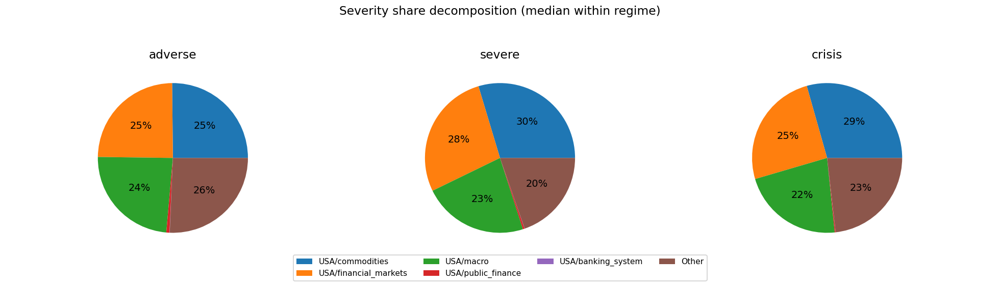
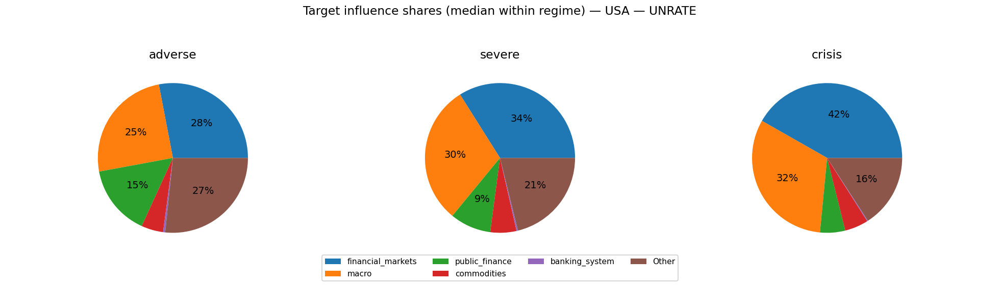

# MC Block Comovements & Regimes — latest

This note summarizes how block aggregates co-move across Monte Carlo draws, and groups draws into coarse regime labels.

## Regime construction (simple, explainable)
- For each draw we compute each block’s **terminal cumulative block aggregate** (sigmas; z-space).
- We compute an economy-level severity score per draw: $S_{L2}=\sqrt{\sum_b (\text{cum}_b(T))^2}$. 
- Regimes are defined by severity quantiles: **baseline** (0–50%), **adverse** (50–80%), **severe** (80–95%), **crisis** (95–100%).

## All ISOs combined

Regime counts (draws):
- baseline: 2500
- adverse: 1500
- severe: 750
- crisis: 250

Top ISO/block columns by cross-draw variability:
- USA/commodities, USA/macro, USA/financial_markets, USA/public_finance, USA/banking_system

### Typical terminal cumulative (median with q10/q90; sigmas)

**baseline**
- USA/macro: -0.49 [-13.47, +13.41]
- USA/commodities: +0.24 [-13.38, +12.65]
- USA/financial_markets: +0.17 [-13.22, +13.66]
- USA/banking_system: -0.03 [-1.05, +1.08]
- USA/public_finance: +0.03 [-4.25, +4.36]
**adverse**
- USA/financial_markets: -1.15 [-22.58, +23.26]
- USA/macro: +0.75 [-21.93, +22.54]
- USA/commodities: +0.38 [-22.44, +22.91]
- USA/public_finance: -0.04 [-4.49, +4.62]
- USA/banking_system: -0.02 [-1.08, +1.08]
**severe**
- USA/macro: +0.69 [-30.70, +30.80]
- USA/commodities: -0.43 [-31.55, +31.54]
- USA/public_finance: +0.28 [-4.40, +4.44]
- USA/banking_system: +0.04 [-1.24, +1.21]
- USA/financial_markets: -0.02 [-29.33, +27.13]
**crisis**
- USA/financial_markets: -4.23 [-39.03, +37.99]
- USA/macro: +1.14 [-41.31, +38.58]
- USA/commodities: +0.17 [-39.11, +40.68]
- USA/banking_system: +0.12 [-1.11, +1.26]
- USA/public_finance: +0.10 [-4.35, +4.46]

### Severity share decomposition ("cake" slices; All ISOs combined)
Shares are fractions of $S_{L2}^2$ attributable to each block (using squared terminal cumulatives).
Interpretation: a large share means the block contributes more to the **simulation severity metric** used here.
This can happen because the block has larger tail dispersion / higher volatility / stronger cumulative drift over the horizon.
It does **not** by itself prove the block has larger causal impact on GDP/PD/LGD; for that, compute shares in propagated target space.
Reported as median share with quantile band q10/q90 within each regime.

**adverse**
- USA/commodities:  25.2% [  1.1%,  79.8%]
- USA/financial_markets:  24.6% [  0.9%,  79.2%]
- USA/macro:  23.8% [  0.9%,  78.7%]
- USA/public_finance:   0.7% [  0.0%,   4.1%]
- USA/banking_system:   0.0% [  0.0%,   0.2%]

**severe**
- USA/macro:  29.6% [  1.1%,  79.3%]
- USA/commodities:  27.6% [  0.6%,  81.8%]
- USA/financial_markets:  22.7% [  1.3%,  70.8%]
- USA/public_finance:   0.4% [  0.0%,   2.2%]
- USA/banking_system:   0.0% [  0.0%,   0.2%]

**crisis**
- USA/financial_markets:  29.4% [  1.7%,  74.2%]
- USA/macro:  25.2% [  1.9%,  77.1%]
- USA/commodities:  22.1% [  0.9%,  76.2%]
- USA/public_finance:   0.2% [  0.0%,   1.3%]
- USA/banking_system:   0.0% [  0.0%,   0.1%]

## USA

Regime counts (draws):
- baseline: 2500
- adverse: 1500
- severe: 750
- crisis: 250

Top blocks by cross-draw variability (used for comovement summaries):
- commodities, macro, financial_markets, public_finance, banking_system

### Typical block terminal cumulative (median with q10/q90; sigmas)
(Signs depend on factor definitions; focus on magnitude + co-movement patterns.)

**baseline**
- macro: -0.49 [-13.47, +13.41]
- commodities: +0.24 [-13.38, +12.65]
- financial_markets: +0.17 [-13.22, +13.66]
- banking_system: -0.03 [-1.05, +1.08]
- public_finance: +0.03 [-4.25, +4.36]
**adverse**
- financial_markets: -1.15 [-22.58, +23.26]
- macro: +0.75 [-21.93, +22.54]
- commodities: +0.38 [-22.44, +22.91]
- public_finance: -0.04 [-4.49, +4.62]
- banking_system: -0.02 [-1.08, +1.08]
**severe**
- macro: +0.69 [-30.70, +30.80]
- commodities: -0.43 [-31.55, +31.54]
- public_finance: +0.28 [-4.40, +4.44]
- banking_system: +0.04 [-1.24, +1.21]
- financial_markets: -0.02 [-29.33, +27.13]
**crisis**
- financial_markets: -4.23 [-39.03, +37.99]
- macro: +1.14 [-41.31, +38.58]
- commodities: +0.17 [-39.11, +40.68]
- banking_system: +0.12 [-1.11, +1.26]
- public_finance: +0.10 [-4.35, +4.46]

### Outcome-space influence proxy (Step 4 targets)
This section projects simulated factor shocks into Step 4 targets using the stored linear coefficients.
Important: this is a **proxy** because Step 4 feature scaling may differ from the Step 12 simulation shock units.
We use **terminal cumulative standardized shocks** (sum of daily/monthly $z$ shocks) and ignore AR target lags when they are not simulated.

#### GDPC1
- transform=yoy_log_pct; features=daily_shortlist; test_r2=0.054; coef_coverage≈68.1%
- WARNING: Low test $R^2$: treat regime/attribution patterns as low confidence.
- Ignored non-simulated features (often AR lags): GDPC1_lag1, GDPC1_lag3, GDPC1_lag2

Typical projected target impact (median with q10/q90; arbitrary units)
- baseline: -0.220 [-8.870, +8.791]
- adverse: +0.480 [-14.472, +14.850]
- severe: +0.091 [-19.359, +20.100]
- crisis: +2.596 [-26.733, +26.584]

Influence share decomposition by block (median share with q10/q90 within regime)
**adverse**
- financial_markets:  56.6% [  3.8%,  91.7%]
- macro:  16.5% [  0.6%,  69.0%]
- public_finance:   4.6% [  0.2%,  26.0%]
- commodities:   3.8% [  0.1%,  30.8%]
- banking_system:   0.7% [  0.0%,   5.1%]

**severe**
- financial_markets:  56.7% [  5.7%,  90.6%]
- macro:  20.9% [  0.7%,  69.2%]
- commodities:   4.5% [  0.1%,  33.2%]
- public_finance:   2.7% [  0.1%,  17.2%]
- banking_system:   0.5% [  0.0%,   3.3%]

**crisis**
- financial_markets:  67.9% [  7.3%,  92.3%]
- macro:  17.6% [  0.9%,  71.5%]
- commodities:   4.0% [  0.1%,  28.6%]
- public_finance:   1.4% [  0.1%,   8.2%]
- banking_system:   0.3% [  0.0%,   1.8%]

#### CPIAUCSL
- transform=yoy_log_pct; features=daily_shortlist; test_r2=0.025; coef_coverage≈62.2%
- WARNING: Low test $R^2$: treat regime/attribution patterns as low confidence.
- Ignored non-simulated features (often AR lags): CPIAUCSL_lag1, CPIAUCSL_lag2

Typical projected target impact (median with q10/q90; arbitrary units)
- baseline: -0.162 [-5.824, +5.568]
- adverse: +0.198 [-9.087, +9.193]
- severe: +0.157 [-12.193, +12.313]
- crisis: -0.647 [-14.536, +16.252]

Influence share decomposition by block (median share with q10/q90 within regime)
**adverse**
- commodities:  61.8% [  5.8%,  93.5%]
- macro:  10.1% [  0.3%,  55.4%]
- public_finance:   6.3% [  0.2%,  33.9%]
- financial_markets:   5.0% [  0.2%,  34.3%]
- banking_system:   0.1% [  0.0%,   0.7%]

**severe**
- commodities:  66.9% [  3.8%,  95.1%]
- macro:  12.8% [  0.4%,  62.5%]
- financial_markets:   4.9% [  0.2%,  33.7%]
- public_finance:   3.3% [  0.1%,  21.6%]
- banking_system:   0.1% [  0.0%,   0.4%]

**crisis**
- commodities:  67.1% [  5.1%,  94.9%]
- macro:  13.6% [  0.5%,  60.8%]
- financial_markets:   6.1% [  0.4%,  40.5%]
- public_finance:   2.2% [  0.1%,  13.7%]
- banking_system:   0.0% [  0.0%,   0.2%]

#### UNRATE
- transform=level; features=daily_shortlist; test_r2=0.479; coef_coverage≈27.9%
- Ignored non-simulated features (often AR lags): UNRATE_lag1, UNRATE_lag3, UNRATE_lag2

Typical projected target impact (median with q10/q90; arbitrary units)
- baseline: +0.012 [-1.669, +1.636]
- adverse: +0.075 [-2.574, +2.449]
- severe: -0.070 [-3.420, +3.286]
- crisis: -0.149 [-4.572, +4.302]

Influence share decomposition by block (median share with q10/q90 within regime)
**adverse**
- financial_markets:  28.0% [  1.2%,  75.9%]
- macro:  24.9% [  1.0%,  76.2%]
- public_finance:  15.3% [  0.7%,  54.0%]
- commodities:   4.7% [  0.2%,  32.0%]
- banking_system:   0.5% [  0.0%,   3.1%]

**severe**
- macro:  33.9% [  1.4%,  77.4%]
- financial_markets:  30.1% [  1.9%,  75.1%]
- public_finance:   8.9% [  0.4%,  40.7%]
- commodities:   5.6% [  0.1%,  35.0%]
- banking_system:   0.3% [  0.0%,   2.1%]

**crisis**
- financial_markets:  41.8% [  2.6%,  79.7%]
- macro:  31.7% [  2.2%,  82.0%]
- public_finance:   5.4% [  0.3%,  24.2%]
- commodities:   5.1% [  0.2%,  35.4%]
- banking_system:   0.2% [  0.0%,   1.2%]

### Severity share decomposition ("cake" slices)
Shares are fractions of $S_{L2}^2$ attributable to each block (using squared terminal cumulatives).
Interpretation: a large share means the block contributes more to the **simulation severity metric** used here.
This can happen because the block has larger tail dispersion / higher volatility / stronger cumulative drift over the horizon.
It does **not** by itself prove the block has larger causal impact on GDP/PD/LGD; for that, compute shares in propagated target space.
Reported as median share with quantile band q10/q90 within each regime.

**adverse**
- commodities:  25.2% [  1.1%,  79.8%]
- financial_markets:  24.6% [  0.9%,  79.2%]
- macro:  23.8% [  0.9%,  78.7%]
- public_finance:   0.7% [  0.0%,   4.1%]
- banking_system:   0.0% [  0.0%,   0.2%]

**severe**
- macro:  29.6% [  1.1%,  79.3%]
- commodities:  27.6% [  0.6%,  81.8%]
- financial_markets:  22.7% [  1.3%,  70.8%]
- public_finance:   0.4% [  0.0%,   2.2%]
- banking_system:   0.0% [  0.0%,   0.2%]

**crisis**
- financial_markets:  29.4% [  1.7%,  74.2%]
- macro:  25.2% [  1.9%,  77.1%]
- commodities:  22.1% [  0.9%,  76.2%]
- public_finance:   0.2% [  0.0%,   1.3%]
- banking_system:   0.0% [  0.0%,   0.1%]

### Comovement snapshot (corr of terminal cumulative across draws)
Positive = blocks tend to move together across scenarios; negative = trade-offs.

- macro ↔ financial_markets: corr=-0.27
- commodities ↔ financial_markets: corr=+0.22
- macro ↔ banking_system: corr=+0.22
- macro ↔ public_finance: corr=+0.15
- public_finance ↔ banking_system: corr=+0.12
- commodities ↔ macro: corr=+0.12
- financial_markets ↔ public_finance: corr=-0.07
- financial_markets ↔ banking_system: corr=-0.06
- commodities ↔ public_finance: corr=+0.03
- commodities ↔ banking_system: corr=+0.00
