# MC Block Comovements & Regimes — latest

This note summarizes how block aggregates co-move across Monte Carlo draws, and groups draws into coarse regime labels.

## Regime construction (simple, explainable)
- For each draw we compute each block’s **terminal cumulative block aggregate** (sigmas; z-space).
- We compute an economy-level severity score per draw: $S_{L2}=\sqrt{\sum_b (\text{cum}_b(T))^2}$. 
- Regimes are defined by severity quantiles: **baseline** (0–50%), **adverse** (50–80%), **severe** (80–95%), **crisis** (95–100%).

## All ISOs combined

Regime counts (draws):
- baseline: 2500
- adverse: 1500
- severe: 750
- crisis: 250

Top ISO/block columns by cross-draw variability:
- ITA/commodities, FRA/commodities, ESP/financial_markets, DEU/financial_markets, ESP/commodities, ITA/financial_markets, DEU/commodities, FRA/financial_markets, USA/commodities, USA/macro, USA/financial_markets, USA/public_finance

### Typical terminal cumulative (median with q10/q90; sigmas)

**baseline**
- USA/macro: -0.49 [-17.11, +17.28]
- FRA/financial_markets: +0.19 [-14.94, +15.09]
- ESP/commodities: -0.17 [-13.75, +13.07]
- ITA/financial_markets: +0.14 [-15.86, +16.38]
- USA/commodities: +0.12 [-13.46, +12.69]
- USA/public_finance: +0.10 [-4.33, +4.51]
- ITA/commodities: -0.09 [-13.44, +13.48]
- FRA/commodities: +0.08 [-13.96, +13.70]
- USA/financial_markets: +0.05 [-16.66, +16.71]
- ESP/financial_markets: +0.03 [-14.99, +15.02]
**adverse**
- ESP/financial_markets: +0.86 [-22.78, +23.04]
- ESP/commodities: +0.80 [-20.78, +20.92]
- DEU/commodities: -0.66 [-21.05, +21.06]
- DEU/financial_markets: +0.48 [-21.95, +23.10]
- ITA/financial_markets: +0.46 [-22.33, +22.16]
- FRA/commodities: +0.43 [-21.91, +21.84]
- USA/macro: +0.27 [-23.01, +24.25]
- USA/commodities: +0.23 [-21.01, +21.50]
- ITA/commodities: +0.11 [-20.78, +21.14]
- USA/financial_markets: -0.09 [-23.46, +22.00]
**severe**
- ESP/commodities: +3.47 [-29.60, +29.95]
- ITA/commodities: +3.42 [-29.29, +29.86]
- FRA/commodities: +2.76 [-28.36, +28.48]
- DEU/commodities: +1.78 [-27.38, +29.88]
- USA/commodities: +1.61 [-28.88, +30.32]
- FRA/financial_markets: -1.59 [-27.51, +29.53]
- DEU/financial_markets: -1.34 [-28.89, +29.06]
- USA/macro: +1.23 [-23.03, +23.44]
- ESP/financial_markets: -0.96 [-28.86, +27.81]
- USA/financial_markets: -0.76 [-25.60, +23.95]
**crisis**
- ITA/commodities: +4.68 [-40.81, +38.73]
- DEU/commodities: -1.92 [-40.74, +38.34]
- FRA/commodities: +1.25 [-39.09, +39.99]
- ESP/commodities: +0.92 [-41.46, +39.27]
- USA/macro: -0.84 [-23.42, +23.59]
- ESP/financial_markets: +0.83 [-33.34, +34.80]
- USA/commodities: -0.78 [-40.50, +39.88]
- ITA/financial_markets: -0.77 [-32.08, +34.54]
- USA/financial_markets: -0.73 [-25.74, +26.42]
- DEU/financial_markets: -0.53 [-30.36, +32.22]

### Severity share decomposition ("cake" slices; All ISOs combined)
Shares are fractions of $S_{L2}^2$ attributable to each block (using squared terminal cumulatives).
Interpretation: a large share means the block contributes more to the **simulation severity metric** used here.
This can happen because the block has larger tail dispersion / higher volatility / stronger cumulative drift over the horizon.
It does **not** by itself prove the block has larger causal impact on GDP/PD/LGD; for that, compute shares in propagated target space.
Reported as median share with quantile band q10/q90 within each regime.

**adverse**
- FRA/commodities:   6.0% [  0.3%,  21.5%]
- FRA/financial_markets:   5.9% [  0.2%,  23.6%]
- ITA/commodities:   5.9% [  0.3%,  19.7%]
- ESP/financial_markets:   5.8% [  0.3%,  25.8%]
- ITA/financial_markets:   5.8% [  0.2%,  23.3%]
- DEU/commodities:   5.7% [  0.3%,  20.9%]
- USA/commodities:   5.7% [  0.3%,  19.7%]
- ESP/commodities:   5.6% [  0.3%,  19.8%]
- DEU/financial_markets:   5.3% [  0.2%,  25.2%]
- USA/financial_markets:   5.2% [  0.1%,  26.6%]

**severe**
- ITA/commodities:   8.8% [  0.6%,  22.2%]
- ESP/commodities:   8.6% [  0.7%,  21.8%]
- DEU/commodities:   8.3% [  0.6%,  20.4%]
- USA/commodities:   8.2% [  0.3%,  22.4%]
- FRA/commodities:   7.8% [  0.4%,  21.2%]
- ESP/financial_markets:   6.1% [  0.2%,  22.1%]
- DEU/financial_markets:   6.0% [  0.2%,  24.7%]
- FRA/financial_markets:   5.9% [  0.2%,  24.4%]
- ITA/financial_markets:   5.5% [  0.2%,  22.5%]
- USA/financial_markets:   4.0% [  0.1%,  18.8%]

**crisis**
- USA/commodities:  12.3% [  1.8%,  22.1%]
- ITA/commodities:  11.6% [  2.0%,  22.1%]
- DEU/commodities:  11.1% [  2.2%,  23.2%]
- ESP/commodities:  11.0% [  2.1%,  22.3%]
- FRA/commodities:  11.0% [  1.4%,  22.4%]
- ITA/financial_markets:   5.3% [  0.1%,  18.5%]
- FRA/financial_markets:   5.2% [  0.2%,  19.8%]
- ESP/financial_markets:   4.4% [  0.1%,  20.6%]
- DEU/financial_markets:   4.0% [  0.2%,  18.8%]
- USA/financial_markets:   2.6% [  0.2%,  12.7%]

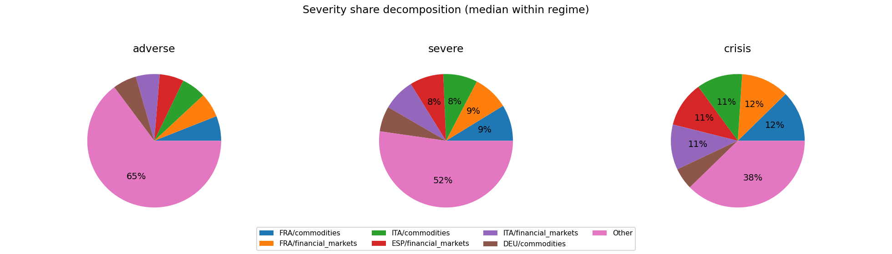

## DEU

Regime counts (draws):
- baseline: 2500
- adverse: 1500
- severe: 750
- crisis: 250

Top blocks by cross-draw variability (used for comovement summaries):
- financial_markets, commodities, public_finance, macro, banking_system

### Typical block terminal cumulative (median with q10/q90; sigmas)
(Signs depend on factor definitions; focus on magnitude + co-movement patterns.)

**baseline**
- commodities: +0.13 [-11.85, +12.10]
- public_finance: -0.04 [-4.48, +4.28]
- macro: -0.04 [-3.01, +3.19]
- financial_markets: +0.03 [-11.76, +11.84]
- banking_system: +0.02 [-1.11, +1.08]
**adverse**
- commodities: -1.45 [-21.40, +21.35]
- public_finance: +0.15 [-4.46, +4.69]
- financial_markets: +0.15 [-21.28, +20.89]
- banking_system: -0.03 [-1.14, +1.08]
- macro: +0.01 [-2.94, +3.10]
**severe**
- financial_markets: +1.66 [-29.85, +30.63]
- commodities: -0.87 [-29.94, +30.29]
- public_finance: -0.14 [-4.41, +4.17]
- banking_system: -0.03 [-1.13, +1.03]
- macro: +0.00 [-2.90, +2.99]
**crisis**
- commodities: +5.83 [-41.37, +40.04]
- financial_markets: -4.23 [-42.10, +41.43]
- macro: +0.54 [-3.03, +3.52]
- public_finance: -0.45 [-4.55, +4.46]
- banking_system: -0.13 [-1.06, +0.86]

### Outcome-space influence proxy (Step 4 targets)
This section projects simulated factor shocks into Step 4 targets using the stored linear coefficients.
Important: this is a **proxy** because Step 4 feature scaling may differ from the Step 12 simulation shock units.
We use **terminal cumulative standardized shocks** (sum of daily/monthly $z$ shocks) and ignore AR target lags when they are not simulated.

#### DEU_GDP_EUROSTAT
- transform=yoy_log_pct; features=daily_shortlist; test_r2=-0.155; coef_coverage≈56.6%
- WARNING: Low test $R^2$: treat regime/attribution patterns as low confidence.
- Ignored non-simulated features (often AR lags): DEU_GDP_EUROSTAT_lag1, DEU_GDP_EUROSTAT_lag3, DEU_GDP_EUROSTAT_lag2

Typical projected target impact (median with q10/q90; arbitrary units)
- baseline: -0.040 [-5.071, +5.020]
- adverse: -0.007 [-8.450, +8.798]
- severe: -0.869 [-12.263, +11.613]
- crisis: +0.930 [-15.746, +16.156]

Influence share decomposition by block (median share with q10/q90 within regime)
**adverse**
- financial_markets:  92.1% [ 36.3%,  99.2%]
- public_finance:   4.5% [  0.2%,  47.5%]
- macro:   1.1% [  0.0%,  11.8%]

**severe**
- financial_markets:  96.8% [ 62.6%,  99.6%]
- public_finance:   1.8% [  0.0%,  25.3%]
- macro:   0.5% [  0.0%,   6.6%]

**crisis**
- financial_markets:  98.1% [ 85.6%,  99.8%]
- public_finance:   1.1% [  0.0%,   9.4%]
- macro:   0.4% [  0.0%,   4.2%]

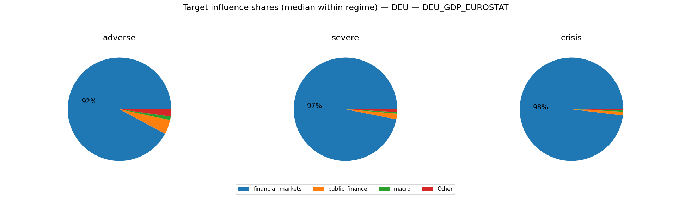

#### DEU_UNRATE_EUROSTAT
- transform=level; features=daily_shortlist; test_r2=0.869; coef_coverage≈8.7%
- Ignored non-simulated features (often AR lags): DEU_UNRATE_EUROSTAT_lag1

Typical projected target impact (median with q10/q90; arbitrary units)
- baseline: -0.001 [-0.495, +0.473]
- adverse: +0.026 [-0.877, +0.869]
- severe: +0.025 [-1.279, +1.251]
- crisis: -0.141 [-1.831, +1.757]

Influence share decomposition by block (median share with q10/q90 within regime)
**adverse**
- commodities:  81.6% [ 14.5%,  98.5%]
- financial_markets:  16.3% [  0.4%,  80.2%]
- macro:   0.8% [  0.0%,   5.6%]
- public_finance:   0.1% [  0.0%,   0.9%]
- banking_system:   0.0% [  0.0%,   0.0%]

**severe**
- commodities:  82.3% [ 14.7%,  98.5%]
- financial_markets:  17.0% [  0.8%,  83.0%]
- macro:   0.4% [  0.0%,   2.6%]
- public_finance:   0.0% [  0.0%,   0.4%]
- banking_system:   0.0% [  0.0%,   0.0%]

**crisis**
- commodities:  81.3% [ 27.5%,  98.3%]
- financial_markets:  18.1% [  1.3%,  70.3%]
- macro:   0.2% [  0.0%,   1.4%]
- public_finance:   0.0% [  0.0%,   0.2%]
- banking_system:   0.0% [  0.0%,   0.0%]

#### DEUCPIALLMINMEI
- transform=yoy_log_pct; features=daily_shortlist; test_r2=0.694; coef_coverage≈46.0%
- Ignored non-simulated features (often AR lags): DEUCPIALLMINMEI_lag1, DEUCPIALLMINMEI_lag2

Typical projected target impact (median with q10/q90; arbitrary units)
- baseline: +0.015 [-1.932, +2.060]
- adverse: -0.095 [-3.550, +3.611]
- severe: -0.135 [-5.153, +5.198]
- crisis: +0.730 [-7.113, +7.444]

Influence share decomposition by block (median share with q10/q90 within regime)
**adverse**
- commodities:  79.4% [ 13.7%,  97.1%]
- financial_markets:  14.4% [  0.4%,  72.8%]
- macro:   2.6% [  0.1%,  17.5%]
- public_finance:   0.2% [  0.0%,   1.7%]
- banking_system:   0.1% [  0.0%,   1.0%]

**severe**
- commodities:  81.8% [ 14.2%,  97.6%]
- financial_markets:  15.6% [  0.7%,  76.7%]
- macro:   1.3% [  0.0%,   8.9%]
- public_finance:   0.1% [  0.0%,   0.8%]
- banking_system:   0.1% [  0.0%,   0.5%]

**crisis**
- commodities:  81.9% [ 28.8%,  97.3%]
- financial_markets:  16.5% [  1.2%,  67.3%]
- macro:   0.7% [  0.0%,   4.8%]
- banking_system:   0.0% [  0.0%,   0.3%]
- public_finance:   0.0% [  0.0%,   0.4%]

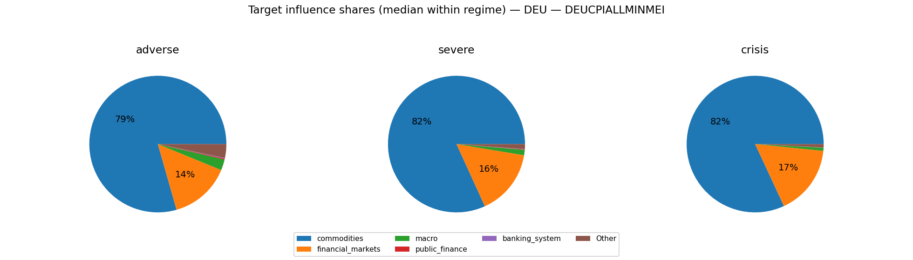

### Severity share decomposition ("cake" slices)
Shares are fractions of $S_{L2}^2$ attributable to each block (using squared terminal cumulatives).
Interpretation: a large share means the block contributes more to the **simulation severity metric** used here.
This can happen because the block has larger tail dispersion / higher volatility / stronger cumulative drift over the horizon.
It does **not** by itself prove the block has larger causal impact on GDP/PD/LGD; for that, compute shares in propagated target space.
Reported as median share with quantile band q10/q90 within each regime.

**adverse**
- commodities:  48.3% [  3.4%,  93.6%]
- financial_markets:  48.2% [  1.9%,  93.6%]
- public_finance:   1.1% [  0.0%,   6.7%]
- macro:   0.5% [  0.0%,   3.0%]
- banking_system:   0.1% [  0.0%,   0.4%]

**severe**
- financial_markets:  50.0% [  3.8%,  94.9%]
- commodities:  48.4% [  3.3%,  94.8%]
- public_finance:   0.4% [  0.0%,   2.8%]
- macro:   0.2% [  0.0%,   1.4%]
- banking_system:   0.0% [  0.0%,   0.2%]

**crisis**
- financial_markets:  52.5% [  6.1%,  91.7%]
- commodities:  47.0% [  7.0%,  93.0%]
- public_finance:   0.2% [  0.0%,   1.5%]
- macro:   0.1% [  0.0%,   0.8%]
- banking_system:   0.0% [  0.0%,   0.1%]

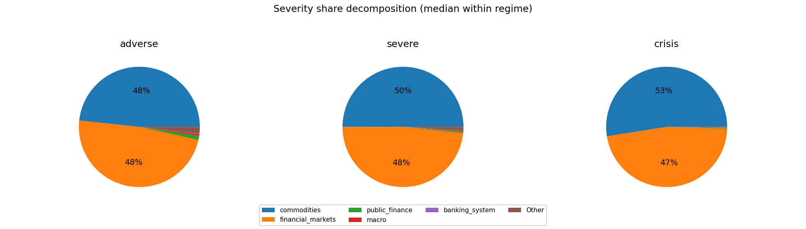

### Comovement snapshot (corr of terminal cumulative across draws)
Positive = blocks tend to move together across scenarios; negative = trade-offs.

- financial_markets ↔ commodities: corr=-0.35
- financial_markets ↔ public_finance: corr=+0.12
- financial_markets ↔ banking_system: corr=-0.10
- public_finance ↔ banking_system: corr=-0.10
- commodities ↔ banking_system: corr=+0.10
- financial_markets ↔ macro: corr=-0.06
- commodities ↔ macro: corr=+0.04
- public_finance ↔ macro: corr=-0.01
- commodities ↔ public_finance: corr=-0.01
- macro ↔ banking_system: corr=+0.00

## ESP

Regime counts (draws):
- baseline: 2500
- adverse: 1500
- severe: 750
- crisis: 250

Top blocks by cross-draw variability (used for comovement summaries):
- financial_markets, commodities, public_finance, macro, banking_system

### Typical block terminal cumulative (median with q10/q90; sigmas)
(Signs depend on factor definitions; focus on magnitude + co-movement patterns.)

**baseline**
- financial_markets: +0.15 [-11.41, +12.12]
- public_finance: +0.04 [-4.18, +4.30]
- banking_system: -0.04 [-1.17, +1.18]
- commodities: +0.02 [-11.95, +11.88]
- macro: +0.02 [-3.09, +3.14]
**adverse**
- commodities: +0.60 [-21.36, +21.47]
- financial_markets: -0.48 [-21.74, +22.11]
- macro: -0.18 [-3.26, +3.03]
- public_finance: +0.05 [-4.42, +4.52]
- banking_system: -0.01 [-1.25, +1.21]
**severe**
- financial_markets: +0.37 [-31.22, +31.01]
- commodities: -0.11 [-30.75, +30.36]
- public_finance: -0.07 [-4.69, +4.31]
- macro: -0.07 [-3.43, +3.18]
- banking_system: +0.00 [-1.28, +1.23]
**crisis**
- financial_markets: -1.38 [-42.60, +40.36]
- commodities: +1.27 [-41.89, +40.52]
- macro: +0.37 [-2.68, +3.32]
- public_finance: +0.29 [-4.57, +4.54]
- banking_system: +0.01 [-1.20, +1.32]

### Outcome-space influence proxy (Step 4 targets)
This section projects simulated factor shocks into Step 4 targets using the stored linear coefficients.
Important: this is a **proxy** because Step 4 feature scaling may differ from the Step 12 simulation shock units.
We use **terminal cumulative standardized shocks** (sum of daily/monthly $z$ shocks) and ignore AR target lags when they are not simulated.

#### ESP_GDP_EUROSTAT
- transform=yoy_log_pct; features=daily_shortlist; test_r2=0.009; coef_coverage≈68.5%
- WARNING: Low test $R^2$: treat regime/attribution patterns as low confidence.
- Ignored non-simulated features (often AR lags): ESP_GDP_EUROSTAT_lag1, ESP_GDP_EUROSTAT_lag3, ESP_GDP_EUROSTAT_lag2

Typical projected target impact (median with q10/q90; arbitrary units)
- baseline: -0.172 [-8.728, +8.399]
- adverse: +0.152 [-15.563, +15.381]
- severe: -1.486 [-21.709, +21.934]
- crisis: +1.406 [-27.701, +28.179]

Influence share decomposition by block (median share with q10/q90 within regime)
**adverse**
- financial_markets:  87.5% [ 17.2%,  98.3%]
- commodities:   8.0% [  0.3%,  65.4%]
- public_finance:   2.0% [  0.1%,  14.1%]
- banking_system:   0.2% [  0.0%,   1.3%]
- macro:   0.1% [  0.0%,   1.0%]

**severe**
- financial_markets:  89.7% [ 17.3%,  99.0%]
- commodities:   8.4% [  0.3%,  74.3%]
- public_finance:   0.9% [  0.0%,   7.6%]
- banking_system:   0.1% [  0.0%,   0.6%]
- macro:   0.1% [  0.0%,   0.5%]

**crisis**
- financial_markets:  87.0% [ 11.5%,  99.1%]
- commodities:  10.7% [  0.4%,  80.1%]
- public_finance:   0.7% [  0.0%,   5.0%]
- banking_system:   0.0% [  0.0%,   0.4%]
- macro:   0.0% [  0.0%,   0.3%]

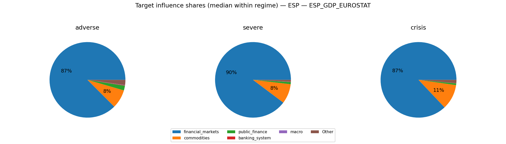

#### ESP_UNRATE_EUROSTAT
- transform=level; features=daily_shortlist; test_r2=0.966; coef_coverage≈36.3%
- Ignored non-simulated features (often AR lags): ESP_UNRATE_EUROSTAT_lag1

Typical projected target impact (median with q10/q90; arbitrary units)
- baseline: +0.023 [-2.178, +2.273]
- adverse: -0.040 [-3.789, +3.848]
- severe: +0.208 [-5.357, +5.329]
- crisis: +0.088 [-7.028, +7.107]

Influence share decomposition by block (median share with q10/q90 within regime)
**adverse**
- financial_markets:  70.3% [  6.2%,  96.0%]
- commodities:  20.9% [  0.8%,  79.9%]
- public_finance:   3.9% [  0.2%,  20.9%]
- macro:   0.1% [  0.0%,   0.7%]
- banking_system:   0.0% [  0.0%,   0.3%]

**severe**
- financial_markets:  73.9% [  6.2%,  97.3%]
- commodities:  22.6% [  0.8%,  88.0%]
- public_finance:   2.0% [  0.1%,  12.2%]
- macro:   0.1% [  0.0%,   0.4%]
- banking_system:   0.0% [  0.0%,   0.2%]

**crisis**
- financial_markets:  68.6% [  4.0%,  97.3%]
- commodities:  27.5% [  1.4%,  89.8%]
- public_finance:   1.4% [  0.0%,   7.7%]
- macro:   0.0% [  0.0%,   0.2%]
- banking_system:   0.0% [  0.0%,   0.1%]

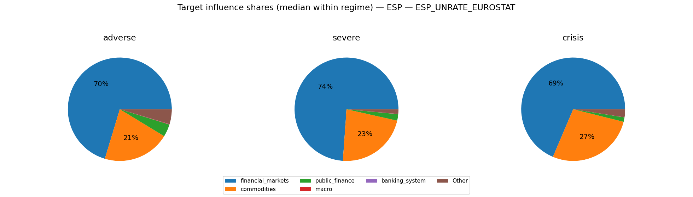

#### ESPCPIALLMINMEI
- transform=yoy_log_pct; features=daily_shortlist; test_r2=0.785; coef_coverage≈44.7%
- Ignored non-simulated features (often AR lags): ESPCPIALLMINMEI_lag1, ESPCPIALLMINMEI_lag2

Typical projected target impact (median with q10/q90; arbitrary units)
- baseline: -0.084 [-2.246, +2.184]
- adverse: +0.110 [-3.943, +3.895]
- severe: -0.195 [-5.541, +5.621]
- crisis: -0.019 [-7.233, +7.467]

Influence share decomposition by block (median share with q10/q90 within regime)
**adverse**
- financial_markets:  82.7% [ 12.4%,  97.0%]
- commodities:  10.7% [  0.4%,  67.6%]
- public_finance:   1.7% [  0.1%,  11.4%]
- macro:   1.6% [  0.1%,  10.2%]
- banking_system:   0.0% [  0.0%,   0.3%]

**severe**
- financial_markets:  85.7% [ 12.2%,  98.2%]
- commodities:  11.4% [  0.4%,  75.5%]
- public_finance:   0.8% [  0.0%,   6.2%]
- macro:   0.8% [  0.0%,   5.7%]
- banking_system:   0.0% [  0.0%,   0.1%]

**crisis**
- financial_markets:  82.4% [  8.4%,  98.4%]
- commodities:  14.5% [  0.6%,  83.2%]
- public_finance:   0.6% [  0.0%,   3.9%]
- macro:   0.5% [  0.0%,   3.2%]
- banking_system:   0.0% [  0.0%,   0.1%]

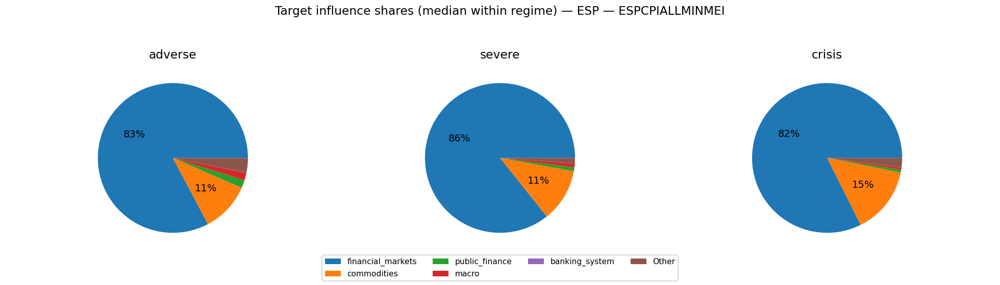

### Severity share decomposition ("cake" slices)
Shares are fractions of $S_{L2}^2$ attributable to each block (using squared terminal cumulatives).
Interpretation: a large share means the block contributes more to the **simulation severity metric** used here.
This can happen because the block has larger tail dispersion / higher volatility / stronger cumulative drift over the horizon.
It does **not** by itself prove the block has larger causal impact on GDP/PD/LGD; for that, compute shares in propagated target space.
Reported as median share with quantile band q10/q90 within each regime.

**adverse**
- financial_markets:  49.8% [  2.5%,  93.6%]
- commodities:  46.1% [  2.5%,  94.1%]
- public_finance:   1.0% [  0.0%,   5.8%]
- macro:   0.5% [  0.0%,   3.0%]
- banking_system:   0.1% [  0.0%,   0.5%]

**severe**
- financial_markets:  50.9% [  2.2%,  95.2%]
- commodities:  47.6% [  2.6%,  95.8%]
- public_finance:   0.5% [  0.0%,   2.9%]
- macro:   0.3% [  0.0%,   1.6%]
- banking_system:   0.0% [  0.0%,   0.2%]

**crisis**
- commodities:  54.5% [  4.2%,  97.1%]
- financial_markets:  43.9% [  1.4%,  94.9%]
- public_finance:   0.3% [  0.0%,   1.5%]
- macro:   0.1% [  0.0%,   0.8%]
- banking_system:   0.0% [  0.0%,   0.1%]

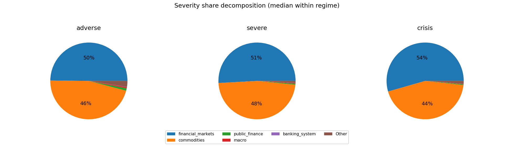

### Comovement snapshot (corr of terminal cumulative across draws)
Positive = blocks tend to move together across scenarios; negative = trade-offs.

- financial_markets ↔ banking_system: corr=-0.14
- public_finance ↔ banking_system: corr=+0.12
- financial_markets ↔ commodities: corr=-0.11
- financial_markets ↔ public_finance: corr=-0.10
- financial_markets ↔ macro: corr=-0.07
- commodities ↔ banking_system: corr=+0.03
- macro ↔ banking_system: corr=-0.03
- commodities ↔ macro: corr=+0.02
- commodities ↔ public_finance: corr=-0.01
- public_finance ↔ macro: corr=+0.00

## FRA

Regime counts (draws):
- baseline: 2500
- adverse: 1500
- severe: 750
- crisis: 250

Top blocks by cross-draw variability (used for comovement summaries):
- commodities, financial_markets, public_finance, macro, banking_system

### Typical block terminal cumulative (median with q10/q90; sigmas)
(Signs depend on factor definitions; focus on magnitude + co-movement patterns.)

**baseline**
- commodities: +0.12 [-12.39, +12.17]
- public_finance: +0.09 [-4.25, +4.29]
- financial_markets: +0.04 [-12.44, +12.45]
- banking_system: +0.01 [-1.14, +1.15]
- macro: +0.00 [-3.14, +3.03]
**adverse**
- commodities: +0.86 [-21.73, +21.84]
- public_finance: +0.11 [-4.46, +4.51]
- macro: +0.09 [-3.15, +3.07]
- financial_markets: +0.09 [-21.30, +21.69]
- banking_system: +0.06 [-1.15, +1.17]
**severe**
- commodities: +2.19 [-30.35, +30.99]
- financial_markets: -1.78 [-30.08, +30.09]
- public_finance: +0.11 [-4.61, +4.78]
- macro: -0.01 [-3.20, +3.13]
- banking_system: -0.01 [-1.32, +1.19]
**crisis**
- commodities: +1.08 [-40.20, +40.83]
- financial_markets: +1.07 [-39.53, +42.75]
- public_finance: +0.17 [-4.48, +4.24]
- macro: -0.14 [-3.15, +2.68]
- banking_system: -0.01 [-1.05, +1.29]

### Outcome-space influence proxy (Step 4 targets)
This section projects simulated factor shocks into Step 4 targets using the stored linear coefficients.
Important: this is a **proxy** because Step 4 feature scaling may differ from the Step 12 simulation shock units.
We use **terminal cumulative standardized shocks** (sum of daily/monthly $z$ shocks) and ignore AR target lags when they are not simulated.

#### FRA_GDP_EUROSTAT
- transform=yoy_log_pct; features=daily_shortlist; test_r2=-0.084; coef_coverage≈44.7%
- WARNING: Low test $R^2$: treat regime/attribution patterns as low confidence.
- Ignored non-simulated features (often AR lags): FRA_GDP_EUROSTAT_lag1, FRA_GDP_EUROSTAT_lag3, FRA_GDP_EUROSTAT_lag2

Typical projected target impact (median with q10/q90; arbitrary units)
- baseline: -0.011 [-4.967, +4.899]
- adverse: +0.091 [-8.645, +8.536]
- severe: +0.469 [-12.034, +11.825]
- crisis: -0.603 [-16.614, +15.036]

Influence share decomposition by block (median share with q10/q90 within regime)
**adverse**
- financial_markets:  96.7% [ 41.1%,  99.7%]
- commodities:   2.1% [  0.1%,  46.5%]
- public_finance:   0.5% [  0.0%,   6.7%]
- macro:   0.0% [  0.0%,   0.4%]
- banking_system:   0.0% [  0.0%,   0.4%]

**severe**
- financial_markets:  96.9% [ 49.0%,  99.8%]
- commodities:   2.4% [  0.1%,  43.4%]
- public_finance:   0.3% [  0.0%,   3.1%]
- macro:   0.0% [  0.0%,   0.2%]
- banking_system:   0.0% [  0.0%,   0.2%]

**crisis**
- financial_markets:  98.1% [ 57.2%,  99.8%]
- commodities:   1.7% [  0.1%,  37.3%]
- public_finance:   0.1% [  0.0%,   2.0%]
- macro:   0.0% [  0.0%,   0.1%]
- banking_system:   0.0% [  0.0%,   0.1%]

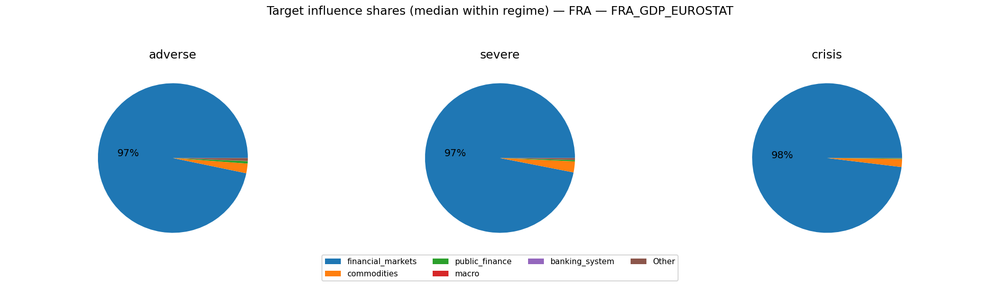

#### FRA_UNRATE_EUROSTAT
- transform=level; features=daily_shortlist; test_r2=0.797; coef_coverage≈15.1%
- Ignored non-simulated features (often AR lags): FRA_UNRATE_EUROSTAT_lag1

Typical projected target impact (median with q10/q90; arbitrary units)
- baseline: +0.006 [-0.502, +0.508]
- adverse: -0.011 [-0.763, +0.774]
- severe: -0.022 [-1.008, +0.994]
- crisis: -0.030 [-1.177, +1.335]

Influence share decomposition by block (median share with q10/q90 within regime)
**adverse**
- financial_markets:  77.7% [ 12.8%,  97.3%]
- macro:  16.3% [  0.6%,  71.4%]
- commodities:   1.1% [  0.0%,  10.6%]
- public_finance:   0.8% [  0.0%,   6.1%]

**severe**
- financial_markets:  87.3% [ 24.3%,  98.3%]
- macro:   8.3% [  0.3%,  57.6%]
- commodities:   1.3% [  0.0%,  12.2%]
- public_finance:   0.5% [  0.0%,   4.5%]

**crisis**
- financial_markets:  92.8% [ 43.2%,  99.0%]
- macro:   4.5% [  0.2%,  32.2%]
- commodities:   1.1% [  0.0%,  20.6%]
- public_finance:   0.3% [  0.0%,   3.1%]

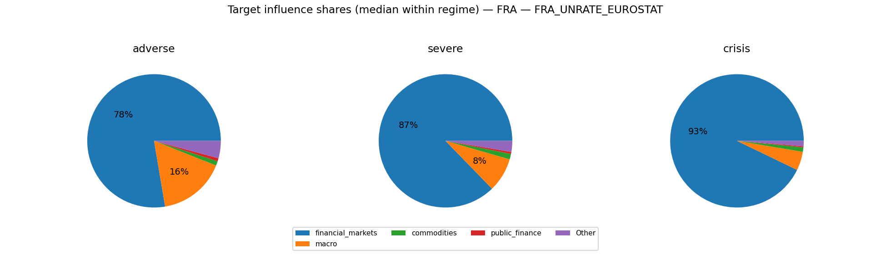

#### FRACPIALLMINMEI
- transform=yoy_log_pct; features=daily_shortlist; test_r2=0.652; coef_coverage≈41.9%
- Ignored non-simulated features (often AR lags): FRACPIALLMINMEI_lag1, FRACPIALLMINMEI_lag3

Typical projected target impact (median with q10/q90; arbitrary units)
- baseline: -0.041 [-1.830, +1.848]
- adverse: +0.015 [-3.016, +3.119]
- severe: +0.323 [-4.106, +4.332]
- crisis: -0.252 [-5.284, +5.320]

Influence share decomposition by block (median share with q10/q90 within regime)
**adverse**
- commodities:  90.0% [ 27.6%,  98.3%]
- public_finance:   3.6% [  0.2%,  34.6%]
- financial_markets:   2.1% [  0.0%,  25.2%]
- banking_system:   1.1% [  0.0%,   9.6%]
- macro:   0.1% [  0.0%,   0.8%]

**severe**
- commodities:  94.0% [ 34.2%,  98.8%]
- public_finance:   2.0% [  0.1%,  21.2%]
- financial_markets:   1.9% [  0.1%,  27.5%]
- banking_system:   0.6% [  0.0%,   5.6%]
- macro:   0.0% [  0.0%,   0.5%]

**crisis**
- commodities:  94.1% [ 42.2%,  99.2%]
- financial_markets:   2.7% [  0.1%,  36.2%]
- public_finance:   1.2% [  0.0%,  10.3%]
- banking_system:   0.4% [  0.0%,   3.2%]
- macro:   0.0% [  0.0%,   0.3%]

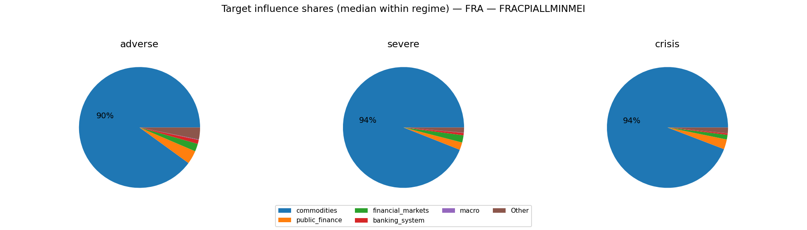

### Severity share decomposition ("cake" slices)
Shares are fractions of $S_{L2}^2$ attributable to each block (using squared terminal cumulatives).
Interpretation: a large share means the block contributes more to the **simulation severity metric** used here.
This can happen because the block has larger tail dispersion / higher volatility / stronger cumulative drift over the horizon.
It does **not** by itself prove the block has larger causal impact on GDP/PD/LGD; for that, compute shares in propagated target space.
Reported as median share with quantile band q10/q90 within each regime.

**adverse**
- commodities:  48.5% [  2.5%,  94.8%]
- financial_markets:  47.4% [  1.6%,  94.0%]
- public_finance:   1.0% [  0.0%,   5.8%]
- macro:   0.5% [  0.0%,   2.9%]
- banking_system:   0.1% [  0.0%,   0.4%]

**severe**
- commodities:  53.1% [  2.9%,  95.4%]
- financial_markets:  45.5% [  2.4%,  94.6%]
- public_finance:   0.5% [  0.0%,   3.3%]
- macro:   0.2% [  0.0%,   1.5%]
- banking_system:   0.0% [  0.0%,   0.2%]

**crisis**
- financial_markets:  53.8% [  3.1%,  96.3%]
- commodities:  44.9% [  2.9%,  95.8%]
- public_finance:   0.3% [  0.0%,   1.7%]
- macro:   0.1% [  0.0%,   0.8%]
- banking_system:   0.0% [  0.0%,   0.1%]

### Comovement snapshot (corr of terminal cumulative across draws)
Positive = blocks tend to move together across scenarios; negative = trade-offs.

- public_finance ↔ banking_system: corr=+0.22
- commodities ↔ financial_markets: corr=+0.13
- financial_markets ↔ banking_system: corr=-0.08
- financial_markets ↔ public_finance: corr=-0.06
- financial_markets ↔ macro: corr=-0.03
- commodities ↔ public_finance: corr=+0.02
- macro ↔ banking_system: corr=-0.02
- commodities ↔ banking_system: corr=-0.01
- commodities ↔ macro: corr=+0.00
- public_finance ↔ macro: corr=-0.00

## ITA

Regime counts (draws):
- baseline: 2500
- adverse: 1500
- severe: 750
- crisis: 250

Top blocks by cross-draw variability (used for comovement summaries):
- commodities, financial_markets, public_finance, macro, banking_system

### Typical block terminal cumulative (median with q10/q90; sigmas)
(Signs depend on factor definitions; focus on magnitude + co-movement patterns.)

**baseline**
- commodities: +0.29 [-11.98, +12.08]
- public_finance: -0.20 [-4.33, +4.30]
- financial_markets: +0.09 [-12.03, +11.91]
- macro: +0.05 [-3.11, +3.13]
- banking_system: +0.01 [-1.12, +1.16]
**adverse**
- commodities: -0.88 [-21.53, +21.85]
- financial_markets: +0.56 [-21.57, +22.05]
- public_finance: +0.04 [-4.56, +4.47]
- banking_system: -0.02 [-1.20, +1.14]
- macro: -0.02 [-3.63, +3.13]
**severe**
- commodities: +2.60 [-29.93, +30.23]
- financial_markets: +1.82 [-30.44, +30.45]
- public_finance: -0.16 [-4.64, +4.62]
- banking_system: -0.04 [-1.15, +1.12]
- macro: -0.01 [-2.91, +3.02]
**crisis**
- commodities: +3.89 [-41.89, +40.43]
- financial_markets: -2.18 [-39.60, +40.54]
- public_finance: +0.29 [-4.47, +4.92]
- macro: +0.20 [-3.04, +2.92]
- banking_system: -0.00 [-1.19, +1.14]

### Outcome-space influence proxy (Step 4 targets)
This section projects simulated factor shocks into Step 4 targets using the stored linear coefficients.
Important: this is a **proxy** because Step 4 feature scaling may differ from the Step 12 simulation shock units.
We use **terminal cumulative standardized shocks** (sum of daily/monthly $z$ shocks) and ignore AR target lags when they are not simulated.

#### ITA_GDP_EUROSTAT
- transform=yoy_log_pct; features=daily_shortlist; test_r2=0.233; coef_coverage≈53.7%
- Ignored non-simulated features (often AR lags): ITA_GDP_EUROSTAT_lag1, ITA_GDP_EUROSTAT_lag3

Typical projected target impact (median with q10/q90; arbitrary units)
- baseline: -0.024 [-5.774, +5.983]
- adverse: -0.310 [-10.919, +10.603]
- severe: -0.869 [-15.034, +14.967]
- crisis: +1.467 [-19.838, +19.565]

Influence share decomposition by block (median share with q10/q90 within regime)
**adverse**
- financial_markets:  99.6% [ 93.5%, 100.0%]
- macro:   0.3% [  0.0%,   4.3%]
- banking_system:   0.0% [  0.0%,   0.9%]
- commodities:   0.0% [  0.0%,   0.6%]

**severe**
- financial_markets:  99.8% [ 95.9%, 100.0%]
- macro:   0.1% [  0.0%,   2.0%]
- banking_system:   0.0% [  0.0%,   0.5%]
- commodities:   0.0% [  0.0%,   0.7%]

**crisis**
- financial_markets:  99.9% [ 96.0%, 100.0%]
- macro:   0.1% [  0.0%,   1.3%]
- commodities:   0.0% [  0.0%,   1.3%]
- banking_system:   0.0% [  0.0%,   0.3%]

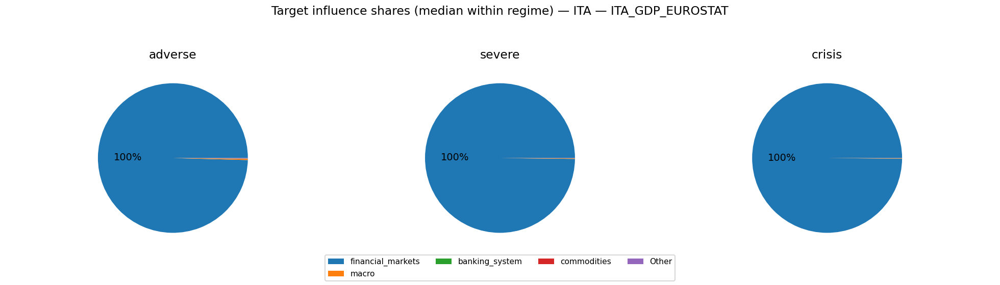

#### ITA_UNRATE_EUROSTAT
- transform=level; features=daily_shortlist; test_r2=0.924; coef_coverage≈15.2%
- Ignored non-simulated features (often AR lags): ITA_UNRATE_EUROSTAT_lag1

Typical projected target impact (median with q10/q90; arbitrary units)
- baseline: +0.025 [-0.835, +0.823]
- adverse: -0.010 [-1.443, +1.439]
- severe: +0.033 [-1.857, +2.020]
- crisis: -0.010 [-2.603, +2.517]

Influence share decomposition by block (median share with q10/q90 within regime)
**adverse**
- commodities:  60.3% [  4.9%,  97.1%]
- financial_markets:  37.5% [  1.7%,  92.6%]
- macro:   0.6% [  0.0%,   3.8%]
- public_finance:   0.1% [  0.0%,   0.5%]
- banking_system:   0.1% [  0.0%,   0.4%]

**severe**
- commodities:  58.4% [  4.7%,  97.6%]
- financial_markets:  41.3% [  1.6%,  93.8%]
- macro:   0.3% [  0.0%,   1.6%]
- public_finance:   0.0% [  0.0%,   0.3%]
- banking_system:   0.0% [  0.0%,   0.2%]

**crisis**
- commodities:  67.3% [  5.7%,  98.6%]
- financial_markets:  32.0% [  0.9%,  93.2%]
- macro:   0.1% [  0.0%,   0.8%]
- public_finance:   0.0% [  0.0%,   0.2%]
- banking_system:   0.0% [  0.0%,   0.1%]

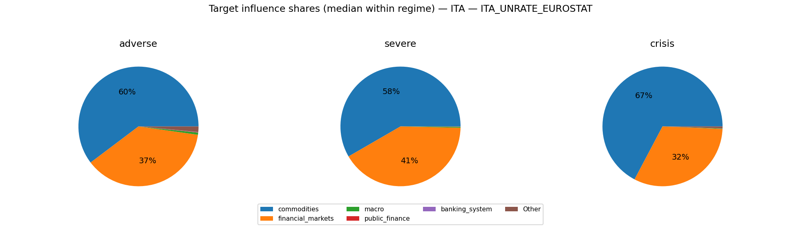

#### ITACPIALLMINMEI
- transform=yoy_log_pct; features=daily_shortlist; test_r2=0.874; coef_coverage≈27.1%
- Ignored non-simulated features (often AR lags): ITACPIALLMINMEI_lag1, ITACPIALLMINMEI_lag3

Typical projected target impact (median with q10/q90; arbitrary units)
- baseline: +0.036 [-0.929, +0.971]
- adverse: -0.079 [-1.564, +1.522]
- severe: +0.204 [-2.021, +2.112]
- crisis: -0.082 [-3.057, +2.840]

Influence share decomposition by block (median share with q10/q90 within regime)
**adverse**
- commodities:  73.0% [ 11.8%,  95.0%]
- financial_markets:   8.3% [  0.3%,  45.9%]
- public_finance:   6.7% [  0.2%,  35.5%]
- macro:   3.1% [  0.1%,  21.2%]
- banking_system:   0.0% [  0.0%,   0.2%]

**severe**
- commodities:  80.9% [ 13.7%,  96.5%]
- financial_markets:  10.5% [  0.3%,  54.7%]
- public_finance:   3.7% [  0.2%,  25.3%]
- macro:   1.5% [  0.1%,  11.1%]
- banking_system:   0.0% [  0.0%,   0.1%]

**crisis**
- commodities:  85.7% [ 22.9%,  97.7%]
- financial_markets:   7.4% [  0.2%,  56.1%]
- public_finance:   2.5% [  0.1%,  14.7%]
- macro:   0.6% [  0.0%,   5.6%]
- banking_system:   0.0% [  0.0%,   0.1%]

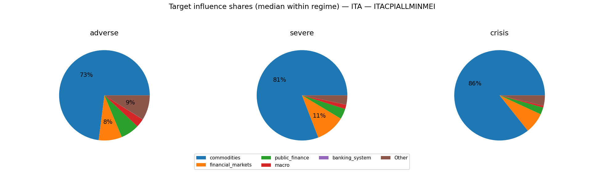

### Severity share decomposition ("cake" slices)
Shares are fractions of $S_{L2}^2$ attributable to each block (using squared terminal cumulatives).
Interpretation: a large share means the block contributes more to the **simulation severity metric** used here.
This can happen because the block has larger tail dispersion / higher volatility / stronger cumulative drift over the horizon.
It does **not** by itself prove the block has larger causal impact on GDP/PD/LGD; for that, compute shares in propagated target space.
Reported as median share with quantile band q10/q90 within each regime.

**adverse**
- financial_markets:  49.0% [  2.8%,  93.7%]
- commodities:  46.8% [  2.8%,  93.7%]
- public_finance:   1.0% [  0.0%,   6.1%]
- macro:   0.5% [  0.0%,   3.5%]
- banking_system:   0.1% [  0.0%,   0.4%]

**severe**
- financial_markets:  54.0% [  2.6%,  95.1%]
- commodities:  45.3% [  2.9%,  95.4%]
- public_finance:   0.5% [  0.0%,   3.2%]
- macro:   0.2% [  0.0%,   1.4%]
- banking_system:   0.0% [  0.0%,   0.2%]

**crisis**
- commodities:  54.5% [  3.5%,  97.6%]
- financial_markets:  43.1% [  1.5%,  94.8%]
- public_finance:   0.4% [  0.0%,   1.9%]
- macro:   0.1% [  0.0%,   0.7%]
- banking_system:   0.0% [  0.0%,   0.1%]

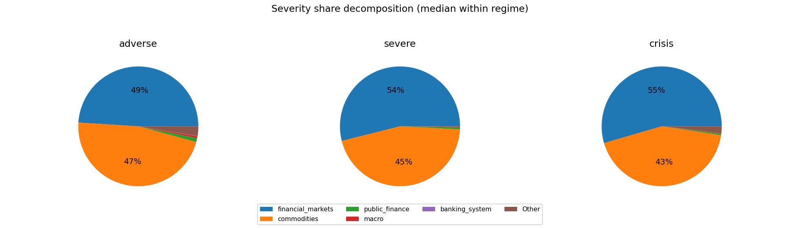

### Comovement snapshot (corr of terminal cumulative across draws)
Positive = blocks tend to move together across scenarios; negative = trade-offs.

- financial_markets ↔ public_finance: corr=-0.12
- commodities ↔ financial_markets: corr=-0.11
- financial_markets ↔ banking_system: corr=-0.11
- financial_markets ↔ macro: corr=-0.08
- commodities ↔ public_finance: corr=+0.03
- commodities ↔ banking_system: corr=+0.03
- commodities ↔ macro: corr=+0.02
- public_finance ↔ banking_system: corr=+0.01
- public_finance ↔ macro: corr=-0.00
- macro ↔ banking_system: corr=+0.00

## USA

Regime counts (draws):
- baseline: 2500
- adverse: 1500
- severe: 750
- crisis: 250

Top blocks by cross-draw variability (used for comovement summaries):
- commodities, macro, financial_markets, public_finance, banking_system

### Typical block terminal cumulative (median with q10/q90; sigmas)
(Signs depend on factor definitions; focus on magnitude + co-movement patterns.)

**baseline**
- macro: -0.49 [-13.47, +13.41]
- commodities: +0.24 [-13.38, +12.65]
- financial_markets: +0.17 [-13.22, +13.66]
- banking_system: -0.03 [-1.05, +1.08]
- public_finance: +0.03 [-4.25, +4.36]
**adverse**
- financial_markets: -1.15 [-22.58, +23.26]
- macro: +0.75 [-21.93, +22.54]
- commodities: +0.38 [-22.44, +22.91]
- public_finance: -0.04 [-4.49, +4.62]
- banking_system: -0.02 [-1.08, +1.08]
**severe**
- macro: +0.69 [-30.70, +30.80]
- commodities: -0.43 [-31.55, +31.54]
- public_finance: +0.28 [-4.40, +4.44]
- banking_system: +0.04 [-1.24, +1.21]
- financial_markets: -0.02 [-29.33, +27.13]
**crisis**
- financial_markets: -4.23 [-39.03, +37.99]
- macro: +1.14 [-41.31, +38.58]
- commodities: +0.17 [-39.11, +40.68]
- banking_system: +0.12 [-1.11, +1.26]
- public_finance: +0.10 [-4.35, +4.46]

### Outcome-space influence proxy (Step 4 targets)
This section projects simulated factor shocks into Step 4 targets using the stored linear coefficients.
Important: this is a **proxy** because Step 4 feature scaling may differ from the Step 12 simulation shock units.
We use **terminal cumulative standardized shocks** (sum of daily/monthly $z$ shocks) and ignore AR target lags when they are not simulated.

#### GDPC1
- transform=yoy_log_pct; features=daily_shortlist; test_r2=0.054; coef_coverage≈68.1%
- WARNING: Low test $R^2$: treat regime/attribution patterns as low confidence.
- Ignored non-simulated features (often AR lags): GDPC1_lag1, GDPC1_lag3, GDPC1_lag2

Typical projected target impact (median with q10/q90; arbitrary units)
- baseline: -0.220 [-8.870, +8.791]
- adverse: +0.480 [-14.472, +14.850]
- severe: +0.091 [-19.359, +20.100]
- crisis: +2.596 [-26.733, +26.584]

Influence share decomposition by block (median share with q10/q90 within regime)
**adverse**
- financial_markets:  56.6% [  3.8%,  91.7%]
- macro:  16.5% [  0.6%,  69.0%]
- public_finance:   4.6% [  0.2%,  26.0%]
- commodities:   3.8% [  0.1%,  30.8%]
- banking_system:   0.7% [  0.0%,   5.1%]

**severe**
- financial_markets:  56.7% [  5.7%,  90.6%]
- macro:  20.9% [  0.7%,  69.2%]
- commodities:   4.5% [  0.1%,  33.2%]
- public_finance:   2.7% [  0.1%,  17.2%]
- banking_system:   0.5% [  0.0%,   3.3%]

**crisis**
- financial_markets:  67.9% [  7.3%,  92.3%]
- macro:  17.6% [  0.9%,  71.5%]
- commodities:   4.0% [  0.1%,  28.6%]
- public_finance:   1.4% [  0.1%,   8.2%]
- banking_system:   0.3% [  0.0%,   1.8%]

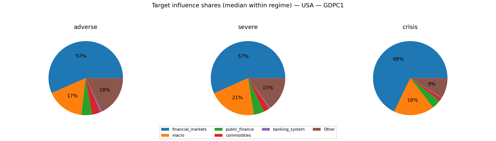

#### CPIAUCSL
- transform=yoy_log_pct; features=daily_shortlist; test_r2=0.025; coef_coverage≈62.2%
- WARNING: Low test $R^2$: treat regime/attribution patterns as low confidence.
- Ignored non-simulated features (often AR lags): CPIAUCSL_lag1, CPIAUCSL_lag2

Typical projected target impact (median with q10/q90; arbitrary units)
- baseline: -0.162 [-5.824, +5.568]
- adverse: +0.198 [-9.087, +9.193]
- severe: +0.157 [-12.193, +12.313]
- crisis: -0.647 [-14.536, +16.252]

Influence share decomposition by block (median share with q10/q90 within regime)
**adverse**
- commodities:  61.8% [  5.8%,  93.5%]
- macro:  10.1% [  0.3%,  55.4%]
- public_finance:   6.3% [  0.2%,  33.9%]
- financial_markets:   5.0% [  0.2%,  34.3%]
- banking_system:   0.1% [  0.0%,   0.7%]

**severe**
- commodities:  66.9% [  3.8%,  95.1%]
- macro:  12.8% [  0.4%,  62.5%]
- financial_markets:   4.9% [  0.2%,  33.7%]
- public_finance:   3.3% [  0.1%,  21.6%]
- banking_system:   0.1% [  0.0%,   0.4%]

**crisis**
- commodities:  67.1% [  5.1%,  94.9%]
- macro:  13.6% [  0.5%,  60.8%]
- financial_markets:   6.1% [  0.4%,  40.5%]
- public_finance:   2.2% [  0.1%,  13.7%]
- banking_system:   0.0% [  0.0%,   0.2%]

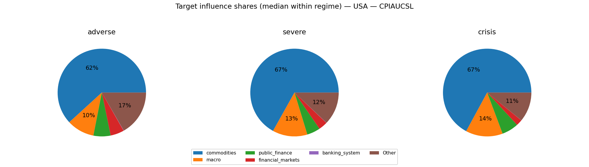

#### UNRATE
- transform=level; features=daily_shortlist; test_r2=0.479; coef_coverage≈27.9%
- Ignored non-simulated features (often AR lags): UNRATE_lag1, UNRATE_lag3, UNRATE_lag2

Typical projected target impact (median with q10/q90; arbitrary units)
- baseline: +0.012 [-1.669, +1.636]
- adverse: +0.075 [-2.574, +2.449]
- severe: -0.070 [-3.420, +3.286]
- crisis: -0.149 [-4.572, +4.302]

Influence share decomposition by block (median share with q10/q90 within regime)
**adverse**
- financial_markets:  28.0% [  1.2%,  75.9%]
- macro:  24.9% [  1.0%,  76.2%]
- public_finance:  15.3% [  0.7%,  54.0%]
- commodities:   4.7% [  0.2%,  32.0%]
- banking_system:   0.5% [  0.0%,   3.1%]

**severe**
- macro:  33.9% [  1.4%,  77.4%]
- financial_markets:  30.1% [  1.9%,  75.1%]
- public_finance:   8.9% [  0.4%,  40.7%]
- commodities:   5.6% [  0.1%,  35.0%]
- banking_system:   0.3% [  0.0%,   2.1%]

**crisis**
- financial_markets:  41.8% [  2.6%,  79.7%]
- macro:  31.7% [  2.2%,  82.0%]
- public_finance:   5.4% [  0.3%,  24.2%]
- commodities:   5.1% [  0.2%,  35.4%]
- banking_system:   0.2% [  0.0%,   1.2%]

### Severity share decomposition ("cake" slices)
Shares are fractions of $S_{L2}^2$ attributable to each block (using squared terminal cumulatives).
Interpretation: a large share means the block contributes more to the **simulation severity metric** used here.
This can happen because the block has larger tail dispersion / higher volatility / stronger cumulative drift over the horizon.
It does **not** by itself prove the block has larger causal impact on GDP/PD/LGD; for that, compute shares in propagated target space.
Reported as median share with quantile band q10/q90 within each regime.

**adverse**
- commodities:  25.2% [  1.1%,  79.8%]
- financial_markets:  24.6% [  0.9%,  79.2%]
- macro:  23.8% [  0.9%,  78.7%]
- public_finance:   0.7% [  0.0%,   4.1%]
- banking_system:   0.0% [  0.0%,   0.2%]

**severe**
- macro:  29.6% [  1.1%,  79.3%]
- commodities:  27.6% [  0.6%,  81.8%]
- financial_markets:  22.7% [  1.3%,  70.8%]
- public_finance:   0.4% [  0.0%,   2.2%]
- banking_system:   0.0% [  0.0%,   0.2%]

**crisis**
- financial_markets:  29.4% [  1.7%,  74.2%]
- macro:  25.2% [  1.9%,  77.1%]
- commodities:  22.1% [  0.9%,  76.2%]
- public_finance:   0.2% [  0.0%,   1.3%]
- banking_system:   0.0% [  0.0%,   0.1%]

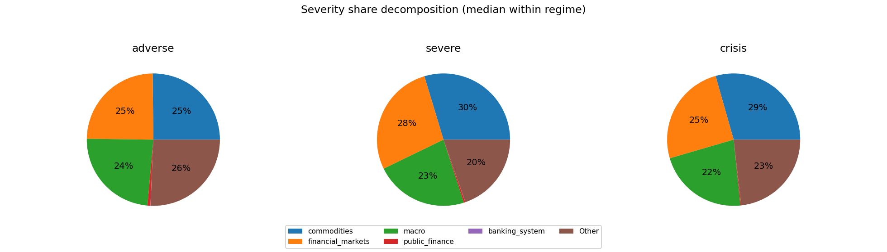

### Comovement snapshot (corr of terminal cumulative across draws)
Positive = blocks tend to move together across scenarios; negative = trade-offs.

- macro ↔ financial_markets: corr=-0.27
- commodities ↔ financial_markets: corr=+0.22
- macro ↔ banking_system: corr=+0.22
- macro ↔ public_finance: corr=+0.15
- public_finance ↔ banking_system: corr=+0.12
- commodities ↔ macro: corr=+0.12
- financial_markets ↔ public_finance: corr=-0.07
- financial_markets ↔ banking_system: corr=-0.06
- commodities ↔ public_finance: corr=+0.03
- commodities ↔ banking_system: corr=+0.00
