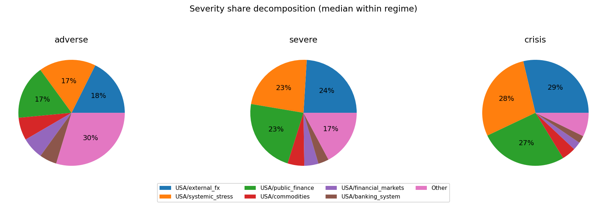
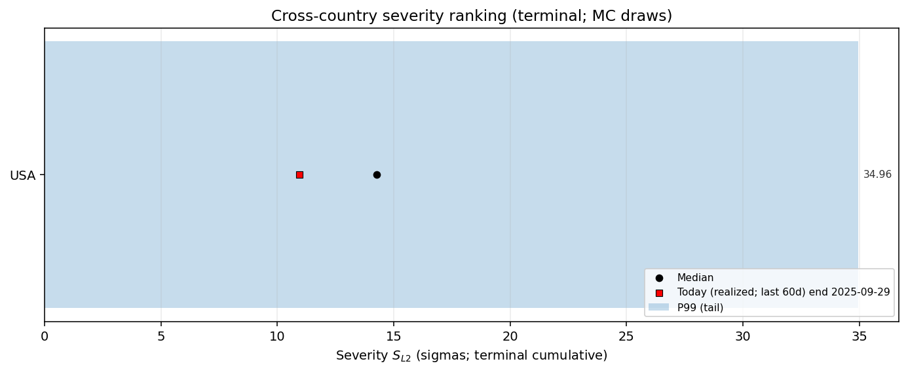

# MC Block Comovements & Regimes — _tmp_qb_small

This note summarizes how block aggregates co-move across Monte Carlo draws, and groups draws into coarse regime labels.

## Regime construction (simple, explainable)
- For each draw we compute each block’s **terminal cumulative block aggregate** (sigmas; z-space).
- We compute an economy-level severity score per draw: $S_{L2}=\sqrt{\sum_b (\text{cum}_b(T))^2}$. 
- Regimes are defined by severity quantiles: **baseline** (0–50%), **adverse** (50–80%), **severe** (80–95%), **crisis** (95–100%).

## All ISOs combined

Regime counts (draws):
- baseline: 2500
- adverse: 1500
- severe: 750
- crisis: 250

Top ISO/block columns by cross-draw variability:
- USA/external_fx, USA/systemic_stress, USA/public_finance, USA/commodities, USA/financial_markets, USA/banking_system, USA/real_estate, USA/macro

### Typical terminal cumulative (median with q10/q90; sigmas)

**baseline**
- USA/public_finance: -0.15 [-5.76, +5.76]
- USA/commodities: +0.12 [-5.99, +6.10]
- USA/systemic_stress: +0.09 [-5.40, +5.68]
- USA/macro: +0.06 [-1.72, +1.76]
- USA/banking_system: +0.04 [-4.65, +4.81]
- USA/real_estate: -0.04 [-1.97, +1.97]
- USA/financial_markets: +0.03 [-5.30, +5.78]
- USA/external_fx: +0.02 [-5.99, +6.17]
**adverse**
- USA/systemic_stress: +0.90 [-9.74, +9.78]
- USA/financial_markets: +0.51 [-7.70, +8.31]
- USA/public_finance: +0.36 [-9.79, +9.69]
- USA/real_estate: +0.07 [-2.09, +2.15]
- USA/external_fx: -0.05 [-10.23, +10.38]
- USA/macro: +0.05 [-1.82, +1.95]
- USA/commodities: -0.03 [-8.30, +8.54]
- USA/banking_system: -0.03 [-6.94, +6.65]
**severe**
- USA/public_finance: +0.80 [-13.90, +13.97]
- USA/external_fx: +0.69 [-14.38, +14.77]
- USA/banking_system: -0.47 [-8.69, +8.05]
- USA/systemic_stress: +0.27 [-13.61, +14.05]
- USA/commodities: -0.10 [-9.69, +8.35]
- USA/financial_markets: -0.09 [-9.28, +7.57]
- USA/macro: -0.03 [-1.97, +1.77]
- USA/real_estate: -0.01 [-1.97, +2.14]
**crisis**
- USA/systemic_stress: +9.39 [-19.08, +20.11]
- USA/public_finance: +5.09 [-19.75, +19.60]
- USA/external_fx: +4.54 [-20.35, +21.42]
- USA/banking_system: -0.46 [-11.25, +10.05]
- USA/real_estate: -0.16 [-2.17, +1.99]
- USA/macro: -0.03 [-1.77, +1.68]
- USA/financial_markets: -0.02 [-8.92, +8.54]
- USA/commodities: -0.02 [-9.42, +8.66]

### Severity share decomposition ("cake" slices; All ISOs combined)
Shares are fractions of $S_{L2}^2$ attributable to each block (using squared terminal cumulatives).
Interpretation: a large share means the block contributes more to the **simulation severity metric** used here.
This can happen because the block has larger tail dispersion / higher volatility / stronger cumulative drift over the horizon.
It does **not** by itself prove the block has larger causal impact on GDP/PD/LGD; for that, compute shares in propagated target space.
Reported as median share with quantile band q10/q90 within each regime.

**adverse**
- USA/external_fx:  17.7% [  0.9%,  47.4%]
- USA/systemic_stress:  17.3% [  1.7%,  41.6%]
- USA/public_finance:  16.5% [  1.0%,  42.4%]
- USA/commodities:   6.9% [  0.2%,  39.5%]
- USA/financial_markets:   6.7% [  0.2%,  34.8%]
- USA/banking_system:   5.3% [  0.2%,  24.7%]
- USA/real_estate:   0.4% [  0.0%,   2.6%]
- USA/macro:   0.3% [  0.0%,   2.0%]

**severe**
- USA/systemic_stress:  24.0% [  8.4%,  41.5%]
- USA/public_finance:  23.3% [  6.8%,  43.8%]
- USA/external_fx:  22.8% [  3.8%,  47.6%]
- USA/banking_system:   5.1% [  0.3%,  20.9%]
- USA/commodities:   4.3% [  0.2%,  26.2%]
- USA/financial_markets:   3.2% [  0.1%,  22.9%]
- USA/real_estate:   0.2% [  0.0%,   1.3%]
- USA/macro:   0.2% [  0.0%,   1.2%]

**crisis**
- USA/systemic_stress:  28.7% [ 15.3%,  42.1%]
- USA/external_fx:  28.4% [ 10.8%,  46.6%]
- USA/public_finance:  26.6% [ 13.0%,  39.4%]
- USA/banking_system:   4.3% [  0.5%,  14.6%]
- USA/commodities:   2.5% [  0.1%,  12.2%]
- USA/financial_markets:   2.3% [  0.1%,  11.0%]
- USA/real_estate:   0.1% [  0.0%,   0.8%]
- USA/macro:   0.1% [  0.0%,   0.5%]

Breakdowns (full list; includes "Other"):
- [SEVERITY_SHARE_BREAKDOWN__ALL_ISOS__adverse.csv](SEVERITY_SHARE_BREAKDOWN__ALL_ISOS__adverse.csv)
- [SEVERITY_SHARE_BREAKDOWN__ALL_ISOS__severe.csv](SEVERITY_SHARE_BREAKDOWN__ALL_ISOS__severe.csv)
- [SEVERITY_SHARE_BREAKDOWN__ALL_ISOS__crisis.csv](SEVERITY_SHARE_BREAKDOWN__ALL_ISOS__crisis.csv)

## Executive summary

- [EXEC_SUMMARY.md](EXEC_SUMMARY.md)
- 
- 

## USA

Regime counts (draws):
- baseline: 2500
- adverse: 1500
- severe: 750
- crisis: 250

Top blocks by cross-draw variability (used for comovement summaries):
- external_fx, systemic_stress, public_finance, commodities, financial_markets, banking_system, real_estate, macro

### Typical block terminal cumulative (median with q10/q90; sigmas)
(Signs depend on factor definitions; focus on magnitude + co-movement patterns.)

**baseline**
- public_finance: -0.15 [-5.76, +5.76]
- commodities: +0.12 [-5.99, +6.10]
- systemic_stress: +0.09 [-5.40, +5.68]
- macro: +0.06 [-1.72, +1.76]
- banking_system: +0.04 [-4.65, +4.81]
- real_estate: -0.04 [-1.97, +1.97]
- financial_markets: +0.03 [-5.30, +5.78]
- external_fx: +0.02 [-5.99, +6.17]
**adverse**
- systemic_stress: +0.90 [-9.74, +9.78]
- financial_markets: +0.51 [-7.70, +8.31]
- public_finance: +0.36 [-9.79, +9.69]
- real_estate: +0.07 [-2.09, +2.15]
- external_fx: -0.05 [-10.23, +10.38]
- macro: +0.05 [-1.82, +1.95]
- commodities: -0.03 [-8.30, +8.54]
- banking_system: -0.03 [-6.94, +6.65]
**severe**
- public_finance: +0.80 [-13.90, +13.97]
- external_fx: +0.69 [-14.38, +14.77]
- banking_system: -0.47 [-8.69, +8.05]
- systemic_stress: +0.27 [-13.61, +14.05]
- commodities: -0.10 [-9.69, +8.35]
- financial_markets: -0.09 [-9.28, +7.57]
- macro: -0.03 [-1.97, +1.77]
- real_estate: -0.01 [-1.97, +2.14]
**crisis**
- systemic_stress: +9.39 [-19.08, +20.11]
- public_finance: +5.09 [-19.75, +19.60]
- external_fx: +4.54 [-20.35, +21.42]
- banking_system: -0.46 [-11.25, +10.05]
- real_estate: -0.16 [-2.17, +1.99]
- macro: -0.03 [-1.77, +1.68]
- financial_markets: -0.02 [-8.92, +8.54]
- commodities: -0.02 [-9.42, +8.66]

### Outcome-space influence proxy (Step 4 targets)
This section projects simulated factor shocks into Step 4 targets using the stored linear coefficients.
Important: this is a **proxy** because Step 4 feature scaling may differ from the Step 12 simulation shock units.
We use **terminal cumulative standardized shocks** (sum of daily/monthly $z$ shocks) and ignore AR target lags when they are not simulated.

#### GDPC1
- transform=yoy_log_pct; features=daily_shortlist; test_r2=0.054; coef_coverage≈14.1%
- WARNING: Low test $R^2$: treat regime/attribution patterns as low confidence.
- Ignored non-simulated features (often AR lags): GC.DOD.TOTL.GD.ZS_USA, GDPC1_lag1, BIS_LBS_Household_Loans_USA, GDPC1_lag3, DFF, GDPC1_lag2, DCOILBRENTEU

Typical projected target impact (median with q10/q90; arbitrary units)
- baseline: -0.140 [-4.195, +4.161]
- adverse: +0.044 [-5.813, +5.833]
- severe: +0.029 [-7.966, +7.847]
- crisis: -1.295 [-10.866, +10.615]

Influence share decomposition by block (median share with q10/q90 within regime)
**adverse**
Note: attribution is degenerate here (only one block has non-trivial mapped contribution); interpret shares as coverage/mapping-limited.
- systemic_stress: 100.0% [100.0%, 100.0%]

**severe**
Note: attribution is degenerate here (only one block has non-trivial mapped contribution); interpret shares as coverage/mapping-limited.
- systemic_stress: 100.0% [100.0%, 100.0%]

**crisis**
Note: attribution is degenerate here (only one block has non-trivial mapped contribution); interpret shares as coverage/mapping-limited.
- systemic_stress: 100.0% [100.0%, 100.0%]

Breakdowns (full list; includes "Other"):
- [TARGET_INFLUENCE_BREAKDOWN__USA__GDPC1__adverse.csv](TARGET%20INFLUENCE/TARGET_INFLUENCE_BREAKDOWN__USA__GDPC1__adverse.csv)
- [TARGET_INFLUENCE_BREAKDOWN__USA__GDPC1__severe.csv](TARGET%20INFLUENCE/TARGET_INFLUENCE_BREAKDOWN__USA__GDPC1__severe.csv)
- [TARGET_INFLUENCE_BREAKDOWN__USA__GDPC1__crisis.csv](TARGET%20INFLUENCE/TARGET_INFLUENCE_BREAKDOWN__USA__GDPC1__crisis.csv)

#### CPIAUCSL
- transform=yoy_log_pct; features=daily_shortlist; test_r2=0.025; coef_coverage≈4.7%
- WARNING: Low test $R^2$: treat regime/attribution patterns as low confidence.
- Ignored non-simulated features (often AR lags): CPIAUCSL_lag1, GC.DOD.TOTL.GD.ZS_USA, DCOILBRENTEU, DFF, BIS_LBS_Household_Loans_USA, CPIAUCSL_lag2

Typical projected target impact (median with q10/q90; arbitrary units)
- baseline: -0.030 [-0.910, +0.903]
- adverse: +0.010 [-1.261, +1.265]
- severe: +0.006 [-1.728, +1.702]
- crisis: -0.281 [-2.357, +2.303]

Influence share decomposition by block (median share with q10/q90 within regime)
**adverse**
Note: attribution is degenerate here (only one block has non-trivial mapped contribution); interpret shares as coverage/mapping-limited.
- systemic_stress: 100.0% [100.0%, 100.0%]

**severe**
Note: attribution is degenerate here (only one block has non-trivial mapped contribution); interpret shares as coverage/mapping-limited.
- systemic_stress: 100.0% [100.0%, 100.0%]

**crisis**
Note: attribution is degenerate here (only one block has non-trivial mapped contribution); interpret shares as coverage/mapping-limited.
- systemic_stress: 100.0% [100.0%, 100.0%]

Breakdowns (full list; includes "Other"):
- [TARGET_INFLUENCE_BREAKDOWN__USA__CPIAUCSL__adverse.csv](TARGET%20INFLUENCE/TARGET_INFLUENCE_BREAKDOWN__USA__CPIAUCSL__adverse.csv)
- [TARGET_INFLUENCE_BREAKDOWN__USA__CPIAUCSL__severe.csv](TARGET%20INFLUENCE/TARGET_INFLUENCE_BREAKDOWN__USA__CPIAUCSL__severe.csv)
- [TARGET_INFLUENCE_BREAKDOWN__USA__CPIAUCSL__crisis.csv](TARGET%20INFLUENCE/TARGET_INFLUENCE_BREAKDOWN__USA__CPIAUCSL__crisis.csv)

#### UNRATE
- transform=level; features=daily_shortlist; test_r2=0.479; coef_coverage≈3.5%
- Ignored non-simulated features (often AR lags): UNRATE_lag1, GC.DOD.TOTL.GD.ZS_USA, UNRATE_lag3, UNRATE_lag2, BIS_LBS_Household_Loans_USA, DFF, DCOILBRENTEU

Typical projected target impact (median with q10/q90; arbitrary units)
- baseline: +0.017 [-0.518, +0.522]
- adverse: -0.006 [-0.725, +0.723]
- severe: -0.004 [-0.976, +0.991]
- crisis: +0.161 [-1.320, +1.351]

Influence share decomposition by block (median share with q10/q90 within regime)
**adverse**
Note: attribution is degenerate here (only one block has non-trivial mapped contribution); interpret shares as coverage/mapping-limited.
- systemic_stress: 100.0% [100.0%, 100.0%]

**severe**
Note: attribution is degenerate here (only one block has non-trivial mapped contribution); interpret shares as coverage/mapping-limited.
- systemic_stress: 100.0% [100.0%, 100.0%]

**crisis**
Note: attribution is degenerate here (only one block has non-trivial mapped contribution); interpret shares as coverage/mapping-limited.
- systemic_stress: 100.0% [100.0%, 100.0%]

Breakdowns (full list; includes "Other"):
- [TARGET_INFLUENCE_BREAKDOWN__USA__UNRATE__adverse.csv](TARGET%20INFLUENCE/TARGET_INFLUENCE_BREAKDOWN__USA__UNRATE__adverse.csv)
- [TARGET_INFLUENCE_BREAKDOWN__USA__UNRATE__severe.csv](TARGET%20INFLUENCE/TARGET_INFLUENCE_BREAKDOWN__USA__UNRATE__severe.csv)
- [TARGET_INFLUENCE_BREAKDOWN__USA__UNRATE__crisis.csv](TARGET%20INFLUENCE/TARGET_INFLUENCE_BREAKDOWN__USA__UNRATE__crisis.csv)

### Severity share decomposition ("cake" slices)
Shares are fractions of $S_{L2}^2$ attributable to each block (using squared terminal cumulatives).
Interpretation: a large share means the block contributes more to the **simulation severity metric** used here.
This can happen because the block has larger tail dispersion / higher volatility / stronger cumulative drift over the horizon.
It does **not** by itself prove the block has larger causal impact on GDP/PD/LGD; for that, compute shares in propagated target space.
Reported as median share with quantile band q10/q90 within each regime.

**adverse**
- external_fx:  17.7% [  0.9%,  47.4%]
- systemic_stress:  17.3% [  1.7%,  41.6%]
- public_finance:  16.5% [  1.0%,  42.4%]
- commodities:   6.9% [  0.2%,  39.5%]
- financial_markets:   6.7% [  0.2%,  34.8%]
- banking_system:   5.3% [  0.2%,  24.7%]
- real_estate:   0.4% [  0.0%,   2.6%]
- macro:   0.3% [  0.0%,   2.0%]

**severe**
- systemic_stress:  24.0% [  8.4%,  41.5%]
- public_finance:  23.3% [  6.8%,  43.8%]
- external_fx:  22.8% [  3.8%,  47.6%]
- banking_system:   5.1% [  0.3%,  20.9%]
- commodities:   4.3% [  0.2%,  26.2%]
- financial_markets:   3.2% [  0.1%,  22.9%]
- real_estate:   0.2% [  0.0%,   1.3%]
- macro:   0.2% [  0.0%,   1.2%]

**crisis**
- systemic_stress:  28.7% [ 15.3%,  42.1%]
- external_fx:  28.4% [ 10.8%,  46.6%]
- public_finance:  26.6% [ 13.0%,  39.4%]
- banking_system:   4.3% [  0.5%,  14.6%]
- commodities:   2.5% [  0.1%,  12.2%]
- financial_markets:   2.3% [  0.1%,  11.0%]
- real_estate:   0.1% [  0.0%,   0.8%]
- macro:   0.1% [  0.0%,   0.5%]

Breakdowns (full list; includes "Other"):
- [SEVERITY_SHARE_BREAKDOWN__USA__adverse.csv](SEVERITY_SHARE_BREAKDOWN__USA__adverse.csv)
- [SEVERITY_SHARE_BREAKDOWN__USA__severe.csv](SEVERITY_SHARE_BREAKDOWN__USA__severe.csv)
- [SEVERITY_SHARE_BREAKDOWN__USA__crisis.csv](SEVERITY_SHARE_BREAKDOWN__USA__crisis.csv)

### Comovement snapshot (corr of terminal cumulative across draws)
Positive = blocks tend to move together across scenarios; negative = trade-offs.

- systemic_stress ↔ public_finance: corr=+0.83
- external_fx ↔ systemic_stress: corr=+0.76
- external_fx ↔ public_finance: corr=+0.73
- systemic_stress ↔ banking_system: corr=-0.58
- public_finance ↔ banking_system: corr=-0.55
- external_fx ↔ banking_system: corr=-0.45
- systemic_stress ↔ financial_markets: corr=+0.25
- public_finance ↔ commodities: corr=+0.24
- commodities ↔ financial_markets: corr=+0.22
- systemic_stress ↔ commodities: corr=+0.21
- public_finance ↔ financial_markets: corr=+0.16
- financial_markets ↔ macro: corr=+0.13
