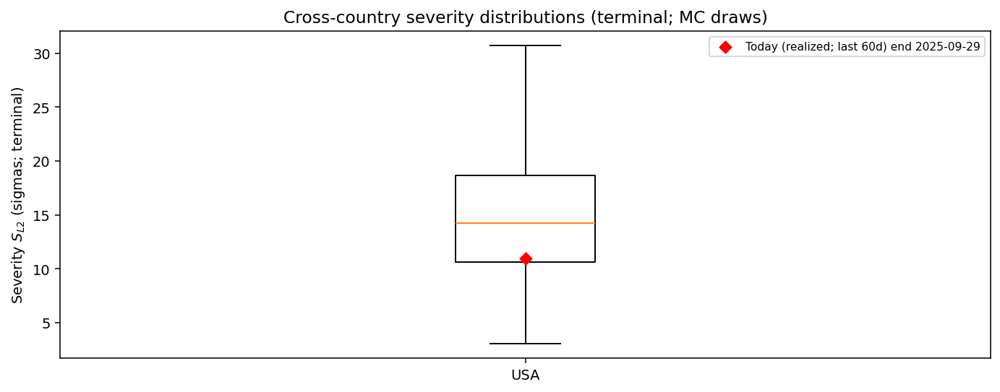
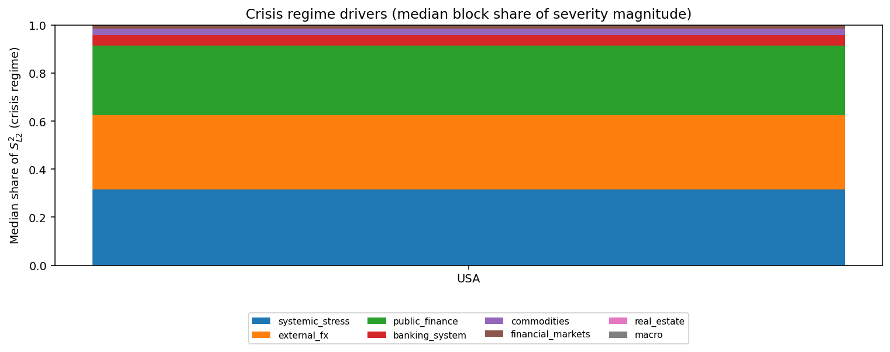

# Monte Carlo Cross-Country Executive Summary — _tmp_qb_small2

This is generated from existing Step 12 block-aggregate matrices (z-space).
It is tail-focused and designed for cross-country comparability.

## Tail severity ranking
(Median and P99 of $S_{L2}$ across draws; higher = more severe simulated stress.)

| ISO | Median | P99 |
|---|---:|---:|
| USA | 14.25 | 34.96 |

## Today vs simulated distribution
(Realized $S_{L2}$ computed from frozen inputs; percentile computed within each ISO’s MC draw distribution.)

| ISO | Today $S_{L2}$ | Today percentile | MC median | MC P99 |
|---|---:|---:|---:|---:|
| USA | 10.94 |  27.3% | 14.25 | 34.96 |

## Crisis driver concentration
(Computed from median crisis-regime shares of $S_{L2}^2$ by block; HHI near 1 = concentrated.)

| ISO | Top block | Top share | HHI |
|---|---|---:|---:|
| USA | systemic_stress |  31.6% | 0.28 |

## Figures
- 
- 
- 

## Realized today marker
Computed over the last 60 days ending 2025-09-29: standardized residuals × Dt, scaled by vol_t0, low-frequency gated, then **demeaned per factor** before cumulation (to match mean-zero MC innovations), aggregated to blocks in z-space.
