# MC Block Comovements & Regimes — alternative

This note summarizes how block aggregates co-move across Monte Carlo draws, and groups draws into coarse regime labels.

## Regime construction (simple, explainable)
- For each draw we compute each block’s **terminal cumulative block aggregate** (sigmas; z-space).
- We compute an economy-level severity score per draw: $S_{L2}=\sqrt{\sum_b (\text{cum}_b(T))^2}$. 
- Regimes are defined by severity quantiles: **baseline** (0–50%), **adverse** (50–80%), **severe** (80–95%), **crisis** (95–100%).

## All ISOs combined

Regime counts (draws):
- baseline: 2500
- adverse: 1500
- severe: 750
- crisis: 250

Top ISO/block columns by cross-draw variability:
- DEU/banking_system, USA/systemic_stress, FRA/banking_system, USA/external_fx, ITA/banking_system, ESP/banking_system, FRA/public_finance, USA/public_finance, FRA/systemic_stress, ESP/systemic_stress, ITA/systemic_stress, DEU/systemic_stress

### Typical terminal cumulative (median with q10/q90; sigmas)

**baseline**
- ITA/banking_system: +0.18 [-8.41, +8.76]
- FRA/banking_system: +0.15 [-8.29, +8.54]
- USA/public_finance: +0.12 [-7.57, +7.79]
- ESP/banking_system: -0.11 [-8.47, +8.25]
- FRA/public_finance: +0.09 [-8.32, +8.49]
- USA/systemic_stress: +0.08 [-7.89, +8.23]
- DEU/systemic_stress: +0.08 [-5.73, +5.63]
- DEU/banking_system: -0.04 [-8.86, +9.08]
- FRA/systemic_stress: +0.04 [-6.00, +6.12]
- USA/external_fx: +0.01 [-7.98, +8.06]
**adverse**
- ITA/systemic_stress: -0.71 [-8.43, +8.30]
- DEU/banking_system: -0.58 [-11.82, +11.27]
- FRA/systemic_stress: -0.40 [-8.91, +8.39]
- DEU/systemic_stress: -0.38 [-8.47, +7.78]
- USA/public_finance: -0.38 [-10.76, +10.22]
- ESP/banking_system: -0.26 [-11.38, +10.44]
- ESP/systemic_stress: -0.23 [-8.73, +8.24]
- FRA/banking_system: -0.21 [-10.31, +10.80]
- FRA/public_finance: -0.18 [-11.07, +10.53]
- ITA/banking_system: +0.16 [-11.24, +10.46]
**severe**
- USA/systemic_stress: +1.51 [-13.35, +14.47]
- ESP/systemic_stress: +0.99 [-11.23, +10.52]
- DEU/systemic_stress: +0.79 [-10.45, +9.96]
- FRA/systemic_stress: +0.71 [-11.15, +11.02]
- ITA/systemic_stress: +0.51 [-11.37, +11.10]
- ESP/banking_system: -0.42 [-13.01, +12.02]
- FRA/banking_system: -0.34 [-13.90, +14.20]
- DEU/banking_system: -0.11 [-13.49, +12.61]
- USA/public_finance: +0.10 [-13.88, +13.18]
- FRA/public_finance: -0.08 [-12.04, +12.40]
**crisis**
- ITA/systemic_stress: +1.97 [-14.12, +15.53]
- FRA/systemic_stress: +1.56 [-13.72, +14.74]
- DEU/systemic_stress: +1.48 [-12.97, +13.81]
- DEU/banking_system: +1.30 [-15.58, +16.10]
- FRA/banking_system: +1.28 [-16.38, +16.32]
- ESP/systemic_stress: +0.93 [-13.49, +14.87]
- FRA/public_finance: +0.85 [-13.98, +13.66]
- USA/external_fx: +0.84 [-16.87, +18.07]
- USA/public_finance: +0.38 [-16.28, +17.93]
- USA/systemic_stress: -0.27 [-17.16, +18.81]

### Severity share decomposition ("cake" slices; All ISOs combined)
Shares are fractions of $S_{L2}^2$ attributable to each block (using squared terminal cumulatives).
Interpretation: a large share means the block contributes more to the **simulation severity metric** used here.
This can happen because the block has larger tail dispersion / higher volatility / stronger cumulative drift over the horizon.
It does **not** by itself prove the block has larger causal impact on GDP/PD/LGD; for that, compute shares in propagated target space.
Reported as median share with quantile band q10/q90 within each regime.

**adverse**
- USA/systemic_stress:   6.4% [  0.3%,  24.7%]
- DEU/banking_system:   6.3% [  0.2%,  29.6%]
- USA/external_fx:   5.8% [  0.2%,  23.3%]
- FRA/public_finance:   5.4% [  0.2%,  26.9%]
- USA/public_finance:   5.4% [  0.2%,  23.6%]
- ESP/banking_system:   5.3% [  0.2%,  27.2%]
- FRA/banking_system:   4.8% [  0.2%,  23.4%]
- ITA/banking_system:   4.8% [  0.2%,  26.6%]
- ESP/systemic_stress:   3.8% [  0.1%,  14.2%]
- ITA/systemic_stress:   3.8% [  0.2%,  13.7%]

**severe**
- USA/systemic_stress:   7.7% [  0.5%,  24.7%]
- USA/public_finance:   6.9% [  0.2%,  23.7%]
- USA/external_fx:   6.3% [  0.3%,  27.0%]
- DEU/banking_system:   5.5% [  0.2%,  25.5%]
- FRA/banking_system:   5.4% [  0.2%,  27.7%]
- ESP/systemic_stress:   4.5% [  0.2%,  14.8%]
- ESP/banking_system:   4.5% [  0.2%,  22.4%]
- ITA/systemic_stress:   4.4% [  0.2%,  15.0%]
- FRA/systemic_stress:   4.2% [  0.1%,  16.1%]
- FRA/public_finance:   4.2% [  0.1%,  22.9%]

**crisis**
- USA/systemic_stress:   8.3% [  0.4%,  27.8%]
- USA/public_finance:   7.4% [  0.2%,  24.2%]
- USA/external_fx:   7.2% [  0.2%,  26.8%]
- FRA/banking_system:   6.4% [  0.3%,  24.3%]
- DEU/banking_system:   6.3% [  0.2%,  24.6%]
- FRA/systemic_stress:   5.2% [  0.3%,  16.4%]
- ESP/systemic_stress:   4.5% [  0.2%,  16.8%]
- ITA/systemic_stress:   4.5% [  0.3%,  16.1%]
- DEU/systemic_stress:   4.1% [  0.1%,  15.1%]
- ESP/banking_system:   3.7% [  0.2%,  22.0%]

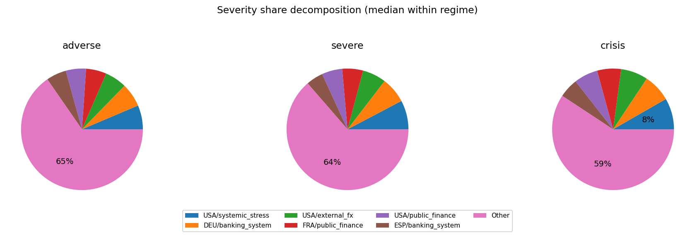

## Executive summary

- [EXEC_SUMMARY.md](EXEC_SUMMARY.md)
- 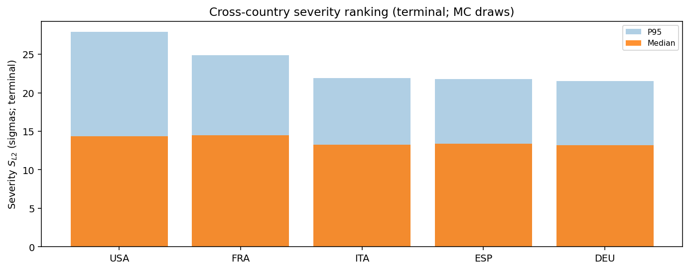
- 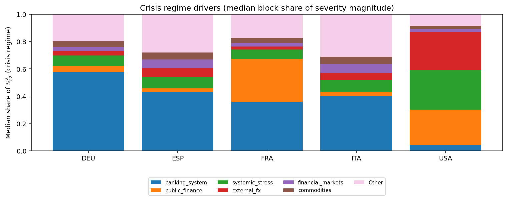
- 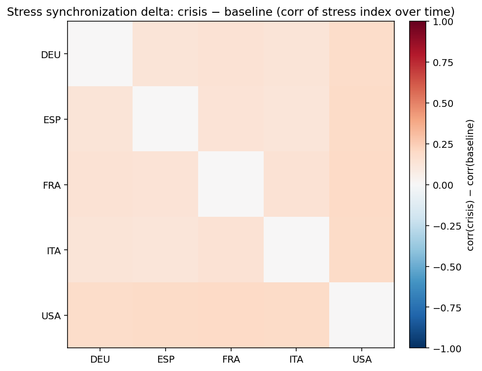

## DEU

Regime counts (draws):
- baseline: 2500
- adverse: 1500
- severe: 750
- crisis: 250

Top blocks by cross-draw variability (used for comovement summaries):
- banking_system, systemic_stress, commodities, public_finance, external_fx, financial_markets, macro, real_estate

### Typical block terminal cumulative (median with q10/q90; sigmas)
(Signs depend on factor definitions; focus on magnitude + co-movement patterns.)

**baseline**
- commodities: +0.30 [-5.45, +5.51]
- public_finance: +0.13 [-5.05, +4.82]
- financial_markets: -0.08 [-4.62, +4.55]
- systemic_stress: +0.06 [-5.52, +5.57]
- banking_system: -0.04 [-6.68, +6.59]
- external_fx: +0.03 [-5.00, +5.17]
- real_estate: +0.01 [-1.38, +1.36]
- macro: +0.01 [-2.37, +2.33]
**adverse**
- financial_markets: +0.22 [-5.92, +6.25]
- external_fx: -0.16 [-6.88, +6.97]
- public_finance: +0.16 [-7.13, +7.40]
- commodities: +0.14 [-7.59, +7.91]
- systemic_stress: +0.03 [-8.88, +8.51]
- real_estate: +0.03 [-1.35, +1.44]
- macro: -0.03 [-2.58, +2.67]
- banking_system: -0.02 [-11.20, +11.13]
**severe**
- banking_system: -1.11 [-15.55, +15.49]
- financial_markets: -0.50 [-7.03, +7.31]
- systemic_stress: -0.24 [-10.85, +9.61]
- macro: -0.17 [-2.92, +2.51]
- external_fx: -0.17 [-7.63, +7.91]
- commodities: -0.13 [-8.62, +8.61]
- public_finance: -0.12 [-8.50, +8.78]
- real_estate: -0.02 [-1.34, +1.33]
**crisis**
- banking_system: -5.86 [-21.73, +22.19]
- commodities: +0.72 [-9.19, +9.24]
- systemic_stress: +0.65 [-12.53, +11.74]
- public_finance: +0.46 [-9.08, +8.48]
- macro: -0.26 [-2.91, +2.82]
- financial_markets: -0.22 [-8.57, +7.16]
- real_estate: -0.06 [-1.41, +1.35]
- external_fx: +0.01 [-10.17, +7.60]

### Outcome-space influence proxy (Step 4 targets)
This section projects simulated factor shocks into Step 4 targets using the stored linear coefficients.
Important: this is a **proxy** because Step 4 feature scaling may differ from the Step 12 simulation shock units.
We use **terminal cumulative standardized shocks** (sum of daily/monthly $z$ shocks) and ignore AR target lags when they are not simulated.

#### DEU_GDP_EUROSTAT
- transform=yoy_log_pct; features=daily_shortlist; test_r2=-0.155; coef_coverage≈17.3%
- WARNING: Low test $R^2$: treat regime/attribution patterns as low confidence.
- Ignored non-simulated features (often AR lags): DEU_GDP_EUROSTAT_lag1, GC.DOD.TOTL.GD.ZS_DEU, ECBDFR, DEU_GDP_EUROSTAT_lag3, DEU_GDP_EUROSTAT_lag2

Typical projected target impact (median with q10/q90; arbitrary units)
- baseline: -0.055 [-4.227, +3.948]
- adverse: -0.060 [-5.019, +4.637]
- severe: -0.238 [-5.453, +5.658]
- crisis: +0.640 [-7.295, +6.113]

Influence share decomposition by block (median share with q10/q90 within regime)
**adverse**
- UNMAPPED: 100.0% [100.0%, 100.0%]

**severe**
- UNMAPPED: 100.0% [100.0%, 100.0%]

**crisis**
- UNMAPPED: 100.0% [100.0%, 100.0%]

#### DEU_UNRATE_EUROSTAT
- transform=level; features=daily_shortlist; test_r2=0.869; coef_coverage≈1.4%
- Ignored non-simulated features (often AR lags): DEU_UNRATE_EUROSTAT_lag1, DCOILBRENTEU, ECBDFR, GC.DOD.TOTL.GD.ZS_DEU, BIS_LBS_Household_Loans_DEU, BIS_LBS_Household_Loans_DEU_lag1

Typical projected target impact (median with q10/q90; arbitrary units)
- baseline: +0.002 [-0.158, +0.170]
- adverse: +0.002 [-0.186, +0.201]
- severe: +0.010 [-0.227, +0.219]
- crisis: -0.026 [-0.245, +0.293]

Influence share decomposition by block (median share with q10/q90 within regime)
**adverse**
- UNMAPPED: 100.0% [100.0%, 100.0%]

**severe**
- UNMAPPED: 100.0% [100.0%, 100.0%]

**crisis**
- UNMAPPED: 100.0% [100.0%, 100.0%]

#### DEUCPIALLMINMEI
- transform=yoy_log_pct; features=daily_shortlist; test_r2=0.694; coef_coverage≈4.9%
- Ignored non-simulated features (often AR lags): DEUCPIALLMINMEI_lag1, ECBDFR, DCOILBRENTEU, BIS_LBS_Household_Loans_DEU, GC.DOD.TOTL.GD.ZS_DEU, DEUCPIALLMINMEI_lag2

Typical projected target impact (median with q10/q90; arbitrary units)
- baseline: -0.009 [-0.654, +0.610]
- adverse: -0.009 [-0.776, +0.717]
- severe: -0.037 [-0.843, +0.875]
- crisis: +0.099 [-1.128, +0.945]

Influence share decomposition by block (median share with q10/q90 within regime)
**adverse**
- UNMAPPED: 100.0% [100.0%, 100.0%]

**severe**
- UNMAPPED: 100.0% [100.0%, 100.0%]

**crisis**
- UNMAPPED: 100.0% [100.0%, 100.0%]

### Severity share decomposition ("cake" slices)
Shares are fractions of $S_{L2}^2$ attributable to each block (using squared terminal cumulatives).
Interpretation: a large share means the block contributes more to the **simulation severity metric** used here.
This can happen because the block has larger tail dispersion / higher volatility / stronger cumulative drift over the horizon.
It does **not** by itself prove the block has larger causal impact on GDP/PD/LGD; for that, compute shares in propagated target space.
Reported as median share with quantile band q10/q90 within each regime.

**adverse**
- banking_system:  25.0% [  1.4%,  66.9%]
- systemic_stress:  10.7% [  0.4%,  49.0%]
- commodities:   8.5% [  0.4%,  39.1%]
- public_finance:   7.1% [  0.2%,  36.0%]
- external_fx:   6.1% [  0.2%,  32.8%]
- financial_markets:   4.8% [  0.2%,  26.4%]
- macro:   0.8% [  0.0%,   4.9%]
- real_estate:   0.2% [  0.0%,   1.5%]

**severe**
- banking_system:  39.2% [  2.6%,  76.1%]
- systemic_stress:   9.7% [  0.6%,  43.0%]
- commodities:   6.8% [  0.2%,  34.1%]
- public_finance:   6.0% [  0.1%,  32.0%]
- external_fx:   5.2% [  0.2%,  27.6%]
- financial_markets:   3.7% [  0.1%,  22.6%]
- macro:   0.5% [  0.0%,   3.6%]
- real_estate:   0.1% [  0.0%,   0.9%]

**crisis**
- banking_system:  57.5% [  9.2%,  84.7%]
- systemic_stress:   7.6% [  0.1%,  43.2%]
- public_finance:   4.6% [  0.1%,  23.5%]
- commodities:   4.4% [  0.2%,  29.0%]
- external_fx:   3.1% [  0.1%,  21.9%]
- financial_markets:   2.9% [  0.1%,  17.1%]
- macro:   0.5% [  0.0%,   2.1%]
- real_estate:   0.1% [  0.0%,   0.6%]

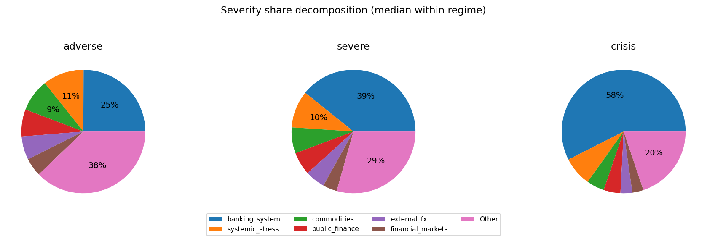

### Comovement snapshot (corr of terminal cumulative across draws)
Positive = blocks tend to move together across scenarios; negative = trade-offs.

- commodities ↔ public_finance: corr=+0.43
- banking_system ↔ financial_markets: corr=+0.30
- commodities ↔ external_fx: corr=-0.22
- banking_system ↔ macro: corr=+0.21
- macro ↔ real_estate: corr=+0.16
- systemic_stress ↔ public_finance: corr=+0.15
- systemic_stress ↔ external_fx: corr=+0.14
- external_fx ↔ financial_markets: corr=+0.13
- banking_system ↔ systemic_stress: corr=-0.13
- banking_system ↔ external_fx: corr=+0.12
- commodities ↔ real_estate: corr=+0.12
- banking_system ↔ public_finance: corr=-0.09

## ESP

Regime counts (draws):
- baseline: 2500
- adverse: 1500
- severe: 750
- crisis: 250

Top blocks by cross-draw variability (used for comovement summaries):
- banking_system, systemic_stress, commodities, external_fx, financial_markets, public_finance, real_estate, macro

### Typical block terminal cumulative (median with q10/q90; sigmas)
(Signs depend on factor definitions; focus on magnitude + co-movement patterns.)

**baseline**
- commodities: +0.25 [-5.87, +5.64]
- external_fx: +0.20 [-5.22, +5.37]
- macro: +0.09 [-1.65, +1.71]
- financial_markets: +0.05 [-4.92, +4.94]
- real_estate: +0.04 [-2.34, +2.47]
- public_finance: +0.02 [-4.01, +4.32]
- systemic_stress: -0.01 [-5.89, +5.74]
- banking_system: +0.01 [-6.78, +6.65]
**adverse**
- banking_system: -0.34 [-10.57, +10.57]
- systemic_stress: +0.26 [-8.99, +8.90]
- public_finance: -0.14 [-5.53, +5.63]
- financial_markets: +0.09 [-7.28, +7.73]
- real_estate: -0.07 [-2.59, +2.67]
- macro: +0.03 [-1.69, +1.72]
- commodities: +0.03 [-8.65, +8.19]
- external_fx: -0.03 [-8.10, +7.81]
**severe**
- banking_system: -1.00 [-14.84, +14.65]
- external_fx: -0.75 [-9.49, +9.01]
- financial_markets: -0.48 [-8.35, +9.50]
- public_finance: -0.43 [-6.86, +6.57]
- commodities: +0.22 [-9.58, +9.77]
- systemic_stress: +0.20 [-11.63, +10.94]
- real_estate: +0.06 [-2.66, +2.78]
- macro: -0.03 [-1.62, +1.73]
**crisis**
- external_fx: -1.59 [-11.57, +9.53]
- commodities: -0.95 [-10.73, +10.65]
- banking_system: -0.95 [-20.53, +19.90]
- public_finance: -0.60 [-8.36, +7.01]
- financial_markets: +0.09 [-11.16, +9.30]
- macro: +0.08 [-1.89, +1.63]
- real_estate: +0.08 [-3.04, +2.84]
- systemic_stress: -0.04 [-13.07, +14.61]

### Outcome-space influence proxy (Step 4 targets)
This section projects simulated factor shocks into Step 4 targets using the stored linear coefficients.
Important: this is a **proxy** because Step 4 feature scaling may differ from the Step 12 simulation shock units.
We use **terminal cumulative standardized shocks** (sum of daily/monthly $z$ shocks) and ignore AR target lags when they are not simulated.

#### ESP_GDP_EUROSTAT
- transform=yoy_log_pct; features=daily_shortlist; test_r2=0.009; coef_coverage≈22.1%
- WARNING: Low test $R^2$: treat regime/attribution patterns as low confidence.
- Ignored non-simulated features (often AR lags): ESP_GDP_EUROSTAT_lag1, GC.DOD.TOTL.GD.ZS_ESP, BIS_LBS_Household_Loans_ESP, ECBDFR, DCOILBRENTEU, ESP_GDP_EUROSTAT_lag3, ESP_GDP_EUROSTAT_lag2

Typical projected target impact (median with q10/q90; arbitrary units)
- baseline: -0.143 [-7.303, +7.027]
- adverse: -0.015 [-8.134, +7.367]
- severe: -0.720 [-7.981, +9.001]
- crisis: -0.496 [-12.116, +9.996]

Influence share decomposition by block (median share with q10/q90 within regime)
**adverse**
- UNMAPPED: 100.0% [100.0%, 100.0%]

**severe**
- UNMAPPED: 100.0% [100.0%, 100.0%]

**crisis**
- UNMAPPED: 100.0% [100.0%, 100.0%]

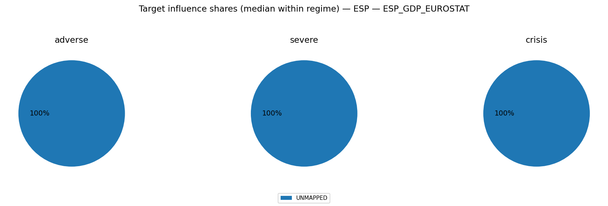

#### ESP_UNRATE_EUROSTAT
- transform=level; features=daily_shortlist; test_r2=0.966; coef_coverage≈9.3%
- Ignored non-simulated features (often AR lags): ESP_UNRATE_EUROSTAT_lag1, GC.DOD.TOTL.GD.ZS_ESP, DCOILBRENTEU, ECBDFR, BIS_LBS_Household_Loans_ESP_lag1, BIS_LBS_Household_Loans_ESP

Typical projected target impact (median with q10/q90; arbitrary units)
- baseline: +0.032 [-1.574, +1.635]
- adverse: +0.003 [-1.650, +1.822]
- severe: +0.161 [-2.016, +1.787]
- crisis: +0.111 [-2.239, +2.713]

Influence share decomposition by block (median share with q10/q90 within regime)
**adverse**
- UNMAPPED: 100.0% [100.0%, 100.0%]

**severe**
- UNMAPPED: 100.0% [100.0%, 100.0%]

**crisis**
- UNMAPPED: 100.0% [100.0%, 100.0%]

#### ESPCPIALLMINMEI
- transform=yoy_log_pct; features=daily_shortlist; test_r2=0.785; coef_coverage≈11.7%
- Ignored non-simulated features (often AR lags): ESPCPIALLMINMEI_lag1, ECBDFR, GC.DOD.TOTL.GD.ZS_ESP, DCOILBRENTEU, ESPCPIALLMINMEI_lag2, BIS_LBS_Household_Loans_ESP

Typical projected target impact (median with q10/q90; arbitrary units)
- baseline: -0.035 [-1.784, +1.716]
- adverse: -0.004 [-1.987, +1.799]
- severe: -0.176 [-1.949, +2.198]
- crisis: -0.121 [-2.959, +2.441]

Influence share decomposition by block (median share with q10/q90 within regime)
**adverse**
- UNMAPPED: 100.0% [100.0%, 100.0%]

**severe**
- UNMAPPED: 100.0% [100.0%, 100.0%]

**crisis**
- UNMAPPED: 100.0% [100.0%, 100.0%]

### Severity share decomposition ("cake" slices)
Shares are fractions of $S_{L2}^2$ attributable to each block (using squared terminal cumulatives).
Interpretation: a large share means the block contributes more to the **simulation severity metric** used here.
This can happen because the block has larger tail dispersion / higher volatility / stronger cumulative drift over the horizon.
It does **not** by itself prove the block has larger causal impact on GDP/PD/LGD; for that, compute shares in propagated target space.
Reported as median share with quantile band q10/q90 within each regime.

**adverse**
- banking_system:  18.8% [  0.8%,  64.6%]
- systemic_stress:  11.0% [  0.5%,  51.0%]
- external_fx:   9.2% [  0.3%,  39.1%]
- commodities:   9.0% [  0.4%,  45.2%]
- financial_markets:   7.2% [  0.3%,  34.0%]
- public_finance:   4.0% [  0.2%,  22.0%]
- real_estate:   0.9% [  0.0%,   5.3%]
- macro:   0.3% [  0.0%,   2.2%]

**severe**
- banking_system:  27.4% [  1.4%,  71.2%]
- systemic_stress:  13.0% [  0.5%,  50.7%]
- commodities:   7.3% [  0.3%,  38.8%]
- external_fx:   6.3% [  0.2%,  36.1%]
- financial_markets:   5.3% [  0.2%,  31.9%]
- public_finance:   4.2% [  0.1%,  17.2%]
- real_estate:   0.5% [  0.0%,   3.2%]
- macro:   0.2% [  0.0%,   1.4%]

**crisis**
- banking_system:  43.0% [  2.1%,  82.7%]
- systemic_stress:   8.2% [  0.2%,  50.4%]
- external_fx:   6.5% [  0.3%,  29.5%]
- financial_markets:   6.5% [  0.2%,  27.0%]
- commodities:   5.1% [  0.2%,  33.2%]
- public_finance:   2.7% [  0.1%,  15.1%]
- real_estate:   0.4% [  0.0%,   2.5%]
- macro:   0.1% [  0.0%,   1.3%]

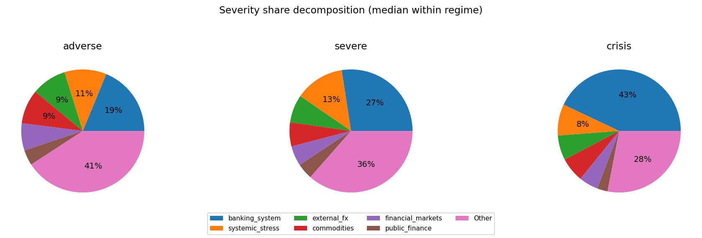

### Comovement snapshot (corr of terminal cumulative across draws)
Positive = blocks tend to move together across scenarios; negative = trade-offs.

- external_fx ↔ public_finance: corr=+0.44
- financial_markets ↔ public_finance: corr=+0.32
- systemic_stress ↔ financial_markets: corr=+0.32
- commodities ↔ public_finance: corr=+0.32
- commodities ↔ financial_markets: corr=+0.26
- external_fx ↔ financial_markets: corr=+0.24
- banking_system ↔ public_finance: corr=+0.16
- banking_system ↔ real_estate: corr=-0.13
- systemic_stress ↔ external_fx: corr=+0.12
- banking_system ↔ external_fx: corr=+0.10
- real_estate ↔ macro: corr=+0.10
- banking_system ↔ systemic_stress: corr=-0.09

## FRA

Regime counts (draws):
- baseline: 2500
- adverse: 1500
- severe: 750
- crisis: 250

Top blocks by cross-draw variability (used for comovement summaries):
- banking_system, public_finance, systemic_stress, commodities, external_fx, financial_markets, macro, real_estate

### Typical block terminal cumulative (median with q10/q90; sigmas)
(Signs depend on factor definitions; focus on magnitude + co-movement patterns.)

**baseline**
- commodities: +0.22 [-5.80, +5.85]
- financial_markets: +0.17 [-5.37, +5.45]
- systemic_stress: -0.14 [-6.11, +5.99]
- banking_system: -0.10 [-6.66, +6.41]
- macro: -0.06 [-2.40, +2.52]
- public_finance: +0.04 [-6.44, +6.70]
- external_fx: +0.04 [-5.64, +5.75]
- real_estate: +0.03 [-1.49, +1.50]
**adverse**
- systemic_stress: +0.48 [-9.15, +9.02]
- external_fx: -0.31 [-8.03, +7.71]
- commodities: +0.21 [-8.10, +8.44]
- banking_system: +0.20 [-10.39, +10.63]
- public_finance: +0.04 [-10.48, +10.15]
- real_estate: +0.02 [-1.49, +1.53]
- macro: -0.02 [-2.57, +2.57]
- financial_markets: -0.01 [-7.20, +7.67]
**severe**
- banking_system: +1.20 [-15.13, +14.80]
- commodities: -0.36 [-9.13, +9.23]
- external_fx: -0.31 [-8.47, +8.96]
- public_finance: +0.25 [-14.73, +14.19]
- systemic_stress: -0.14 [-11.80, +10.66]
- real_estate: -0.12 [-1.65, +1.49]
- macro: -0.06 [-2.65, +2.54]
- financial_markets: -0.01 [-8.42, +8.58]
**crisis**
- banking_system: +3.72 [-21.01, +20.88]
- systemic_stress: +1.65 [-10.71, +14.57]
- financial_markets: +0.55 [-7.24, +9.76]
- public_finance: -0.28 [-19.64, +19.70]
- macro: -0.18 [-2.83, +2.83]
- real_estate: +0.14 [-1.69, +1.71]
- commodities: +0.06 [-9.65, +9.26]
- external_fx: +0.05 [-9.53, +8.65]

### Outcome-space influence proxy (Step 4 targets)
This section projects simulated factor shocks into Step 4 targets using the stored linear coefficients.
Important: this is a **proxy** because Step 4 feature scaling may differ from the Step 12 simulation shock units.
We use **terminal cumulative standardized shocks** (sum of daily/monthly $z$ shocks) and ignore AR target lags when they are not simulated.

#### FRA_GDP_EUROSTAT
- transform=yoy_log_pct; features=daily_shortlist; test_r2=-0.084; coef_coverage≈23.5%
- WARNING: Low test $R^2$: treat regime/attribution patterns as low confidence.
- Ignored non-simulated features (often AR lags): FRA_GDP_EUROSTAT_lag1, FRA_GDP_EUROSTAT_lag3, GC.DOD.TOTL.GD.ZS_FRA, BIS_LBS_Household_Loans_FRA, FRA_GDP_EUROSTAT_lag2, ECBDFR, DCOILBRENTEU

Typical projected target impact (median with q10/q90; arbitrary units)
- baseline: -0.078 [-4.163, +3.792]
- adverse: +0.118 [-4.485, +4.686]
- severe: -0.079 [-5.452, +5.820]
- crisis: -0.173 [-7.647, +7.562]

Influence share decomposition by block (median share with q10/q90 within regime)
**adverse**
- UNMAPPED: 100.0% [100.0%, 100.0%]

**severe**
- UNMAPPED: 100.0% [100.0%, 100.0%]

**crisis**
- UNMAPPED: 100.0% [100.0%, 100.0%]

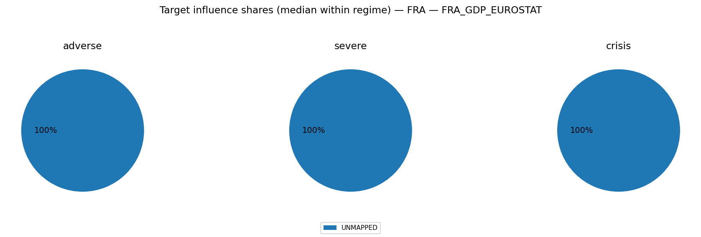

#### FRA_UNRATE_EUROSTAT
- transform=level; features=daily_shortlist; test_r2=0.797; coef_coverage≈2.8%
- Ignored non-simulated features (often AR lags): FRA_UNRATE_EUROSTAT_lag1, ECBDFR, GC.DOD.TOTL.GD.ZS_FRA, DCOILBRENTEU

Typical projected target impact (median with q10/q90; arbitrary units)
- baseline: +0.006 [-0.285, +0.313]
- adverse: -0.009 [-0.352, +0.337]
- severe: +0.006 [-0.438, +0.410]
- crisis: +0.013 [-0.569, +0.575]

Influence share decomposition by block (median share with q10/q90 within regime)
**adverse**
- UNMAPPED: 100.0% [100.0%, 100.0%]

**severe**
- UNMAPPED: 100.0% [100.0%, 100.0%]

**crisis**
- UNMAPPED: 100.0% [100.0%, 100.0%]

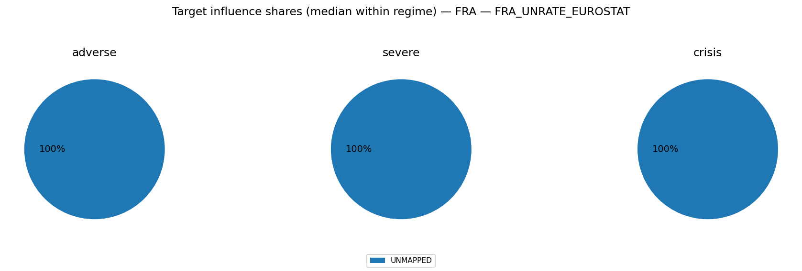

#### FRACPIALLMINMEI
- transform=yoy_log_pct; features=daily_shortlist; test_r2=0.652; coef_coverage≈1.7%
- Ignored non-simulated features (often AR lags): FRACPIALLMINMEI_lag1, GC.DOD.TOTL.GD.ZS_FRA, BIS_LBS_Household_Loans_FRA, DCOILBRENTEU, ECBDFR, FRACPIALLMINMEI_lag3

Typical projected target impact (median with q10/q90; arbitrary units)
- baseline: -0.004 [-0.216, +0.196]
- adverse: +0.006 [-0.232, +0.243]
- severe: -0.004 [-0.282, +0.301]
- crisis: -0.009 [-0.396, +0.392]

Influence share decomposition by block (median share with q10/q90 within regime)
**adverse**
- UNMAPPED: 100.0% [100.0%, 100.0%]

**severe**
- UNMAPPED: 100.0% [100.0%, 100.0%]

**crisis**
- UNMAPPED: 100.0% [100.0%, 100.0%]

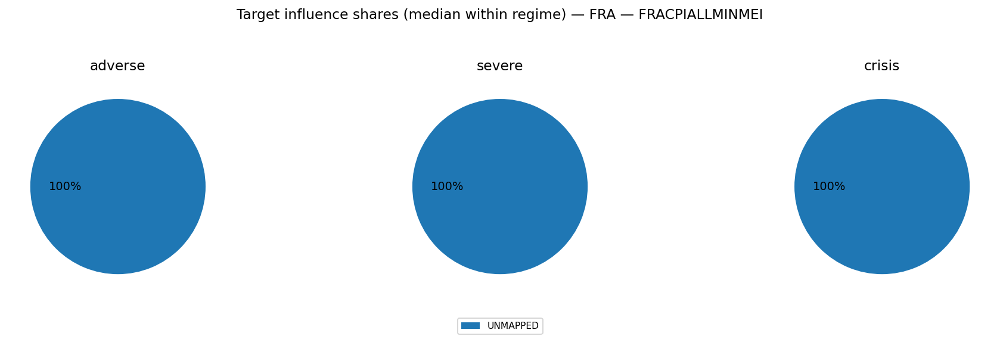

### Severity share decomposition ("cake" slices)
Shares are fractions of $S_{L2}^2$ attributable to each block (using squared terminal cumulatives).
Interpretation: a large share means the block contributes more to the **simulation severity metric** used here.
This can happen because the block has larger tail dispersion / higher volatility / stronger cumulative drift over the horizon.
It does **not** by itself prove the block has larger causal impact on GDP/PD/LGD; for that, compute shares in propagated target space.
Reported as median share with quantile band q10/q90 within each regime.

**adverse**
- banking_system:  16.6% [  0.8%,  53.9%]
- public_finance:  15.3% [  0.6%,  50.7%]
- systemic_stress:   9.9% [  0.4%,  43.6%]
- commodities:   6.8% [  0.2%,  37.7%]
- external_fx:   6.6% [  0.2%,  33.6%]
- financial_markets:   6.1% [  0.3%,  32.4%]
- macro:   0.6% [  0.0%,   3.9%]
- real_estate:   0.2% [  0.0%,   1.4%]

**severe**
- public_finance:  23.4% [  1.7%,  58.4%]
- banking_system:  23.3% [  1.6%,  58.9%]
- systemic_stress:   8.2% [  0.3%,  42.8%]
- commodities:   5.2% [  0.2%,  27.4%]
- financial_markets:   4.8% [  0.2%,  25.9%]
- external_fx:   4.8% [  0.1%,  26.1%]
- macro:   0.4% [  0.0%,   2.7%]
- real_estate:   0.2% [  0.0%,   0.9%]

**crisis**
- banking_system:  35.9% [  7.6%,  65.1%]
- public_finance:  31.5% [  2.3%,  59.0%]
- systemic_stress:   6.6% [  0.1%,  34.1%]
- commodities:   3.7% [  0.1%,  17.2%]
- financial_markets:   2.6% [  0.1%,  16.6%]
- external_fx:   2.2% [  0.0%,  18.4%]
- macro:   0.2% [  0.0%,   1.7%]
- real_estate:   0.1% [  0.0%,   0.6%]

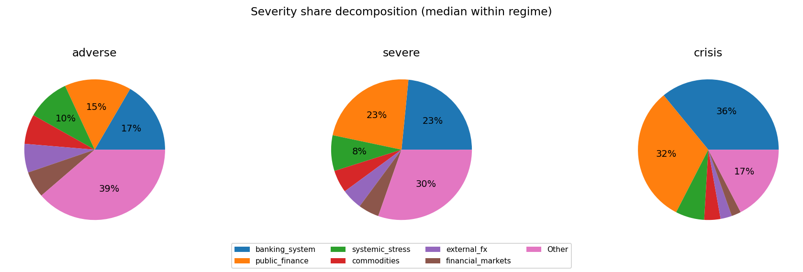

### Comovement snapshot (corr of terminal cumulative across draws)
Positive = blocks tend to move together across scenarios; negative = trade-offs.

- banking_system ↔ public_finance: corr=-0.55
- systemic_stress ↔ financial_markets: corr=+0.37
- external_fx ↔ financial_markets: corr=+0.27
- public_finance ↔ external_fx: corr=+0.24
- public_finance ↔ commodities: corr=+0.23
- public_finance ↔ systemic_stress: corr=+0.19
- banking_system ↔ macro: corr=+0.19
- banking_system ↔ systemic_stress: corr=-0.19
- public_finance ↔ financial_markets: corr=+0.18
- systemic_stress ↔ external_fx: corr=+0.15
- public_finance ↔ macro: corr=-0.14
- macro ↔ real_estate: corr=+0.12

## ITA

Regime counts (draws):
- baseline: 2500
- adverse: 1500
- severe: 750
- crisis: 250

Top blocks by cross-draw variability (used for comovement summaries):
- banking_system, systemic_stress, commodities, external_fx, financial_markets, public_finance, real_estate, macro

### Typical block terminal cumulative (median with q10/q90; sigmas)
(Signs depend on factor definitions; focus on magnitude + co-movement patterns.)

**baseline**
- public_finance: -0.16 [-4.07, +4.27]
- commodities: +0.07 [-5.76, +5.58]
- financial_markets: -0.04 [-5.23, +5.10]
- systemic_stress: -0.03 [-5.85, +5.63]
- banking_system: +0.03 [-6.73, +6.36]
- real_estate: +0.02 [-1.68, +1.73]
- macro: +0.01 [-1.50, +1.49]
- external_fx: +0.00 [-5.40, +5.48]
**adverse**
- banking_system: +0.62 [-10.42, +10.95]
- systemic_stress: -0.25 [-8.54, +8.88]
- external_fx: -0.24 [-7.93, +7.91]
- public_finance: -0.17 [-5.34, +5.46]
- commodities: -0.11 [-8.44, +8.62]
- financial_markets: -0.09 [-7.13, +7.10]
- macro: +0.05 [-1.49, +1.50]
- real_estate: +0.02 [-1.73, +1.85]
**severe**
- banking_system: -0.84 [-14.94, +14.31]
- external_fx: -0.78 [-10.26, +8.83]
- commodities: +0.39 [-10.04, +9.61]
- financial_markets: -0.34 [-8.84, +9.19]
- public_finance: -0.13 [-6.42, +6.25]
- systemic_stress: -0.07 [-11.55, +11.21]
- real_estate: -0.04 [-1.75, +1.84]
- macro: -0.04 [-1.56, +1.65]
**crisis**
- banking_system: +1.64 [-20.71, +20.50]
- financial_markets: +0.70 [-10.72, +11.69]
- external_fx: +0.62 [-9.22, +11.07]
- commodities: +0.40 [-11.36, +11.03]
- systemic_stress: +0.29 [-13.13, +14.92]
- macro: +0.21 [-1.46, +1.70]
- real_estate: +0.11 [-1.63, +1.80]
- public_finance: -0.03 [-6.48, +7.75]

### Outcome-space influence proxy (Step 4 targets)
This section projects simulated factor shocks into Step 4 targets using the stored linear coefficients.
Important: this is a **proxy** because Step 4 feature scaling may differ from the Step 12 simulation shock units.
We use **terminal cumulative standardized shocks** (sum of daily/monthly $z$ shocks) and ignore AR target lags when they are not simulated.

#### ITA_GDP_EUROSTAT
- transform=yoy_log_pct; features=daily_shortlist; test_r2=0.233; coef_coverage≈32.7%
- Ignored non-simulated features (often AR lags): ITA_GDP_EUROSTAT_lag1, ECBDFR, BIS_LBS_Household_Loans_ITA, ITA_GDP_EUROSTAT_lag3, DCOILBRENTEU

Typical projected target impact (median with q10/q90; arbitrary units)
- baseline: +0.087 [-4.997, +5.171]
- adverse: -0.090 [-5.889, +5.842]
- severe: -0.071 [-7.059, +6.410]
- crisis: +0.049 [-7.394, +8.219]

Influence share decomposition by block (median share with q10/q90 within regime)
**adverse**
- UNMAPPED: 100.0% [100.0%, 100.0%]

**severe**
- UNMAPPED: 100.0% [100.0%, 100.0%]

**crisis**
- UNMAPPED: 100.0% [100.0%, 100.0%]

#### ITA_UNRATE_EUROSTAT
- transform=level; features=daily_shortlist; test_r2=0.924; coef_coverage≈3.5%
- Ignored non-simulated features (often AR lags): ITA_UNRATE_EUROSTAT_lag1, DCOILBRENTEU, ECBDFR, BIS_LBS_Household_Loans_ITA, GC.DOD.TOTL.GD.ZS_ITA

Typical projected target impact (median with q10/q90; arbitrary units)
- baseline: -0.007 [-0.432, +0.418]
- adverse: +0.008 [-0.489, +0.493]
- severe: +0.006 [-0.536, +0.590]
- crisis: -0.004 [-0.687, +0.618]

Influence share decomposition by block (median share with q10/q90 within regime)
**adverse**
- UNMAPPED: 100.0% [100.0%, 100.0%]

**severe**
- UNMAPPED: 100.0% [100.0%, 100.0%]

**crisis**
- UNMAPPED: 100.0% [100.0%, 100.0%]

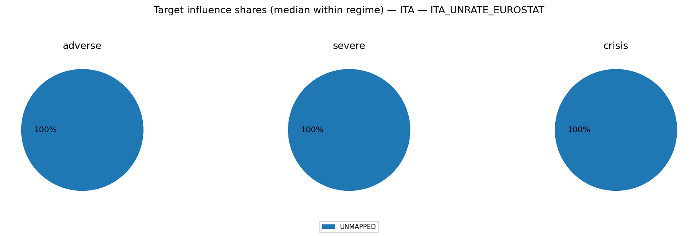

#### ITACPIALLMINMEI
- transform=yoy_log_pct; features=daily_shortlist; test_r2=0.874; coef_coverage≈1.7%
- Ignored non-simulated features (often AR lags): ITACPIALLMINMEI_lag1, GC.DOD.TOTL.GD.ZS_ITA, ECBDFR, DCOILBRENTEU, ITACPIALLMINMEI_lag3, BIS_LBS_Household_Loans_ITA

Typical projected target impact (median with q10/q90; arbitrary units)
- baseline: +0.004 [-0.205, +0.212]
- adverse: -0.004 [-0.241, +0.239]
- severe: -0.003 [-0.289, +0.262]
- crisis: +0.002 [-0.303, +0.336]

Influence share decomposition by block (median share with q10/q90 within regime)
**adverse**
- UNMAPPED: 100.0% [100.0%, 100.0%]

**severe**
- UNMAPPED: 100.0% [100.0%, 100.0%]

**crisis**
- UNMAPPED: 100.0% [100.0%, 100.0%]

### Severity share decomposition ("cake" slices)
Shares are fractions of $S_{L2}^2$ attributable to each block (using squared terminal cumulatives).
Interpretation: a large share means the block contributes more to the **simulation severity metric** used here.
This can happen because the block has larger tail dispersion / higher volatility / stronger cumulative drift over the horizon.
It does **not** by itself prove the block has larger causal impact on GDP/PD/LGD; for that, compute shares in propagated target space.
Reported as median share with quantile band q10/q90 within each regime.

**adverse**
- banking_system:  19.1% [  0.8%,  67.0%]
- systemic_stress:  10.9% [  0.4%,  49.1%]
- commodities:  10.5% [  0.5%,  45.4%]
- external_fx:   9.0% [  0.4%,  41.3%]
- financial_markets:   7.2% [  0.3%,  33.8%]
- public_finance:   4.2% [  0.2%,  20.7%]
- real_estate:   0.4% [  0.0%,   2.4%]
- macro:   0.3% [  0.0%,   1.7%]

**severe**
- banking_system:  27.3% [  1.8%,  70.9%]
- systemic_stress:  11.7% [  0.4%,  50.7%]
- external_fx:   8.3% [  0.3%,  35.8%]
- commodities:   7.8% [  0.3%,  40.4%]
- financial_markets:   7.3% [  0.3%,  32.3%]
- public_finance:   3.5% [  0.1%,  17.7%]
- real_estate:   0.2% [  0.0%,   1.6%]
- macro:   0.2% [  0.0%,   1.2%]

**crisis**
- banking_system:  40.2% [  2.6%,  83.6%]
- systemic_stress:   9.2% [  0.4%,  52.6%]
- financial_markets:   6.7% [  0.2%,  29.4%]
- commodities:   5.1% [  0.3%,  35.0%]
- external_fx:   4.8% [  0.2%,  25.4%]
- public_finance:   2.7% [  0.1%,  15.0%]
- macro:   0.1% [  0.0%,   0.8%]
- real_estate:   0.1% [  0.0%,   0.8%]

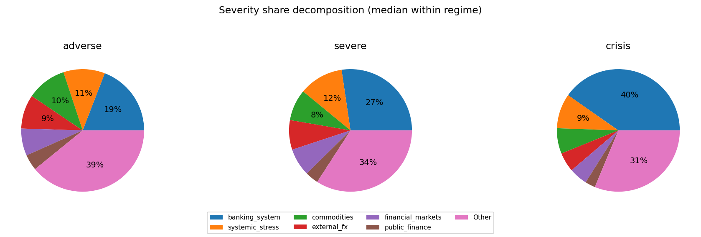

### Comovement snapshot (corr of terminal cumulative across draws)
Positive = blocks tend to move together across scenarios; negative = trade-offs.

- external_fx ↔ public_finance: corr=+0.43
- financial_markets ↔ public_finance: corr=+0.37
- systemic_stress ↔ financial_markets: corr=+0.35
- commodities ↔ public_finance: corr=+0.34
- external_fx ↔ financial_markets: corr=+0.31
- commodities ↔ financial_markets: corr=+0.18
- systemic_stress ↔ external_fx: corr=+0.13
- public_finance ↔ real_estate: corr=+0.13
- systemic_stress ↔ public_finance: corr=+0.11
- banking_system ↔ public_finance: corr=+0.10
- systemic_stress ↔ commodities: corr=+0.09
- banking_system ↔ commodities: corr=+0.07

## USA

Regime counts (draws):
- baseline: 2500
- adverse: 1500
- severe: 750
- crisis: 250

Top blocks by cross-draw variability (used for comovement summaries):
- systemic_stress, external_fx, public_finance, commodities, financial_markets, banking_system, real_estate, macro

### Typical block terminal cumulative (median with q10/q90; sigmas)
(Signs depend on factor definitions; focus on magnitude + co-movement patterns.)

**baseline**
- public_finance: -0.15 [-5.84, +5.76]
- commodities: +0.12 [-6.14, +6.15]
- macro: +0.06 [-1.72, +1.74]
- banking_system: +0.05 [-4.68, +4.81]
- real_estate: -0.04 [-1.97, +1.94]
- financial_markets: +0.03 [-5.24, +5.78]
- external_fx: -0.02 [-6.12, +6.20]
- systemic_stress: +0.01 [-5.97, +5.87]
**adverse**
- systemic_stress: +0.73 [-10.24, +10.38]
- financial_markets: +0.53 [-7.93, +8.30]
- public_finance: +0.14 [-9.87, +9.81]
- banking_system: -0.12 [-6.87, +6.61]
- real_estate: +0.09 [-2.11, +2.15]
- macro: +0.06 [-1.87, +1.95]
- commodities: +0.03 [-8.29, +8.38]
- external_fx: +0.03 [-10.26, +10.23]
**severe**
- systemic_stress: +3.44 [-14.35, +14.81]
- external_fx: +1.63 [-14.28, +14.93]
- public_finance: +1.43 [-13.99, +13.96]
- banking_system: -0.58 [-8.94, +8.13]
- commodities: -0.49 [-9.66, +8.19]
- real_estate: -0.01 [-1.90, +2.11]
- financial_markets: -0.01 [-8.84, +7.57]
- macro: -0.00 [-1.93, +1.74]
**crisis**
- systemic_stress: +10.10 [-21.01, +20.72]
- public_finance: +5.80 [-19.91, +19.69]
- external_fx: +3.69 [-20.10, +21.42]
- banking_system: -0.35 [-11.07, +10.81]
- real_estate: -0.15 [-2.17, +2.17]
- commodities: +0.13 [-8.71, +8.70]
- macro: -0.05 [-1.76, +1.74]
- financial_markets: -0.03 [-8.93, +8.66]

### Outcome-space influence proxy (Step 4 targets)
This section projects simulated factor shocks into Step 4 targets using the stored linear coefficients.
Important: this is a **proxy** because Step 4 feature scaling may differ from the Step 12 simulation shock units.
We use **terminal cumulative standardized shocks** (sum of daily/monthly $z$ shocks) and ignore AR target lags when they are not simulated.

#### GDPC1
- transform=yoy_log_pct; features=daily_shortlist; test_r2=0.054; coef_coverage≈14.1%
- WARNING: Low test $R^2$: treat regime/attribution patterns as low confidence.
- Ignored non-simulated features (often AR lags): GC.DOD.TOTL.GD.ZS_USA, GDPC1_lag1, BIS_LBS_Household_Loans_USA, GDPC1_lag3, DFF, GDPC1_lag2, DCOILBRENTEU

Typical projected target impact (median with q10/q90; arbitrary units)
- baseline: -0.157 [-4.653, +4.458]
- adverse: +0.163 [-5.653, +5.831]
- severe: -0.528 [-7.932, +7.595]
- crisis: -1.079 [-10.780, +10.211]

Influence share decomposition by block (median share with q10/q90 within regime)
**adverse**
- UNMAPPED: 100.0% [100.0%, 100.0%]

**severe**
- UNMAPPED: 100.0% [100.0%, 100.0%]

**crisis**
- UNMAPPED: 100.0% [100.0%, 100.0%]

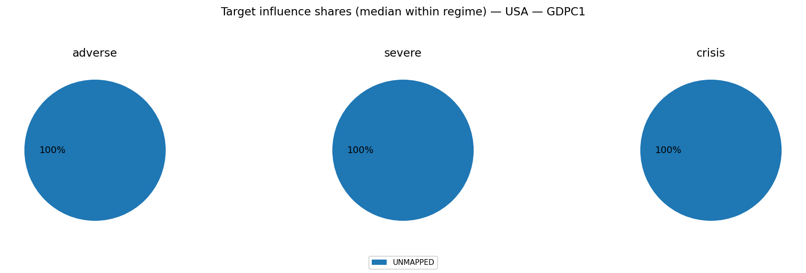

#### CPIAUCSL
- transform=yoy_log_pct; features=daily_shortlist; test_r2=0.025; coef_coverage≈4.7%
- WARNING: Low test $R^2$: treat regime/attribution patterns as low confidence.
- Ignored non-simulated features (often AR lags): CPIAUCSL_lag1, GC.DOD.TOTL.GD.ZS_USA, DCOILBRENTEU, DFF, BIS_LBS_Household_Loans_USA, CPIAUCSL_lag2

Typical projected target impact (median with q10/q90; arbitrary units)
- baseline: -0.034 [-1.009, +0.967]
- adverse: +0.035 [-1.226, +1.265]
- severe: -0.115 [-1.721, +1.648]
- crisis: -0.234 [-2.338, +2.215]

Influence share decomposition by block (median share with q10/q90 within regime)
**adverse**
- UNMAPPED: 100.0% [100.0%, 100.0%]

**severe**
- UNMAPPED: 100.0% [100.0%, 100.0%]

**crisis**
- UNMAPPED: 100.0% [100.0%, 100.0%]

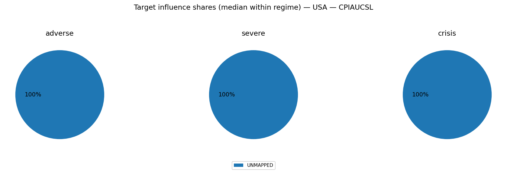

#### UNRATE
- transform=level; features=daily_shortlist; test_r2=0.479; coef_coverage≈3.5%
- Ignored non-simulated features (often AR lags): UNRATE_lag1, GC.DOD.TOTL.GD.ZS_USA, UNRATE_lag3, UNRATE_lag2, BIS_LBS_Household_Loans_USA, DFF, DCOILBRENTEU

Typical projected target impact (median with q10/q90; arbitrary units)
- baseline: +0.020 [-0.554, +0.579]
- adverse: -0.020 [-0.725, +0.703]
- severe: +0.066 [-0.945, +0.986]
- crisis: +0.134 [-1.270, +1.341]

Influence share decomposition by block (median share with q10/q90 within regime)
**adverse**
- UNMAPPED: 100.0% [100.0%, 100.0%]

**severe**
- UNMAPPED: 100.0% [100.0%, 100.0%]

**crisis**
- UNMAPPED: 100.0% [100.0%, 100.0%]

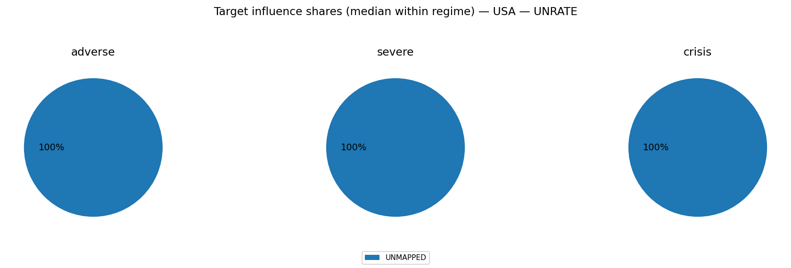

### Severity share decomposition ("cake" slices)
Shares are fractions of $S_{L2}^2$ attributable to each block (using squared terminal cumulatives).
Interpretation: a large share means the block contributes more to the **simulation severity metric** used here.
This can happen because the block has larger tail dispersion / higher volatility / stronger cumulative drift over the horizon.
It does **not** by itself prove the block has larger causal impact on GDP/PD/LGD; for that, compute shares in propagated target space.
Reported as median share with quantile band q10/q90 within each regime.

**adverse**
- systemic_stress:  19.1% [  1.8%,  44.8%]
- external_fx:  16.9% [  0.9%,  48.0%]
- public_finance:  16.1% [  1.0%,  42.4%]
- financial_markets:   6.7% [  0.2%,  35.3%]
- commodities:   6.6% [  0.3%,  37.5%]
- banking_system:   5.0% [  0.2%,  23.2%]
- real_estate:   0.4% [  0.0%,   2.6%]
- macro:   0.3% [  0.0%,   2.0%]

**severe**
- systemic_stress:  25.1% [  8.0%,  45.7%]
- public_finance:  22.5% [  6.1%,  41.8%]
- external_fx:  21.9% [  3.9%,  47.9%]
- banking_system:   5.3% [  0.3%,  20.4%]
- commodities:   4.3% [  0.2%,  25.5%]
- financial_markets:   3.1% [  0.1%,  22.0%]
- real_estate:   0.2% [  0.0%,   1.2%]
- macro:   0.2% [  0.0%,   1.1%]

**crisis**
- systemic_stress:  29.2% [ 15.2%,  47.1%]
- external_fx:  27.9% [ 10.6%,  46.3%]
- public_finance:  25.8% [ 12.1%,  40.3%]
- banking_system:   4.2% [  0.5%,  14.5%]
- commodities:   2.2% [  0.0%,  11.8%]
- financial_markets:   2.1% [  0.1%,  11.7%]
- real_estate:   0.1% [  0.0%,   0.9%]
- macro:   0.1% [  0.0%,   0.6%]

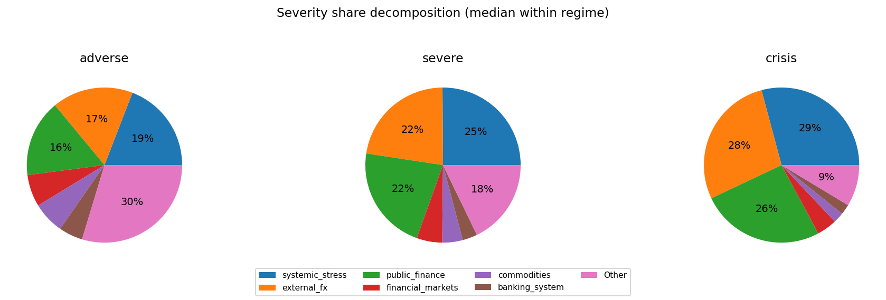

### Comovement snapshot (corr of terminal cumulative across draws)
Positive = blocks tend to move together across scenarios; negative = trade-offs.

- systemic_stress ↔ public_finance: corr=+0.81
- systemic_stress ↔ external_fx: corr=+0.74
- external_fx ↔ public_finance: corr=+0.73
- systemic_stress ↔ banking_system: corr=-0.60
- public_finance ↔ banking_system: corr=-0.55
- external_fx ↔ banking_system: corr=-0.45
- public_finance ↔ commodities: corr=+0.24
- systemic_stress ↔ financial_markets: corr=+0.23
- commodities ↔ financial_markets: corr=+0.22
- public_finance ↔ financial_markets: corr=+0.16
- financial_markets ↔ macro: corr=+0.13
- real_estate ↔ macro: corr=+0.13
