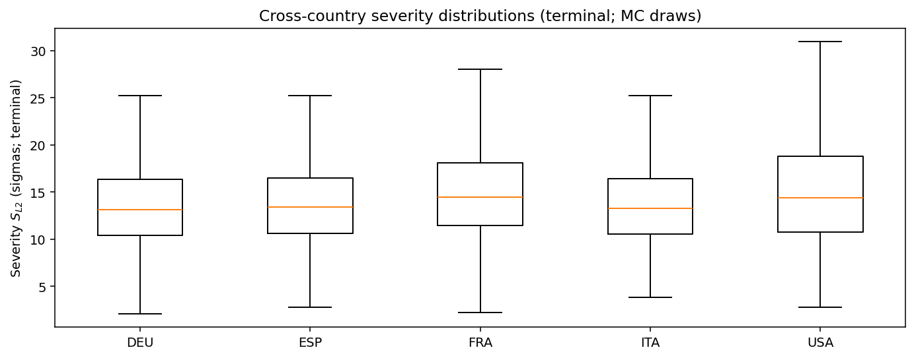
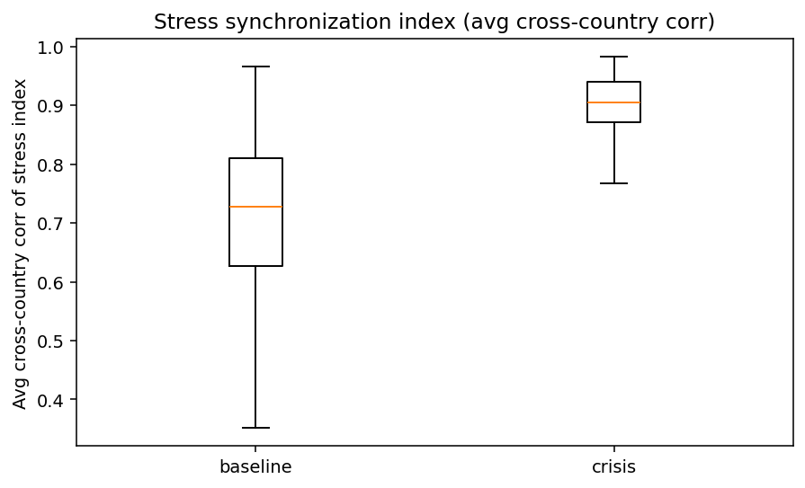

# Monte Carlo Cross-Country Executive Summary — alternative

This is generated from existing Step 12 block-aggregate matrices (z-space).
It is tail-focused and designed for cross-country comparability.

## Tail severity ranking
(Median and P95 of $S_{L2}$ across draws; higher = more severe simulated stress.)

| ISO | Median | P95 |
|---|---:|---:|
| USA | 14.39 | 27.88 |
| FRA | 14.50 | 24.85 |
| ITA | 13.25 | 21.92 |
| ESP | 13.41 | 21.75 |
| DEU | 13.17 | 21.52 |

## Figures
- 
- 
- 
- 
- 

## Synchronization takeaway
Average cross-country synchronization (median) rises from **+0.73** (baseline) to **+0.91** (crisis).
