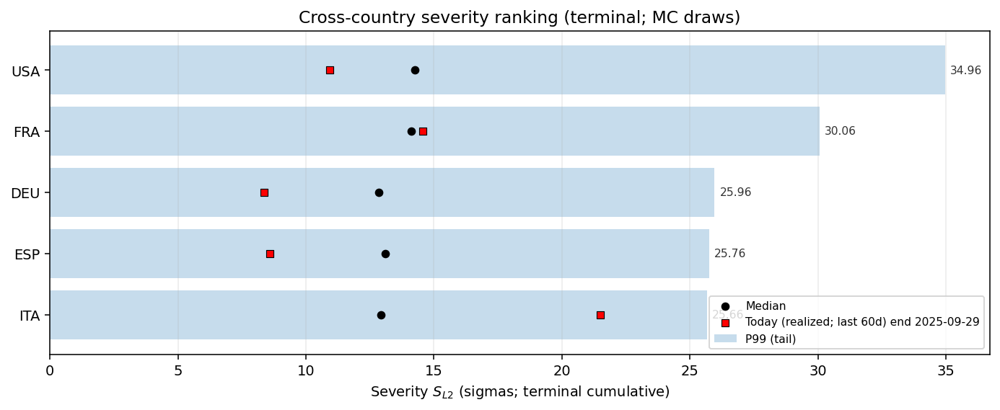
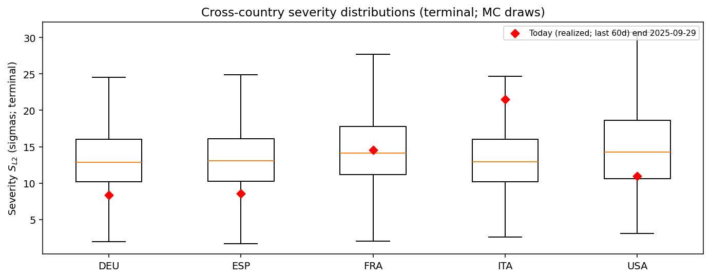
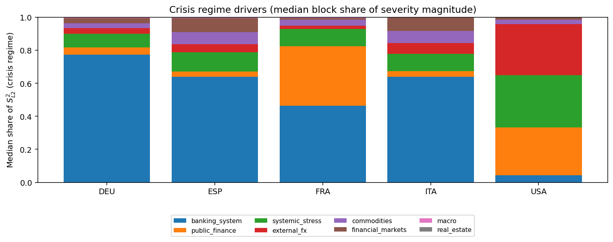
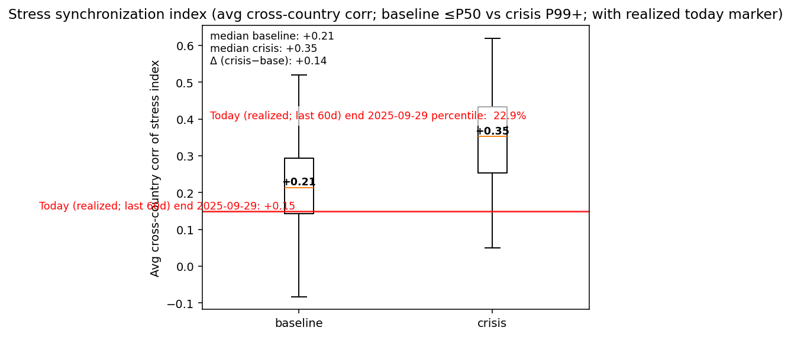
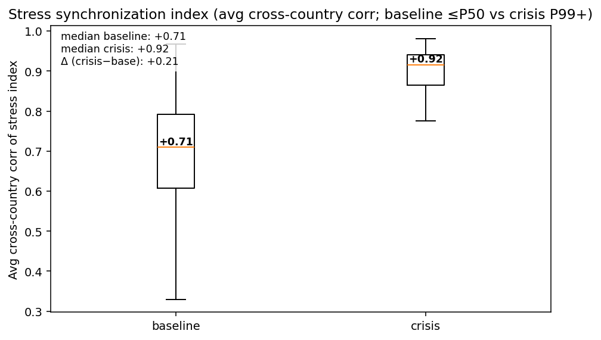

# Monte Carlo Cross-Country Executive Summary — alternative2

This is generated from existing Step 12 block-aggregate matrices (z-space).
It is tail-focused and designed for cross-country comparability.

## Tail severity ranking
(Median and P99 of $S_{L2}$ across draws; higher = more severe simulated stress.)

| ISO | Median | P99 |
|---|---:|---:|
| USA | 14.25 | 34.96 |
| FRA | 14.10 | 30.06 |
| DEU | 12.85 | 25.96 |
| ESP | 13.09 | 25.76 |
| ITA | 12.93 | 25.66 |

## Today vs simulated distribution
(Realized $S_{L2}$ computed from frozen inputs; percentile computed within each ISO’s MC draw distribution.)

| ISO | Today $S_{L2}$ | Today percentile | MC median | MC P99 |
|---|---:|---:|---:|---:|
| USA | 10.94 |  27.3% | 14.25 | 34.96 |
| FRA | 14.57 |  54.1% | 14.10 | 30.06 |
| DEU | 8.35 |  11.2% | 12.85 | 25.96 |
| ESP | 8.60 |  12.2% | 13.09 | 25.76 |
| ITA | 21.50 |  95.1% | 12.93 | 25.66 |

## Crisis driver concentration
(Computed from median crisis-regime shares of $S_{L2}^2$ by block; HHI near 1 = concentrated.)

| ISO | Top block | Top share | HHI |
|---|---|---:|---:|
| DEU | banking_system |  77.3% | 0.61 |
| ESP | banking_system |  63.9% | 0.44 |
| FRA | banking_system |  46.3% | 0.36 |
| ITA | banking_system |  64.0% | 0.44 |
| USA | systemic_stress |  31.6% | 0.28 |

## Figures
- 
- 
- 
- 
- 
- 
- 
- 
- 
- 
- 

## Realized today marker
Computed over the last 60 days ending 2025-09-29: standardized residuals × Dt, scaled by vol_t0, low-frequency gated, then **demeaned per factor** before cumulation (to match mean-zero MC innovations), aggregated to blocks in z-space.

## Synchronization takeaway
(Computed as average cross-country correlation of first differences $\Delta$stress; this avoids spurious inflation from shared drift.)
Average cross-country synchronization (median) rises from **+0.21** (baseline ≤P50) to **+0.35** (crisis P99+).
