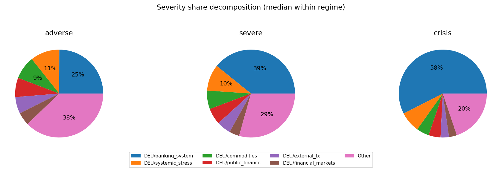
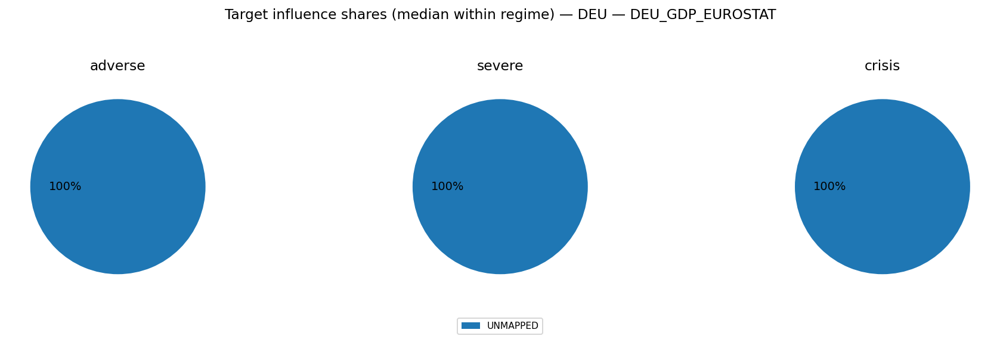

# MC Block Comovements & Regimes — alternative_test

This note summarizes how block aggregates co-move across Monte Carlo draws, and groups draws into coarse regime labels.

## Regime construction (simple, explainable)
- For each draw we compute each block’s **terminal cumulative block aggregate** (sigmas; z-space).
- We compute an economy-level severity score per draw: $S_{L2}=\sqrt{\sum_b (\text{cum}_b(T))^2}$. 
- Regimes are defined by severity quantiles: **baseline** (0–50%), **adverse** (50–80%), **severe** (80–95%), **crisis** (95–100%).

## All ISOs combined

Regime counts (draws):
- baseline: 2500
- adverse: 1500
- severe: 750
- crisis: 250

Top ISO/block columns by cross-draw variability:
- DEU/banking_system, DEU/systemic_stress, DEU/commodities, DEU/public_finance, DEU/external_fx, DEU/financial_markets, DEU/macro, DEU/real_estate

### Typical terminal cumulative (median with q10/q90; sigmas)

**baseline**
- DEU/commodities: +0.30 [-5.45, +5.51]
- DEU/public_finance: +0.13 [-5.05, +4.82]
- DEU/financial_markets: -0.08 [-4.62, +4.55]
- DEU/systemic_stress: +0.06 [-5.52, +5.57]
- DEU/banking_system: -0.04 [-6.68, +6.59]
- DEU/external_fx: +0.03 [-5.00, +5.17]
- DEU/real_estate: +0.01 [-1.38, +1.36]
- DEU/macro: +0.01 [-2.37, +2.33]
**adverse**
- DEU/financial_markets: +0.22 [-5.92, +6.25]
- DEU/external_fx: -0.16 [-6.88, +6.97]
- DEU/public_finance: +0.16 [-7.13, +7.40]
- DEU/commodities: +0.14 [-7.59, +7.91]
- DEU/systemic_stress: +0.03 [-8.88, +8.51]
- DEU/real_estate: +0.03 [-1.35, +1.44]
- DEU/macro: -0.03 [-2.58, +2.67]
- DEU/banking_system: -0.02 [-11.20, +11.13]
**severe**
- DEU/banking_system: -1.11 [-15.55, +15.49]
- DEU/financial_markets: -0.50 [-7.03, +7.31]
- DEU/systemic_stress: -0.24 [-10.85, +9.61]
- DEU/macro: -0.17 [-2.92, +2.51]
- DEU/external_fx: -0.17 [-7.63, +7.91]
- DEU/commodities: -0.13 [-8.62, +8.61]
- DEU/public_finance: -0.12 [-8.50, +8.78]
- DEU/real_estate: -0.02 [-1.34, +1.33]
**crisis**
- DEU/banking_system: -5.86 [-21.73, +22.19]
- DEU/commodities: +0.72 [-9.19, +9.24]
- DEU/systemic_stress: +0.65 [-12.53, +11.74]
- DEU/public_finance: +0.46 [-9.08, +8.48]
- DEU/macro: -0.26 [-2.91, +2.82]
- DEU/financial_markets: -0.22 [-8.57, +7.16]
- DEU/real_estate: -0.06 [-1.41, +1.35]
- DEU/external_fx: +0.01 [-10.17, +7.60]

### Severity share decomposition ("cake" slices; All ISOs combined)
Shares are fractions of $S_{L2}^2$ attributable to each block (using squared terminal cumulatives).
Interpretation: a large share means the block contributes more to the **simulation severity metric** used here.
This can happen because the block has larger tail dispersion / higher volatility / stronger cumulative drift over the horizon.
It does **not** by itself prove the block has larger causal impact on GDP/PD/LGD; for that, compute shares in propagated target space.
Reported as median share with quantile band q10/q90 within each regime.

**adverse**
- DEU/banking_system:  25.0% [  1.4%,  66.9%]
- DEU/systemic_stress:  10.7% [  0.4%,  49.0%]
- DEU/commodities:   8.5% [  0.4%,  39.1%]
- DEU/public_finance:   7.1% [  0.2%,  36.0%]
- DEU/external_fx:   6.1% [  0.2%,  32.8%]
- DEU/financial_markets:   4.8% [  0.2%,  26.4%]
- DEU/macro:   0.8% [  0.0%,   4.9%]
- DEU/real_estate:   0.2% [  0.0%,   1.5%]

**severe**
- DEU/banking_system:  39.2% [  2.6%,  76.1%]
- DEU/systemic_stress:   9.7% [  0.6%,  43.0%]
- DEU/commodities:   6.8% [  0.2%,  34.1%]
- DEU/public_finance:   6.0% [  0.1%,  32.0%]
- DEU/external_fx:   5.2% [  0.2%,  27.6%]
- DEU/financial_markets:   3.7% [  0.1%,  22.6%]
- DEU/macro:   0.5% [  0.0%,   3.6%]
- DEU/real_estate:   0.1% [  0.0%,   0.9%]

**crisis**
- DEU/banking_system:  57.5% [  9.2%,  84.7%]
- DEU/systemic_stress:   7.6% [  0.1%,  43.2%]
- DEU/public_finance:   4.6% [  0.1%,  23.5%]
- DEU/commodities:   4.4% [  0.2%,  29.0%]
- DEU/external_fx:   3.1% [  0.1%,  21.9%]
- DEU/financial_markets:   2.9% [  0.1%,  17.1%]
- DEU/macro:   0.5% [  0.0%,   2.1%]
- DEU/real_estate:   0.1% [  0.0%,   0.6%]

## Executive summary

- [EXEC_SUMMARY.md](EXEC_SUMMARY.md)
- 
- 

## DEU

Regime counts (draws):
- baseline: 2500
- adverse: 1500
- severe: 750
- crisis: 250

Top blocks by cross-draw variability (used for comovement summaries):
- banking_system, systemic_stress, commodities, public_finance, external_fx, financial_markets, macro, real_estate

### Typical block terminal cumulative (median with q10/q90; sigmas)
(Signs depend on factor definitions; focus on magnitude + co-movement patterns.)

**baseline**
- commodities: +0.30 [-5.45, +5.51]
- public_finance: +0.13 [-5.05, +4.82]
- financial_markets: -0.08 [-4.62, +4.55]
- systemic_stress: +0.06 [-5.52, +5.57]
- banking_system: -0.04 [-6.68, +6.59]
- external_fx: +0.03 [-5.00, +5.17]
- real_estate: +0.01 [-1.38, +1.36]
- macro: +0.01 [-2.37, +2.33]
**adverse**
- financial_markets: +0.22 [-5.92, +6.25]
- external_fx: -0.16 [-6.88, +6.97]
- public_finance: +0.16 [-7.13, +7.40]
- commodities: +0.14 [-7.59, +7.91]
- systemic_stress: +0.03 [-8.88, +8.51]
- real_estate: +0.03 [-1.35, +1.44]
- macro: -0.03 [-2.58, +2.67]
- banking_system: -0.02 [-11.20, +11.13]
**severe**
- banking_system: -1.11 [-15.55, +15.49]
- financial_markets: -0.50 [-7.03, +7.31]
- systemic_stress: -0.24 [-10.85, +9.61]
- macro: -0.17 [-2.92, +2.51]
- external_fx: -0.17 [-7.63, +7.91]
- commodities: -0.13 [-8.62, +8.61]
- public_finance: -0.12 [-8.50, +8.78]
- real_estate: -0.02 [-1.34, +1.33]
**crisis**
- banking_system: -5.86 [-21.73, +22.19]
- commodities: +0.72 [-9.19, +9.24]
- systemic_stress: +0.65 [-12.53, +11.74]
- public_finance: +0.46 [-9.08, +8.48]
- macro: -0.26 [-2.91, +2.82]
- financial_markets: -0.22 [-8.57, +7.16]
- real_estate: -0.06 [-1.41, +1.35]
- external_fx: +0.01 [-10.17, +7.60]

### Outcome-space influence proxy (Step 4 targets)
This section projects simulated factor shocks into Step 4 targets using the stored linear coefficients.
Important: this is a **proxy** because Step 4 feature scaling may differ from the Step 12 simulation shock units.
We use **terminal cumulative standardized shocks** (sum of daily/monthly $z$ shocks) and ignore AR target lags when they are not simulated.

#### DEU_GDP_EUROSTAT
- transform=yoy_log_pct; features=daily_shortlist; test_r2=-0.155; coef_coverage≈17.3%
- WARNING: Low test $R^2$: treat regime/attribution patterns as low confidence.
- Ignored non-simulated features (often AR lags): DEU_GDP_EUROSTAT_lag1, GC.DOD.TOTL.GD.ZS_DEU, ECBDFR, DEU_GDP_EUROSTAT_lag3, DEU_GDP_EUROSTAT_lag2

Typical projected target impact (median with q10/q90; arbitrary units)
- baseline: -0.055 [-4.227, +3.948]
- adverse: -0.060 [-5.019, +4.637]
- severe: -0.238 [-5.453, +5.658]
- crisis: +0.640 [-7.295, +6.113]

Influence share decomposition by block (median share with q10/q90 within regime)
**adverse**
- UNMAPPED: 100.0% [100.0%, 100.0%]

**severe**
- UNMAPPED: 100.0% [100.0%, 100.0%]

**crisis**
- UNMAPPED: 100.0% [100.0%, 100.0%]

#### DEU_UNRATE_EUROSTAT
- transform=level; features=daily_shortlist; test_r2=0.869; coef_coverage≈1.4%
- Ignored non-simulated features (often AR lags): DEU_UNRATE_EUROSTAT_lag1, DCOILBRENTEU, ECBDFR, GC.DOD.TOTL.GD.ZS_DEU, BIS_LBS_Household_Loans_DEU, BIS_LBS_Household_Loans_DEU_lag1

Typical projected target impact (median with q10/q90; arbitrary units)
- baseline: +0.002 [-0.158, +0.170]
- adverse: +0.002 [-0.186, +0.201]
- severe: +0.010 [-0.227, +0.219]
- crisis: -0.026 [-0.245, +0.293]

Influence share decomposition by block (median share with q10/q90 within regime)
**adverse**
- UNMAPPED: 100.0% [100.0%, 100.0%]

**severe**
- UNMAPPED: 100.0% [100.0%, 100.0%]

**crisis**
- UNMAPPED: 100.0% [100.0%, 100.0%]

#### DEUCPIALLMINMEI
- transform=yoy_log_pct; features=daily_shortlist; test_r2=0.694; coef_coverage≈4.9%
- Ignored non-simulated features (often AR lags): DEUCPIALLMINMEI_lag1, ECBDFR, DCOILBRENTEU, BIS_LBS_Household_Loans_DEU, GC.DOD.TOTL.GD.ZS_DEU, DEUCPIALLMINMEI_lag2

Typical projected target impact (median with q10/q90; arbitrary units)
- baseline: -0.009 [-0.654, +0.610]
- adverse: -0.009 [-0.776, +0.717]
- severe: -0.037 [-0.843, +0.875]
- crisis: +0.099 [-1.128, +0.945]

Influence share decomposition by block (median share with q10/q90 within regime)
**adverse**
- UNMAPPED: 100.0% [100.0%, 100.0%]

**severe**
- UNMAPPED: 100.0% [100.0%, 100.0%]

**crisis**
- UNMAPPED: 100.0% [100.0%, 100.0%]

### Severity share decomposition ("cake" slices)
Shares are fractions of $S_{L2}^2$ attributable to each block (using squared terminal cumulatives).
Interpretation: a large share means the block contributes more to the **simulation severity metric** used here.
This can happen because the block has larger tail dispersion / higher volatility / stronger cumulative drift over the horizon.
It does **not** by itself prove the block has larger causal impact on GDP/PD/LGD; for that, compute shares in propagated target space.
Reported as median share with quantile band q10/q90 within each regime.

**adverse**
- banking_system:  25.0% [  1.4%,  66.9%]
- systemic_stress:  10.7% [  0.4%,  49.0%]
- commodities:   8.5% [  0.4%,  39.1%]
- public_finance:   7.1% [  0.2%,  36.0%]
- external_fx:   6.1% [  0.2%,  32.8%]
- financial_markets:   4.8% [  0.2%,  26.4%]
- macro:   0.8% [  0.0%,   4.9%]
- real_estate:   0.2% [  0.0%,   1.5%]

**severe**
- banking_system:  39.2% [  2.6%,  76.1%]
- systemic_stress:   9.7% [  0.6%,  43.0%]
- commodities:   6.8% [  0.2%,  34.1%]
- public_finance:   6.0% [  0.1%,  32.0%]
- external_fx:   5.2% [  0.2%,  27.6%]
- financial_markets:   3.7% [  0.1%,  22.6%]
- macro:   0.5% [  0.0%,   3.6%]
- real_estate:   0.1% [  0.0%,   0.9%]

**crisis**
- banking_system:  57.5% [  9.2%,  84.7%]
- systemic_stress:   7.6% [  0.1%,  43.2%]
- public_finance:   4.6% [  0.1%,  23.5%]
- commodities:   4.4% [  0.2%,  29.0%]
- external_fx:   3.1% [  0.1%,  21.9%]
- financial_markets:   2.9% [  0.1%,  17.1%]
- macro:   0.5% [  0.0%,   2.1%]
- real_estate:   0.1% [  0.0%,   0.6%]

### Comovement snapshot (corr of terminal cumulative across draws)
Positive = blocks tend to move together across scenarios; negative = trade-offs.

- commodities ↔ public_finance: corr=+0.43
- banking_system ↔ financial_markets: corr=+0.30
- commodities ↔ external_fx: corr=-0.22
- banking_system ↔ macro: corr=+0.21
- macro ↔ real_estate: corr=+0.16
- systemic_stress ↔ public_finance: corr=+0.15
- systemic_stress ↔ external_fx: corr=+0.14
- external_fx ↔ financial_markets: corr=+0.13
- banking_system ↔ systemic_stress: corr=-0.13
- banking_system ↔ external_fx: corr=+0.12
- commodities ↔ real_estate: corr=+0.12
- banking_system ↔ public_finance: corr=-0.09
