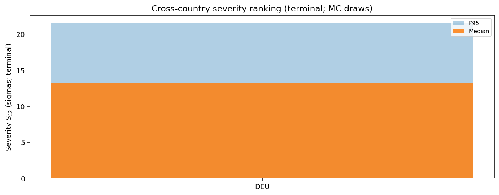
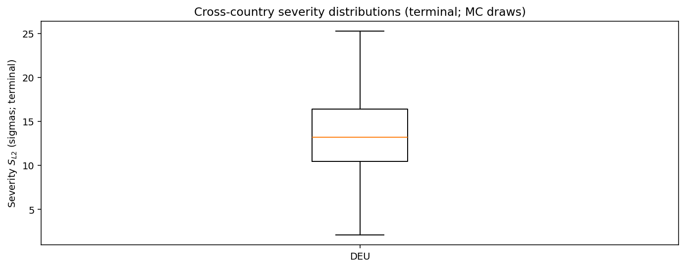
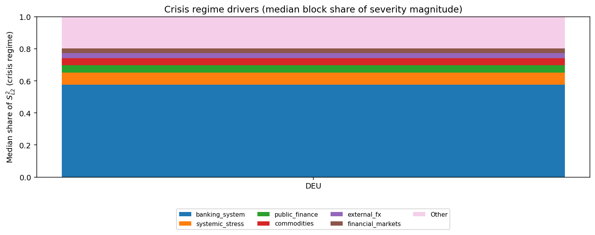

# Monte Carlo Cross-Country Executive Summary — alternative_test

This is generated from existing Step 12 block-aggregate matrices (z-space).
It is tail-focused and designed for cross-country comparability.

## Tail severity ranking
(Median and P95 of $S_{L2}$ across draws; higher = more severe simulated stress.)

| ISO | Median | P95 |
|---|---:|---:|
| DEU | 13.17 | 21.52 |

## Figures
- 
- 
- 
