# MC Block Comovements & Regimes — latest_20260225

This note summarizes how block aggregates co-move across Monte Carlo draws, and groups draws into coarse regime labels.

## Regime construction (simple, explainable)
- For each draw we compute each block’s **terminal cumulative block aggregate** (sigmas; z-space).
- We compute an economy-level severity score per draw: $S_{L2}=\sqrt{\sum_b (\text{cum}_b(T))^2}$. 
- Regimes are defined by severity quantiles: **baseline** (0–50%), **adverse** (50–80%), **severe** (80–95%), **crisis** (95–100%).

## All ISOs combined

Regime counts (draws):
- baseline: 2500
- adverse: 1500
- severe: 750
- crisis: 250

Top ISO/block columns by cross-draw variability:
- DEU/banking_system, FRA/banking_system, USA/external_fx, ITA/banking_system, ESP/banking_system, USA/systemic_stress, FRA/public_finance, USA/public_finance, ITA/commodities, ESP/commodities, USA/commodities, FRA/systemic_stress

### Typical terminal cumulative (median with q10/q90; sigmas)

**baseline**
- ESP/commodities: +0.18 [-5.99, +5.72]
- ITA/commodities: +0.10 [-5.83, +5.89]
- ESP/banking_system: -0.09 [-8.51, +8.08]
- ITA/banking_system: +0.09 [-8.45, +8.70]
- FRA/banking_system: +0.09 [-8.10, +8.40]
- USA/commodities: +0.08 [-5.86, +5.70]
- USA/public_finance: +0.05 [-7.57, +7.66]
- FRA/systemic_stress: -0.03 [-5.61, +5.62]
- USA/systemic_stress: +0.02 [-7.54, +7.60]
- DEU/banking_system: -0.01 [-8.88, +8.95]
**adverse**
- DEU/banking_system: -0.69 [-11.76, +11.32]
- ITA/banking_system: +0.42 [-10.47, +10.30]
- USA/systemic_stress: +0.36 [-10.64, +10.53]
- ESP/banking_system: -0.36 [-11.15, +10.49]
- ESP/commodities: +0.22 [-8.08, +7.80]
- FRA/systemic_stress: +0.20 [-7.73, +7.60]
- USA/external_fx: +0.15 [-10.69, +10.34]
- USA/public_finance: -0.12 [-10.67, +10.37]
- FRA/public_finance: +0.09 [-10.71, +10.43]
- FRA/banking_system: -0.07 [-10.44, +10.99]
**severe**
- USA/systemic_stress: +0.64 [-12.96, +13.89]
- ITA/banking_system: -0.42 [-13.13, +12.74]
- FRA/banking_system: -0.35 [-13.93, +14.18]
- ESP/banking_system: -0.27 [-13.11, +12.29]
- USA/external_fx: -0.17 [-14.27, +14.54]
- ITA/commodities: -0.13 [-8.85, +9.20]
- USA/public_finance: -0.10 [-13.78, +13.36]
- USA/commodities: -0.08 [-9.50, +9.83]
- FRA/systemic_stress: +0.07 [-9.49, +9.44]
- ESP/commodities: +0.04 [-9.32, +9.15]
**crisis**
- USA/systemic_stress: +1.56 [-16.89, +18.36]
- FRA/banking_system: +1.48 [-16.78, +17.14]
- DEU/banking_system: +1.02 [-15.81, +15.64]
- FRA/public_finance: +0.86 [-15.03, +13.66]
- FRA/systemic_stress: +0.77 [-10.01, +12.49]
- USA/external_fx: +0.61 [-16.84, +18.64]
- ESP/banking_system: +0.49 [-16.42, +14.37]
- ITA/commodities: +0.42 [-11.88, +11.25]
- USA/commodities: +0.33 [-11.94, +11.69]
- ITA/banking_system: -0.07 [-13.82, +16.46]

### Severity share decomposition ("cake" slices; All ISOs combined)
Shares are fractions of $S_{L2}^2$ attributable to each block (using squared terminal cumulatives).
Interpretation: a large share means the block contributes more to the **simulation severity metric** used here.
This can happen because the block has larger tail dispersion / higher volatility / stronger cumulative drift over the horizon.
It does **not** by itself prove the block has larger causal impact on GDP/PD/LGD; for that, compute shares in propagated target space.
Reported as median share with quantile band q10/q90 within each regime.

**adverse**
- DEU/banking_system:   3.3% [  0.1%,  17.5%]
- USA/systemic_stress:   3.3% [  0.1%,  13.1%]
- USA/external_fx:   3.2% [  0.1%,  14.1%]
- USA/public_finance:   3.1% [  0.1%,  13.6%]
- FRA/banking_system:   3.1% [  0.1%,  14.6%]
- FRA/public_finance:   3.0% [  0.1%,  15.0%]
- ESP/banking_system:   2.9% [  0.1%,  15.0%]
- ITA/banking_system:   2.5% [  0.1%,  14.4%]
- ITA/commodities:   1.7% [  0.1%,   8.1%]
- USA/commodities:   1.6% [  0.1%,   7.4%]

**severe**
- USA/systemic_stress:   4.1% [  0.2%,  15.6%]
- USA/public_finance:   4.0% [  0.1%,  14.8%]
- USA/external_fx:   4.0% [  0.2%,  17.8%]
- DEU/banking_system:   3.4% [  0.1%,  15.6%]
- FRA/banking_system:   2.9% [  0.1%,  17.4%]
- ESP/banking_system:   2.7% [  0.1%,  14.2%]
- ITA/banking_system:   2.7% [  0.1%,  14.8%]
- FRA/public_finance:   2.6% [  0.1%,  15.0%]
- FRA/systemic_stress:   1.8% [  0.1%,   8.3%]
- USA/commodities:   1.7% [  0.0%,   7.8%]

**crisis**
- USA/systemic_stress:   5.7% [  0.3%,  16.4%]
- USA/public_finance:   5.0% [  0.2%,  16.5%]
- USA/external_fx:   4.3% [  0.1%,  18.3%]
- FRA/banking_system:   3.9% [  0.2%,  16.9%]
- DEU/banking_system:   3.7% [  0.1%,  17.0%]
- ESP/banking_system:   2.6% [  0.1%,  15.3%]
- FRA/public_finance:   2.4% [  0.1%,  13.3%]
- USA/commodities:   2.3% [  0.1%,   8.3%]
- ITA/commodities:   2.1% [  0.1%,   7.9%]
- DEU/commodities:   2.0% [  0.1%,   7.5%]

Breakdowns (full list; includes "Other"):
- [SEVERITY_SHARE_BREAKDOWN__ALL_ISOS__adverse.csv](SEVERITY_SHARE_BREAKDOWN__ALL_ISOS__adverse.csv)
- [SEVERITY_SHARE_BREAKDOWN__ALL_ISOS__severe.csv](SEVERITY_SHARE_BREAKDOWN__ALL_ISOS__severe.csv)
- [SEVERITY_SHARE_BREAKDOWN__ALL_ISOS__crisis.csv](SEVERITY_SHARE_BREAKDOWN__ALL_ISOS__crisis.csv)

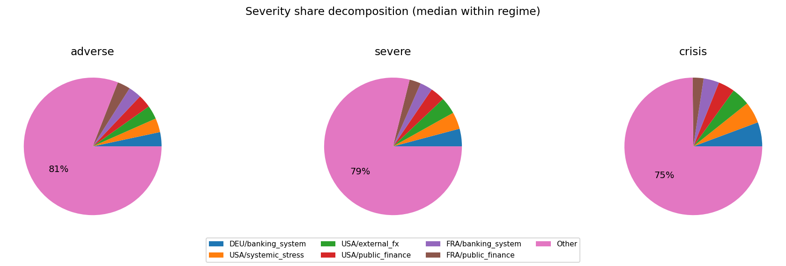

## Executive summary

- [EXEC_SUMMARY.md](EXEC_SUMMARY.md)
- 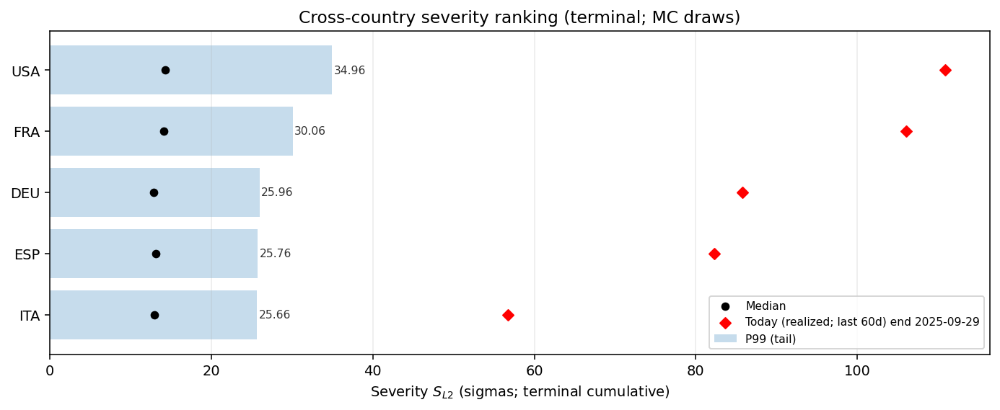
- 

## DEU

Regime counts (draws):
- baseline: 2500
- adverse: 1500
- severe: 750
- crisis: 250

Top blocks by cross-draw variability (used for comovement summaries):
- banking_system, commodities, systemic_stress, public_finance, external_fx, financial_markets, macro, real_estate

### Typical block terminal cumulative (median with q10/q90; sigmas)
(Signs depend on factor definitions; focus on magnitude + co-movement patterns.)

**baseline**
- commodities: +0.28 [-5.45, +5.48]
- public_finance: +0.12 [-5.01, +4.81]
- systemic_stress: -0.08 [-5.05, +5.10]
- financial_markets: -0.03 [-4.59, +4.56]
- external_fx: -0.02 [-5.04, +5.11]
- real_estate: +0.01 [-1.38, +1.37]
- macro: -0.01 [-2.35, +2.28]
- banking_system: +0.00 [-6.35, +6.37]
**adverse**
- public_finance: +0.14 [-7.13, +7.40]
- banking_system: -0.11 [-10.85, +11.00]
- financial_markets: +0.08 [-6.06, +6.24]
- systemic_stress: +0.07 [-7.31, +7.36]
- external_fx: -0.07 [-6.97, +7.20]
- real_estate: +0.03 [-1.38, +1.39]
- commodities: +0.01 [-7.67, +7.91]
- macro: -0.00 [-2.60, +2.70]
**severe**
- banking_system: -1.76 [-15.08, +15.17]
- financial_markets: -0.58 [-7.29, +7.22]
- external_fx: -0.33 [-7.66, +7.91]
- macro: -0.23 [-2.87, +2.68]
- commodities: +0.16 [-8.62, +8.83]
- systemic_stress: +0.15 [-9.27, +8.74]
- public_finance: +0.12 [-8.39, +8.97]
- real_estate: -0.05 [-1.34, +1.38]
**crisis**
- banking_system: -4.65 [-21.73, +22.19]
- external_fx: +0.55 [-10.17, +7.60]
- systemic_stress: +0.50 [-11.23, +11.67]
- commodities: +0.34 [-9.09, +9.52]
- macro: -0.15 [-2.91, +2.82]
- real_estate: -0.04 [-1.34, +1.43]
- financial_markets: -0.01 [-7.69, +7.34]
- public_finance: -0.00 [-9.42, +8.42]

### Outcome-space influence proxy (Step 4 targets)
This section projects simulated factor shocks into Step 4 targets using the stored linear coefficients.
Important: this is a **proxy** because Step 4 feature scaling may differ from the Step 12 simulation shock units.
We use **terminal cumulative standardized shocks** (sum of daily/monthly $z$ shocks) and ignore AR target lags when they are not simulated.

#### DEU_GDP_EUROSTAT
- transform=yoy_log_pct; features=daily_shortlist; test_r2=-0.155; coef_coverage≈17.3%
- WARNING: Low test $R^2$: treat regime/attribution patterns as low confidence.
- Ignored non-simulated features (often AR lags): DEU_GDP_EUROSTAT_lag1, GC.DOD.TOTL.GD.ZS_DEU, ECBDFR, DEU_GDP_EUROSTAT_lag3, DEU_GDP_EUROSTAT_lag2

Typical projected target impact (median with q10/q90; arbitrary units)
- baseline: -0.044 [-3.962, +3.758]
- adverse: -0.045 [-4.830, +4.644]
- severe: -0.282 [-6.213, +6.186]
- crisis: +0.620 [-8.197, +7.183]

Influence share decomposition by block (median share with q10/q90 within regime)
**adverse**
- systemic_stress: 100.0% [100.0%, 100.0%]

**severe**
- systemic_stress: 100.0% [100.0%, 100.0%]

**crisis**
- systemic_stress: 100.0% [100.0%, 100.0%]

Breakdowns (full list; includes "Other"):
- [TARGET_INFLUENCE_BREAKDOWN__DEU__DEU_GDP_EUROSTAT__adverse.csv](TARGET_INFLUENCE_BREAKDOWN__DEU__DEU_GDP_EUROSTAT__adverse.csv)
- [TARGET_INFLUENCE_BREAKDOWN__DEU__DEU_GDP_EUROSTAT__severe.csv](TARGET_INFLUENCE_BREAKDOWN__DEU__DEU_GDP_EUROSTAT__severe.csv)
- [TARGET_INFLUENCE_BREAKDOWN__DEU__DEU_GDP_EUROSTAT__crisis.csv](TARGET_INFLUENCE_BREAKDOWN__DEU__DEU_GDP_EUROSTAT__crisis.csv)

#### DEU_UNRATE_EUROSTAT
- transform=level; features=daily_shortlist; test_r2=0.869; coef_coverage≈1.4%
- Ignored non-simulated features (often AR lags): DEU_UNRATE_EUROSTAT_lag1, DCOILBRENTEU, ECBDFR, GC.DOD.TOTL.GD.ZS_DEU, BIS_LBS_Household_Loans_DEU, BIS_LBS_Household_Loans_DEU_lag1

Typical projected target impact (median with q10/q90; arbitrary units)
- baseline: +0.002 [-0.151, +0.159]
- adverse: +0.002 [-0.186, +0.194]
- severe: +0.011 [-0.248, +0.249]
- crisis: -0.025 [-0.288, +0.329]

Influence share decomposition by block (median share with q10/q90 within regime)
**adverse**
- systemic_stress: 100.0% [100.0%, 100.0%]

**severe**
- systemic_stress: 100.0% [100.0%, 100.0%]

**crisis**
- systemic_stress: 100.0% [100.0%, 100.0%]

Breakdowns (full list; includes "Other"):
- [TARGET_INFLUENCE_BREAKDOWN__DEU__DEU_UNRATE_EUROSTAT__adverse.csv](TARGET_INFLUENCE_BREAKDOWN__DEU__DEU_UNRATE_EUROSTAT__adverse.csv)
- [TARGET_INFLUENCE_BREAKDOWN__DEU__DEU_UNRATE_EUROSTAT__severe.csv](TARGET_INFLUENCE_BREAKDOWN__DEU__DEU_UNRATE_EUROSTAT__severe.csv)
- [TARGET_INFLUENCE_BREAKDOWN__DEU__DEU_UNRATE_EUROSTAT__crisis.csv](TARGET_INFLUENCE_BREAKDOWN__DEU__DEU_UNRATE_EUROSTAT__crisis.csv)

#### DEUCPIALLMINMEI
- transform=yoy_log_pct; features=daily_shortlist; test_r2=0.694; coef_coverage≈4.9%
- Ignored non-simulated features (often AR lags): DEUCPIALLMINMEI_lag1, ECBDFR, DCOILBRENTEU, BIS_LBS_Household_Loans_DEU, GC.DOD.TOTL.GD.ZS_DEU, DEUCPIALLMINMEI_lag2

Typical projected target impact (median with q10/q90; arbitrary units)
- baseline: -0.007 [-0.613, +0.581]
- adverse: -0.007 [-0.747, +0.718]
- severe: -0.044 [-0.961, +0.956]
- crisis: +0.096 [-1.267, +1.111]

Influence share decomposition by block (median share with q10/q90 within regime)
**adverse**
- systemic_stress: 100.0% [100.0%, 100.0%]

**severe**
- systemic_stress: 100.0% [100.0%, 100.0%]

**crisis**
- systemic_stress: 100.0% [100.0%, 100.0%]

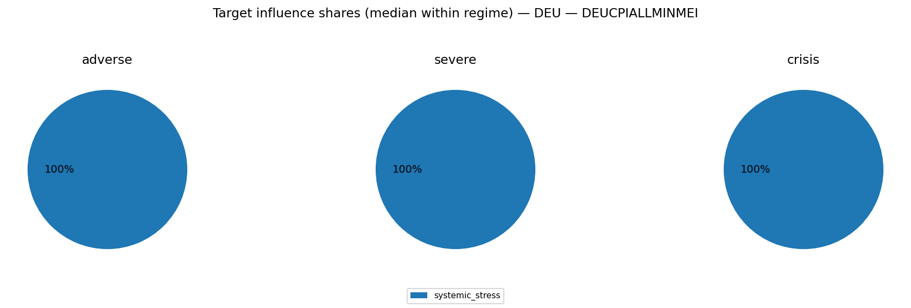
Breakdowns (full list; includes "Other"):
- [TARGET_INFLUENCE_BREAKDOWN__DEU__DEUCPIALLMINMEI__adverse.csv](TARGET_INFLUENCE_BREAKDOWN__DEU__DEUCPIALLMINMEI__adverse.csv)
- [TARGET_INFLUENCE_BREAKDOWN__DEU__DEUCPIALLMINMEI__severe.csv](TARGET_INFLUENCE_BREAKDOWN__DEU__DEUCPIALLMINMEI__severe.csv)
- [TARGET_INFLUENCE_BREAKDOWN__DEU__DEUCPIALLMINMEI__crisis.csv](TARGET_INFLUENCE_BREAKDOWN__DEU__DEUCPIALLMINMEI__crisis.csv)

### Severity share decomposition ("cake" slices)
Shares are fractions of $S_{L2}^2$ attributable to each block (using squared terminal cumulatives).
Interpretation: a large share means the block contributes more to the **simulation severity metric** used here.
This can happen because the block has larger tail dispersion / higher volatility / stronger cumulative drift over the horizon.
It does **not** by itself prove the block has larger causal impact on GDP/PD/LGD; for that, compute shares in propagated target space.
Reported as median share with quantile band q10/q90 within each regime.

**adverse**
- banking_system:  26.9% [  1.5%,  67.8%]
- commodities:   9.2% [  0.4%,  41.0%]
- systemic_stress:   7.7% [  0.3%,  36.6%]
- public_finance:   7.6% [  0.3%,  36.9%]
- external_fx:   6.9% [  0.3%,  35.1%]
- financial_markets:   4.8% [  0.2%,  27.9%]
- macro:   0.8% [  0.0%,   5.4%]
- real_estate:   0.2% [  0.0%,   1.6%]

**severe**
- banking_system:  41.8% [  4.2%,  73.7%]
- systemic_stress:   8.8% [  0.3%,  33.3%]
- commodities:   7.7% [  0.2%,  36.2%]
- public_finance:   6.2% [  0.2%,  33.3%]
- external_fx:   5.2% [  0.2%,  26.4%]
- financial_markets:   4.3% [  0.1%,  24.2%]
- macro:   0.6% [  0.0%,   3.6%]
- real_estate:   0.1% [  0.0%,   1.0%]

**crisis**
- banking_system:  60.1% [ 13.9%,  83.3%]
- systemic_stress:   9.1% [  0.4%,  29.2%]
- public_finance:   4.8% [  0.1%,  23.4%]
- commodities:   4.5% [  0.1%,  23.8%]
- external_fx:   3.1% [  0.1%,  21.8%]
- financial_markets:   2.4% [  0.1%,  15.8%]
- macro:   0.4% [  0.0%,   2.2%]
- real_estate:   0.1% [  0.0%,   0.6%]

Breakdowns (full list; includes "Other"):
- [SEVERITY_SHARE_BREAKDOWN__DEU__adverse.csv](SEVERITY_SHARE_BREAKDOWN__DEU__adverse.csv)
- [SEVERITY_SHARE_BREAKDOWN__DEU__severe.csv](SEVERITY_SHARE_BREAKDOWN__DEU__severe.csv)
- [SEVERITY_SHARE_BREAKDOWN__DEU__crisis.csv](SEVERITY_SHARE_BREAKDOWN__DEU__crisis.csv)

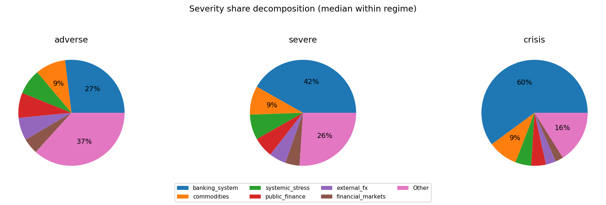

### Comovement snapshot (corr of terminal cumulative across draws)
Positive = blocks tend to move together across scenarios; negative = trade-offs.

- commodities ↔ public_finance: corr=+0.43
- banking_system ↔ systemic_stress: corr=-0.42
- banking_system ↔ financial_markets: corr=+0.30
- commodities ↔ external_fx: corr=-0.22
- banking_system ↔ macro: corr=+0.21
- systemic_stress ↔ public_finance: corr=+0.19
- macro ↔ real_estate: corr=+0.16
- external_fx ↔ financial_markets: corr=+0.13
- systemic_stress ↔ external_fx: corr=+0.12
- banking_system ↔ external_fx: corr=+0.12
- commodities ↔ real_estate: corr=+0.12
- commodities ↔ systemic_stress: corr=+0.11

## ESP

Regime counts (draws):
- baseline: 2500
- adverse: 1500
- severe: 750
- crisis: 250

Top blocks by cross-draw variability (used for comovement summaries):
- banking_system, commodities, systemic_stress, external_fx, financial_markets, public_finance, real_estate, macro

### Typical block terminal cumulative (median with q10/q90; sigmas)
(Signs depend on factor definitions; focus on magnitude + co-movement patterns.)

**baseline**
- commodities: +0.27 [-5.69, +5.44]
- external_fx: +0.12 [-5.26, +5.26]
- macro: +0.08 [-1.65, +1.69]
- real_estate: +0.04 [-2.38, +2.49]
- financial_markets: +0.03 [-4.92, +4.94]
- systemic_stress: +0.02 [-5.44, +5.39]
- public_finance: +0.02 [-3.92, +4.16]
- banking_system: +0.01 [-6.62, +6.56]
**adverse**
- public_finance: -0.27 [-5.78, +5.75]
- banking_system: -0.25 [-10.51, +10.41]
- commodities: -0.15 [-8.65, +8.19]
- real_estate: -0.06 [-2.62, +2.67]
- external_fx: -0.02 [-8.02, +7.72]
- systemic_stress: +0.02 [-7.52, +7.88]
- financial_markets: +0.01 [-7.23, +7.44]
- macro: +0.00 [-1.71, +1.75]
**severe**
- banking_system: -1.77 [-14.93, +14.43]
- commodities: +0.76 [-9.80, +10.00]
- systemic_stress: +0.60 [-9.76, +9.88]
- external_fx: -0.42 [-9.27, +9.32]
- public_finance: -0.21 [-6.73, +6.83]
- financial_markets: -0.14 [-8.59, +9.58]
- macro: +0.06 [-1.48, +1.81]
- real_estate: +0.06 [-2.49, +2.71]
**crisis**
- banking_system: +1.62 [-20.53, +20.16]
- external_fx: -1.30 [-12.31, +9.53]
- systemic_stress: +0.98 [-11.37, +11.16]
- commodities: -0.33 [-10.72, +11.32]
- financial_markets: -0.25 [-10.44, +9.70]
- public_finance: -0.24 [-8.40, +6.78]
- real_estate: +0.06 [-3.00, +2.86]
- macro: +0.03 [-1.96, +1.57]

### Outcome-space influence proxy (Step 4 targets)
This section projects simulated factor shocks into Step 4 targets using the stored linear coefficients.
Important: this is a **proxy** because Step 4 feature scaling may differ from the Step 12 simulation shock units.
We use **terminal cumulative standardized shocks** (sum of daily/monthly $z$ shocks) and ignore AR target lags when they are not simulated.

#### ESP_GDP_EUROSTAT
- transform=yoy_log_pct; features=daily_shortlist; test_r2=0.009; coef_coverage≈22.1%
- WARNING: Low test $R^2$: treat regime/attribution patterns as low confidence.
- Ignored non-simulated features (often AR lags): ESP_GDP_EUROSTAT_lag1, GC.DOD.TOTL.GD.ZS_ESP, BIS_LBS_Household_Loans_ESP, ECBDFR, DCOILBRENTEU, ESP_GDP_EUROSTAT_lag3, ESP_GDP_EUROSTAT_lag2

Typical projected target impact (median with q10/q90; arbitrary units)
- baseline: -0.150 [-6.791, +6.604]
- adverse: +0.028 [-8.051, +7.577]
- severe: -0.786 [-9.520, +9.445]
- crisis: -0.913 [-12.656, +12.361]

Influence share decomposition by block (median share with q10/q90 within regime)
**adverse**
- systemic_stress: 100.0% [100.0%, 100.0%]

**severe**
- systemic_stress: 100.0% [100.0%, 100.0%]

**crisis**
- systemic_stress: 100.0% [100.0%, 100.0%]

Breakdowns (full list; includes "Other"):
- [TARGET_INFLUENCE_BREAKDOWN__ESP__ESP_GDP_EUROSTAT__adverse.csv](TARGET_INFLUENCE_BREAKDOWN__ESP__ESP_GDP_EUROSTAT__adverse.csv)
- [TARGET_INFLUENCE_BREAKDOWN__ESP__ESP_GDP_EUROSTAT__severe.csv](TARGET_INFLUENCE_BREAKDOWN__ESP__ESP_GDP_EUROSTAT__severe.csv)
- [TARGET_INFLUENCE_BREAKDOWN__ESP__ESP_GDP_EUROSTAT__crisis.csv](TARGET_INFLUENCE_BREAKDOWN__ESP__ESP_GDP_EUROSTAT__crisis.csv)

#### ESP_UNRATE_EUROSTAT
- transform=level; features=daily_shortlist; test_r2=0.966; coef_coverage≈9.3%
- Ignored non-simulated features (often AR lags): ESP_UNRATE_EUROSTAT_lag1, GC.DOD.TOTL.GD.ZS_ESP, DCOILBRENTEU, ECBDFR, BIS_LBS_Household_Loans_ESP_lag1, BIS_LBS_Household_Loans_ESP

Typical projected target impact (median with q10/q90; arbitrary units)
- baseline: +0.034 [-1.479, +1.521]
- adverse: -0.006 [-1.697, +1.803]
- severe: +0.176 [-2.115, +2.132]
- crisis: +0.204 [-2.768, +2.834]

Influence share decomposition by block (median share with q10/q90 within regime)
**adverse**
- systemic_stress: 100.0% [100.0%, 100.0%]

**severe**
- systemic_stress: 100.0% [100.0%, 100.0%]

**crisis**
- systemic_stress: 100.0% [100.0%, 100.0%]

Breakdowns (full list; includes "Other"):
- [TARGET_INFLUENCE_BREAKDOWN__ESP__ESP_UNRATE_EUROSTAT__adverse.csv](TARGET_INFLUENCE_BREAKDOWN__ESP__ESP_UNRATE_EUROSTAT__adverse.csv)
- [TARGET_INFLUENCE_BREAKDOWN__ESP__ESP_UNRATE_EUROSTAT__severe.csv](TARGET_INFLUENCE_BREAKDOWN__ESP__ESP_UNRATE_EUROSTAT__severe.csv)
- [TARGET_INFLUENCE_BREAKDOWN__ESP__ESP_UNRATE_EUROSTAT__crisis.csv](TARGET_INFLUENCE_BREAKDOWN__ESP__ESP_UNRATE_EUROSTAT__crisis.csv)

#### ESPCPIALLMINMEI
- transform=yoy_log_pct; features=daily_shortlist; test_r2=0.785; coef_coverage≈11.7%
- Ignored non-simulated features (often AR lags): ESPCPIALLMINMEI_lag1, ECBDFR, GC.DOD.TOTL.GD.ZS_ESP, DCOILBRENTEU, ESPCPIALLMINMEI_lag2, BIS_LBS_Household_Loans_ESP

Typical projected target impact (median with q10/q90; arbitrary units)
- baseline: -0.037 [-1.659, +1.613]
- adverse: +0.007 [-1.966, +1.851]
- severe: -0.192 [-2.325, +2.307]
- crisis: -0.223 [-3.091, +3.019]

Influence share decomposition by block (median share with q10/q90 within regime)
**adverse**
- systemic_stress: 100.0% [100.0%, 100.0%]

**severe**
- systemic_stress: 100.0% [100.0%, 100.0%]

**crisis**
- systemic_stress: 100.0% [100.0%, 100.0%]

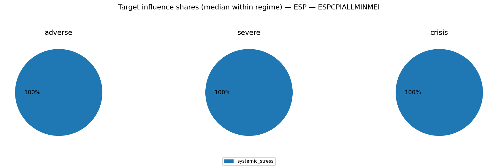
Breakdowns (full list; includes "Other"):
- [TARGET_INFLUENCE_BREAKDOWN__ESP__ESPCPIALLMINMEI__adverse.csv](TARGET_INFLUENCE_BREAKDOWN__ESP__ESPCPIALLMINMEI__adverse.csv)
- [TARGET_INFLUENCE_BREAKDOWN__ESP__ESPCPIALLMINMEI__severe.csv](TARGET_INFLUENCE_BREAKDOWN__ESP__ESPCPIALLMINMEI__severe.csv)
- [TARGET_INFLUENCE_BREAKDOWN__ESP__ESPCPIALLMINMEI__crisis.csv](TARGET_INFLUENCE_BREAKDOWN__ESP__ESPCPIALLMINMEI__crisis.csv)

### Severity share decomposition ("cake" slices)
Shares are fractions of $S_{L2}^2$ attributable to each block (using squared terminal cumulatives).
Interpretation: a large share means the block contributes more to the **simulation severity metric** used here.
This can happen because the block has larger tail dispersion / higher volatility / stronger cumulative drift over the horizon.
It does **not** by itself prove the block has larger causal impact on GDP/PD/LGD; for that, compute shares in propagated target space.
Reported as median share with quantile band q10/q90 within each regime.

**adverse**
- banking_system:  20.0% [  0.9%,  64.8%]
- commodities:  10.3% [  0.4%,  48.4%]
- external_fx:   9.5% [  0.3%,  40.6%]
- systemic_stress:   8.7% [  0.3%,  42.4%]
- financial_markets:   7.1% [  0.2%,  34.8%]
- public_finance:   4.5% [  0.2%,  23.3%]
- real_estate:   0.9% [  0.0%,   5.6%]
- macro:   0.4% [  0.0%,   2.3%]

**severe**
- banking_system:  29.2% [  1.6%,  70.9%]
- systemic_stress:   9.8% [  0.5%,  38.0%]
- commodities:   7.7% [  0.4%,  42.6%]
- external_fx:   7.2% [  0.2%,  41.0%]
- financial_markets:   6.6% [  0.2%,  33.4%]
- public_finance:   4.4% [  0.1%,  18.2%]
- real_estate:   0.5% [  0.0%,   3.2%]
- macro:   0.2% [  0.0%,   1.4%]

**crisis**
- banking_system:  48.3% [  5.2%,  80.5%]
- systemic_stress:   8.0% [  0.4%,  33.3%]
- financial_markets:   6.4% [  0.2%,  28.6%]
- external_fx:   6.2% [  0.2%,  32.2%]
- commodities:   5.0% [  0.2%,  34.9%]
- public_finance:   2.8% [  0.1%,  15.1%]
- real_estate:   0.4% [  0.0%,   2.2%]
- macro:   0.1% [  0.0%,   1.2%]

Breakdowns (full list; includes "Other"):
- [SEVERITY_SHARE_BREAKDOWN__ESP__adverse.csv](SEVERITY_SHARE_BREAKDOWN__ESP__adverse.csv)
- [SEVERITY_SHARE_BREAKDOWN__ESP__severe.csv](SEVERITY_SHARE_BREAKDOWN__ESP__severe.csv)
- [SEVERITY_SHARE_BREAKDOWN__ESP__crisis.csv](SEVERITY_SHARE_BREAKDOWN__ESP__crisis.csv)

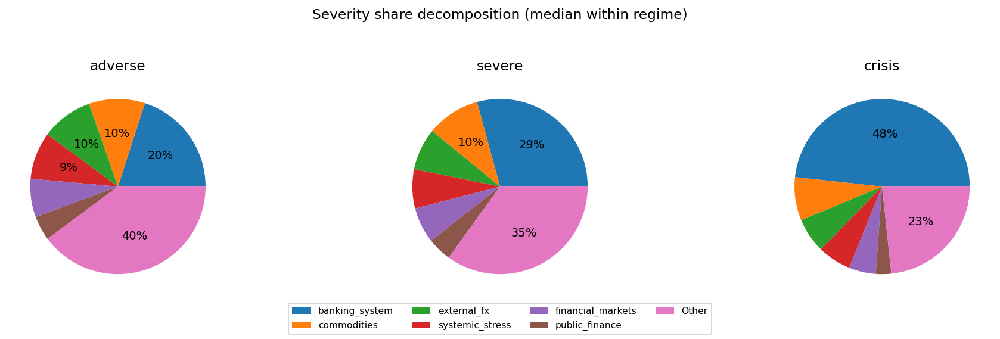

### Comovement snapshot (corr of terminal cumulative across draws)
Positive = blocks tend to move together across scenarios; negative = trade-offs.

- external_fx ↔ public_finance: corr=+0.44
- systemic_stress ↔ financial_markets: corr=+0.40
- financial_markets ↔ public_finance: corr=+0.32
- commodities ↔ public_finance: corr=+0.32
- banking_system ↔ systemic_stress: corr=-0.31
- commodities ↔ financial_markets: corr=+0.26
- external_fx ↔ financial_markets: corr=+0.24
- banking_system ↔ public_finance: corr=+0.16
- systemic_stress ↔ public_finance: corr=+0.14
- banking_system ↔ real_estate: corr=-0.13
- commodities ↔ systemic_stress: corr=+0.13
- systemic_stress ↔ external_fx: corr=+0.13

## FRA

Regime counts (draws):
- baseline: 2500
- adverse: 1500
- severe: 750
- crisis: 250

Top blocks by cross-draw variability (used for comovement summaries):
- banking_system, public_finance, systemic_stress, commodities, external_fx, financial_markets, macro, real_estate

### Typical block terminal cumulative (median with q10/q90; sigmas)
(Signs depend on factor definitions; focus on magnitude + co-movement patterns.)

**baseline**
- commodities: +0.24 [-5.80, +5.86]
- financial_markets: +0.15 [-5.26, +5.46]
- external_fx: -0.09 [-5.60, +5.62]
- banking_system: -0.07 [-6.48, +6.41]
- macro: -0.06 [-2.39, +2.46]
- public_finance: +0.05 [-6.33, +6.49]
- systemic_stress: +0.01 [-5.17, +5.31]
- real_estate: +0.01 [-1.48, +1.49]
**adverse**
- banking_system: +0.11 [-10.40, +10.64]
- external_fx: -0.09 [-8.11, +8.16]
- commodities: +0.08 [-8.16, +8.03]
- financial_markets: +0.06 [-7.35, +7.61]
- macro: -0.05 [-2.56, +2.58]
- real_estate: +0.04 [-1.50, +1.55]
- public_finance: -0.02 [-10.11, +10.21]
- systemic_stress: +0.02 [-8.04, +7.40]
**severe**
- public_finance: +1.21 [-14.73, +14.12]
- systemic_stress: +0.36 [-9.39, +10.26]
- external_fx: -0.35 [-8.61, +8.63]
- commodities: +0.14 [-8.39, +9.51]
- banking_system: -0.11 [-15.23, +14.80]
- real_estate: -0.06 [-1.66, +1.52]
- macro: -0.04 [-2.65, +2.74]
- financial_markets: +0.02 [-8.75, +8.97]
**crisis**
- banking_system: +7.16 [-20.93, +20.94]
- public_finance: -4.18 [-20.03, +19.49]
- systemic_stress: +0.41 [-12.41, +12.50]
- financial_markets: +0.27 [-7.85, +8.77]
- macro: -0.12 [-2.83, +2.81]
- external_fx: +0.05 [-9.13, +8.36]
- real_estate: +0.04 [-1.65, +1.60]
- commodities: -0.02 [-9.88, +9.65]

### Outcome-space influence proxy (Step 4 targets)
This section projects simulated factor shocks into Step 4 targets using the stored linear coefficients.
Important: this is a **proxy** because Step 4 feature scaling may differ from the Step 12 simulation shock units.
We use **terminal cumulative standardized shocks** (sum of daily/monthly $z$ shocks) and ignore AR target lags when they are not simulated.

#### FRA_GDP_EUROSTAT
- transform=yoy_log_pct; features=daily_shortlist; test_r2=-0.084; coef_coverage≈23.5%
- WARNING: Low test $R^2$: treat regime/attribution patterns as low confidence.
- Ignored non-simulated features (often AR lags): FRA_GDP_EUROSTAT_lag1, FRA_GDP_EUROSTAT_lag3, GC.DOD.TOTL.GD.ZS_FRA, BIS_LBS_Household_Loans_FRA, FRA_GDP_EUROSTAT_lag2, ECBDFR, DCOILBRENTEU

Typical projected target impact (median with q10/q90; arbitrary units)
- baseline: -0.092 [-3.964, +3.674]
- adverse: +0.174 [-4.597, +4.770]
- severe: -0.251 [-5.810, +5.905]
- crisis: +0.885 [-7.804, +8.465]

Influence share decomposition by block (median share with q10/q90 within regime)
**adverse**
- systemic_stress: 100.0% [100.0%, 100.0%]

**severe**
- systemic_stress: 100.0% [100.0%, 100.0%]

**crisis**
- systemic_stress: 100.0% [100.0%, 100.0%]

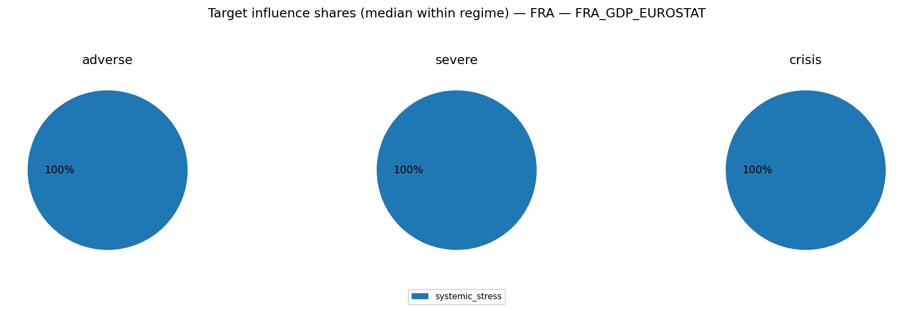
Breakdowns (full list; includes "Other"):
- [TARGET_INFLUENCE_BREAKDOWN__FRA__FRA_GDP_EUROSTAT__adverse.csv](TARGET_INFLUENCE_BREAKDOWN__FRA__FRA_GDP_EUROSTAT__adverse.csv)
- [TARGET_INFLUENCE_BREAKDOWN__FRA__FRA_GDP_EUROSTAT__severe.csv](TARGET_INFLUENCE_BREAKDOWN__FRA__FRA_GDP_EUROSTAT__severe.csv)
- [TARGET_INFLUENCE_BREAKDOWN__FRA__FRA_GDP_EUROSTAT__crisis.csv](TARGET_INFLUENCE_BREAKDOWN__FRA__FRA_GDP_EUROSTAT__crisis.csv)

#### FRA_UNRATE_EUROSTAT
- transform=level; features=daily_shortlist; test_r2=0.797; coef_coverage≈2.8%
- Ignored non-simulated features (often AR lags): FRA_UNRATE_EUROSTAT_lag1, ECBDFR, GC.DOD.TOTL.GD.ZS_FRA, DCOILBRENTEU

Typical projected target impact (median with q10/q90; arbitrary units)
- baseline: +0.007 [-0.276, +0.298]
- adverse: -0.013 [-0.359, +0.346]
- severe: +0.019 [-0.444, +0.437]
- crisis: -0.067 [-0.637, +0.587]

Influence share decomposition by block (median share with q10/q90 within regime)
**adverse**
- systemic_stress: 100.0% [100.0%, 100.0%]

**severe**
- systemic_stress: 100.0% [100.0%, 100.0%]

**crisis**
- systemic_stress: 100.0% [100.0%, 100.0%]

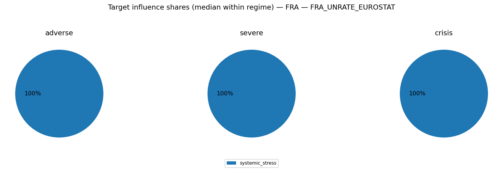
Breakdowns (full list; includes "Other"):
- [TARGET_INFLUENCE_BREAKDOWN__FRA__FRA_UNRATE_EUROSTAT__adverse.csv](TARGET_INFLUENCE_BREAKDOWN__FRA__FRA_UNRATE_EUROSTAT__adverse.csv)
- [TARGET_INFLUENCE_BREAKDOWN__FRA__FRA_UNRATE_EUROSTAT__severe.csv](TARGET_INFLUENCE_BREAKDOWN__FRA__FRA_UNRATE_EUROSTAT__severe.csv)
- [TARGET_INFLUENCE_BREAKDOWN__FRA__FRA_UNRATE_EUROSTAT__crisis.csv](TARGET_INFLUENCE_BREAKDOWN__FRA__FRA_UNRATE_EUROSTAT__crisis.csv)

#### FRACPIALLMINMEI
- transform=yoy_log_pct; features=daily_shortlist; test_r2=0.652; coef_coverage≈1.7%
- Ignored non-simulated features (often AR lags): FRACPIALLMINMEI_lag1, GC.DOD.TOTL.GD.ZS_FRA, BIS_LBS_Household_Loans_FRA, DCOILBRENTEU, ECBDFR, FRACPIALLMINMEI_lag3

Typical projected target impact (median with q10/q90; arbitrary units)
- baseline: -0.005 [-0.205, +0.190]
- adverse: +0.009 [-0.238, +0.247]
- severe: -0.013 [-0.301, +0.306]
- crisis: +0.046 [-0.404, +0.439]

Influence share decomposition by block (median share with q10/q90 within regime)
**adverse**
- systemic_stress: 100.0% [100.0%, 100.0%]

**severe**
- systemic_stress: 100.0% [100.0%, 100.0%]

**crisis**
- systemic_stress: 100.0% [100.0%, 100.0%]

Breakdowns (full list; includes "Other"):
- [TARGET_INFLUENCE_BREAKDOWN__FRA__FRACPIALLMINMEI__adverse.csv](TARGET_INFLUENCE_BREAKDOWN__FRA__FRACPIALLMINMEI__adverse.csv)
- [TARGET_INFLUENCE_BREAKDOWN__FRA__FRACPIALLMINMEI__severe.csv](TARGET_INFLUENCE_BREAKDOWN__FRA__FRACPIALLMINMEI__severe.csv)
- [TARGET_INFLUENCE_BREAKDOWN__FRA__FRACPIALLMINMEI__crisis.csv](TARGET_INFLUENCE_BREAKDOWN__FRA__FRACPIALLMINMEI__crisis.csv)

### Severity share decomposition ("cake" slices)
Shares are fractions of $S_{L2}^2$ attributable to each block (using squared terminal cumulatives).
Interpretation: a large share means the block contributes more to the **simulation severity metric** used here.
This can happen because the block has larger tail dispersion / higher volatility / stronger cumulative drift over the horizon.
It does **not** by itself prove the block has larger causal impact on GDP/PD/LGD; for that, compute shares in propagated target space.
Reported as median share with quantile band q10/q90 within each regime.

**adverse**
- banking_system:  17.3% [  0.8%,  56.0%]
- public_finance:  16.7% [  0.6%,  50.6%]
- systemic_stress:   7.9% [  0.3%,  33.5%]
- commodities:   7.7% [  0.2%,  38.3%]
- external_fx:   7.5% [  0.3%,  38.0%]
- financial_markets:   6.4% [  0.2%,  33.3%]
- macro:   0.6% [  0.0%,   4.3%]
- real_estate:   0.2% [  0.0%,   1.5%]

**severe**
- banking_system:  25.3% [  1.5%,  59.5%]
- public_finance:  24.9% [  2.4%,  57.9%]
- systemic_stress:   7.2% [  0.3%,  31.3%]
- commodities:   5.0% [  0.2%,  29.4%]
- financial_markets:   5.0% [  0.3%,  28.1%]
- external_fx:   4.6% [  0.2%,  26.7%]
- macro:   0.5% [  0.0%,   2.9%]
- real_estate:   0.2% [  0.0%,   1.0%]

**crisis**
- banking_system:  35.2% [  7.7%,  64.9%]
- public_finance:  33.4% [  4.2%,  57.0%]
- systemic_stress:   8.3% [  0.7%,  24.8%]
- commodities:   3.8% [  0.2%,  19.3%]
- external_fx:   2.5% [  0.0%,  17.9%]
- financial_markets:   2.4% [  0.1%,  15.8%]
- macro:   0.2% [  0.0%,   1.7%]
- real_estate:   0.1% [  0.0%,   0.5%]

Breakdowns (full list; includes "Other"):
- [SEVERITY_SHARE_BREAKDOWN__FRA__adverse.csv](SEVERITY_SHARE_BREAKDOWN__FRA__adverse.csv)
- [SEVERITY_SHARE_BREAKDOWN__FRA__severe.csv](SEVERITY_SHARE_BREAKDOWN__FRA__severe.csv)
- [SEVERITY_SHARE_BREAKDOWN__FRA__crisis.csv](SEVERITY_SHARE_BREAKDOWN__FRA__crisis.csv)

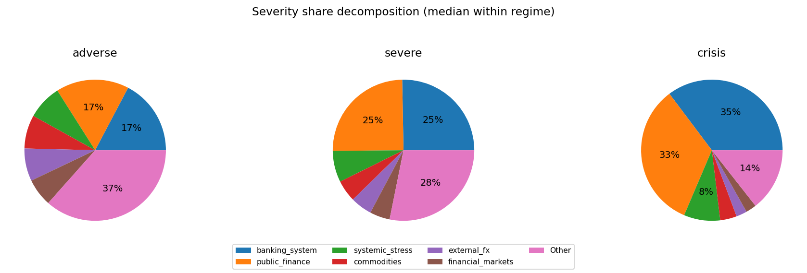

### Comovement snapshot (corr of terminal cumulative across draws)
Positive = blocks tend to move together across scenarios; negative = trade-offs.

- banking_system ↔ public_finance: corr=-0.55
- public_finance ↔ systemic_stress: corr=+0.47
- systemic_stress ↔ financial_markets: corr=+0.42
- banking_system ↔ systemic_stress: corr=-0.39
- external_fx ↔ financial_markets: corr=+0.27
- public_finance ↔ external_fx: corr=+0.24
- public_finance ↔ commodities: corr=+0.23
- banking_system ↔ macro: corr=+0.19
- public_finance ↔ financial_markets: corr=+0.18
- systemic_stress ↔ external_fx: corr=+0.16
- public_finance ↔ macro: corr=-0.14
- systemic_stress ↔ commodities: corr=+0.14

## ITA

Regime counts (draws):
- baseline: 2500
- adverse: 1500
- severe: 750
- crisis: 250

Top blocks by cross-draw variability (used for comovement summaries):
- banking_system, commodities, external_fx, systemic_stress, financial_markets, public_finance, real_estate, macro

### Typical block terminal cumulative (median with q10/q90; sigmas)
(Signs depend on factor definitions; focus on magnitude + co-movement patterns.)

**baseline**
- public_finance: -0.16 [-4.04, +4.23]
- external_fx: -0.08 [-5.48, +5.40]
- financial_markets: -0.07 [-5.04, +4.96]
- banking_system: +0.07 [-6.57, +6.31]
- commodities: +0.06 [-5.74, +5.56]
- systemic_stress: -0.05 [-5.33, +5.01]
- real_estate: +0.02 [-1.69, +1.71]
- macro: +0.02 [-1.49, +1.48]
**adverse**
- banking_system: +0.45 [-10.34, +10.75]
- systemic_stress: +0.16 [-7.51, +7.98]
- public_finance: -0.15 [-5.38, +5.39]
- commodities: -0.15 [-8.54, +8.56]
- financial_markets: -0.14 [-7.54, +7.17]
- external_fx: -0.11 [-7.74, +7.73]
- macro: +0.03 [-1.52, +1.55]
- real_estate: +0.01 [-1.75, +1.87]
**severe**
- systemic_stress: +0.72 [-9.65, +9.63]
- banking_system: -0.69 [-14.87, +14.13]
- commodities: +0.59 [-10.04, +9.95]
- external_fx: -0.31 [-10.43, +9.20]
- financial_markets: +0.19 [-8.97, +9.44]
- public_finance: -0.10 [-6.81, +6.37]
- real_estate: -0.03 [-1.63, +1.86]
- macro: +0.00 [-1.62, +1.65]
**crisis**
- banking_system: +2.28 [-20.71, +20.62]
- systemic_stress: -0.88 [-11.09, +12.00]
- public_finance: -0.37 [-7.09, +7.77]
- financial_markets: +0.35 [-10.72, +10.78]
- external_fx: -0.20 [-9.28, +10.66]
- commodities: -0.14 [-11.71, +10.63]
- real_estate: +0.09 [-1.83, +1.67]
- macro: +0.06 [-1.39, +1.90]

### Outcome-space influence proxy (Step 4 targets)
This section projects simulated factor shocks into Step 4 targets using the stored linear coefficients.
Important: this is a **proxy** because Step 4 feature scaling may differ from the Step 12 simulation shock units.
We use **terminal cumulative standardized shocks** (sum of daily/monthly $z$ shocks) and ignore AR target lags when they are not simulated.

#### ITA_GDP_EUROSTAT
- transform=yoy_log_pct; features=daily_shortlist; test_r2=0.233; coef_coverage≈32.7%
- Ignored non-simulated features (often AR lags): ITA_GDP_EUROSTAT_lag1, ECBDFR, BIS_LBS_Household_Loans_ITA, ITA_GDP_EUROSTAT_lag3, DCOILBRENTEU

Typical projected target impact (median with q10/q90; arbitrary units)
- baseline: +0.033 [-4.676, +4.685]
- adverse: -0.013 [-6.013, +6.044]
- severe: -0.051 [-7.297, +6.834]
- crisis: +0.049 [-9.248, +9.515]

Influence share decomposition by block (median share with q10/q90 within regime)
**adverse**
- systemic_stress: 100.0% [100.0%, 100.0%]

**severe**
- systemic_stress: 100.0% [100.0%, 100.0%]

**crisis**
- systemic_stress: 100.0% [100.0%, 100.0%]

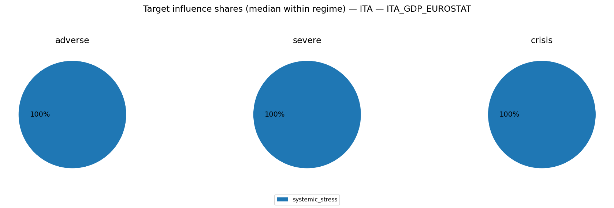
Breakdowns (full list; includes "Other"):
- [TARGET_INFLUENCE_BREAKDOWN__ITA__ITA_GDP_EUROSTAT__adverse.csv](TARGET_INFLUENCE_BREAKDOWN__ITA__ITA_GDP_EUROSTAT__adverse.csv)
- [TARGET_INFLUENCE_BREAKDOWN__ITA__ITA_GDP_EUROSTAT__severe.csv](TARGET_INFLUENCE_BREAKDOWN__ITA__ITA_GDP_EUROSTAT__severe.csv)
- [TARGET_INFLUENCE_BREAKDOWN__ITA__ITA_GDP_EUROSTAT__crisis.csv](TARGET_INFLUENCE_BREAKDOWN__ITA__ITA_GDP_EUROSTAT__crisis.csv)

#### ITA_UNRATE_EUROSTAT
- transform=level; features=daily_shortlist; test_r2=0.924; coef_coverage≈3.5%
- Ignored non-simulated features (often AR lags): ITA_UNRATE_EUROSTAT_lag1, DCOILBRENTEU, ECBDFR, BIS_LBS_Household_Loans_ITA, GC.DOD.TOTL.GD.ZS_ITA

Typical projected target impact (median with q10/q90; arbitrary units)
- baseline: -0.003 [-0.392, +0.391]
- adverse: +0.001 [-0.506, +0.503]
- severe: +0.004 [-0.572, +0.610]
- crisis: -0.004 [-0.796, +0.774]

Influence share decomposition by block (median share with q10/q90 within regime)
**adverse**
- systemic_stress: 100.0% [100.0%, 100.0%]

**severe**
- systemic_stress: 100.0% [100.0%, 100.0%]

**crisis**
- systemic_stress: 100.0% [100.0%, 100.0%]

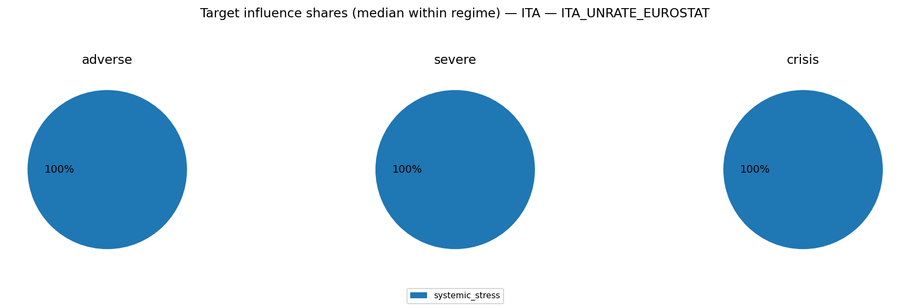
Breakdowns (full list; includes "Other"):
- [TARGET_INFLUENCE_BREAKDOWN__ITA__ITA_UNRATE_EUROSTAT__adverse.csv](TARGET_INFLUENCE_BREAKDOWN__ITA__ITA_UNRATE_EUROSTAT__adverse.csv)
- [TARGET_INFLUENCE_BREAKDOWN__ITA__ITA_UNRATE_EUROSTAT__severe.csv](TARGET_INFLUENCE_BREAKDOWN__ITA__ITA_UNRATE_EUROSTAT__severe.csv)
- [TARGET_INFLUENCE_BREAKDOWN__ITA__ITA_UNRATE_EUROSTAT__crisis.csv](TARGET_INFLUENCE_BREAKDOWN__ITA__ITA_UNRATE_EUROSTAT__crisis.csv)

#### ITACPIALLMINMEI
- transform=yoy_log_pct; features=daily_shortlist; test_r2=0.874; coef_coverage≈1.7%
- Ignored non-simulated features (often AR lags): ITACPIALLMINMEI_lag1, GC.DOD.TOTL.GD.ZS_ITA, ECBDFR, DCOILBRENTEU, ITACPIALLMINMEI_lag3, BIS_LBS_Household_Loans_ITA

Typical projected target impact (median with q10/q90; arbitrary units)
- baseline: +0.001 [-0.191, +0.192]
- adverse: -0.001 [-0.246, +0.247]
- severe: -0.002 [-0.299, +0.280]
- crisis: +0.002 [-0.379, +0.389]

Influence share decomposition by block (median share with q10/q90 within regime)
**adverse**
- systemic_stress: 100.0% [100.0%, 100.0%]

**severe**
- systemic_stress: 100.0% [100.0%, 100.0%]

**crisis**
- systemic_stress: 100.0% [100.0%, 100.0%]

Breakdowns (full list; includes "Other"):
- [TARGET_INFLUENCE_BREAKDOWN__ITA__ITACPIALLMINMEI__adverse.csv](TARGET_INFLUENCE_BREAKDOWN__ITA__ITACPIALLMINMEI__adverse.csv)
- [TARGET_INFLUENCE_BREAKDOWN__ITA__ITACPIALLMINMEI__severe.csv](TARGET_INFLUENCE_BREAKDOWN__ITA__ITACPIALLMINMEI__severe.csv)
- [TARGET_INFLUENCE_BREAKDOWN__ITA__ITACPIALLMINMEI__crisis.csv](TARGET_INFLUENCE_BREAKDOWN__ITA__ITACPIALLMINMEI__crisis.csv)

### Severity share decomposition ("cake" slices)
Shares are fractions of $S_{L2}^2$ attributable to each block (using squared terminal cumulatives).
Interpretation: a large share means the block contributes more to the **simulation severity metric** used here.
This can happen because the block has larger tail dispersion / higher volatility / stronger cumulative drift over the horizon.
It does **not** by itself prove the block has larger causal impact on GDP/PD/LGD; for that, compute shares in propagated target space.
Reported as median share with quantile band q10/q90 within each regime.

**adverse**
- banking_system:  21.1% [  0.9%,  66.6%]
- commodities:  10.8% [  0.4%,  46.5%]
- external_fx:   8.7% [  0.4%,  40.5%]
- systemic_stress:   8.7% [  0.3%,  42.1%]
- financial_markets:   8.0% [  0.4%,  35.9%]
- public_finance:   4.4% [  0.1%,  21.6%]
- real_estate:   0.4% [  0.0%,   2.5%]
- macro:   0.3% [  0.0%,   1.9%]

**severe**
- banking_system:  28.3% [  2.1%,  70.6%]
- systemic_stress:   9.3% [  0.4%,  38.5%]
- external_fx:   8.9% [  0.3%,  39.9%]
- commodities:   8.1% [  0.4%,  42.6%]
- financial_markets:   7.7% [  0.3%,  34.7%]
- public_finance:   3.8% [  0.1%,  19.3%]
- real_estate:   0.2% [  0.0%,   1.6%]
- macro:   0.2% [  0.0%,   1.3%]

**crisis**
- banking_system:  50.0% [  4.8%,  83.5%]
- systemic_stress:   8.5% [  0.5%,  31.2%]
- financial_markets:   6.7% [  0.2%,  30.4%]
- commodities:   5.7% [  0.2%,  36.2%]
- external_fx:   5.1% [  0.2%,  27.5%]
- public_finance:   2.9% [  0.2%,  15.1%]
- macro:   0.1% [  0.0%,   0.8%]
- real_estate:   0.1% [  0.0%,   0.9%]

Breakdowns (full list; includes "Other"):
- [SEVERITY_SHARE_BREAKDOWN__ITA__adverse.csv](SEVERITY_SHARE_BREAKDOWN__ITA__adverse.csv)
- [SEVERITY_SHARE_BREAKDOWN__ITA__severe.csv](SEVERITY_SHARE_BREAKDOWN__ITA__severe.csv)
- [SEVERITY_SHARE_BREAKDOWN__ITA__crisis.csv](SEVERITY_SHARE_BREAKDOWN__ITA__crisis.csv)

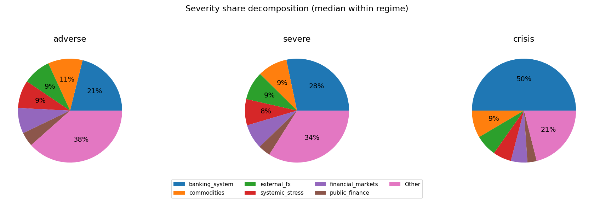

### Comovement snapshot (corr of terminal cumulative across draws)
Positive = blocks tend to move together across scenarios; negative = trade-offs.

- external_fx ↔ public_finance: corr=+0.43
- systemic_stress ↔ financial_markets: corr=+0.41
- financial_markets ↔ public_finance: corr=+0.37
- commodities ↔ public_finance: corr=+0.34
- external_fx ↔ financial_markets: corr=+0.31
- banking_system ↔ systemic_stress: corr=-0.27
- commodities ↔ financial_markets: corr=+0.18
- systemic_stress ↔ public_finance: corr=+0.17
- external_fx ↔ systemic_stress: corr=+0.14
- public_finance ↔ real_estate: corr=+0.13
- commodities ↔ systemic_stress: corr=+0.12
- banking_system ↔ public_finance: corr=+0.10

## USA

Regime counts (draws):
- baseline: 2500
- adverse: 1500
- severe: 750
- crisis: 250

Top blocks by cross-draw variability (used for comovement summaries):
- external_fx, systemic_stress, public_finance, commodities, financial_markets, banking_system, real_estate, macro

### Typical block terminal cumulative (median with q10/q90; sigmas)
(Signs depend on factor definitions; focus on magnitude + co-movement patterns.)

**baseline**
- public_finance: -0.15 [-5.76, +5.76]
- commodities: +0.12 [-5.99, +6.10]
- systemic_stress: +0.09 [-5.40, +5.68]
- macro: +0.06 [-1.72, +1.76]
- banking_system: +0.04 [-4.65, +4.81]
- real_estate: -0.04 [-1.97, +1.97]
- financial_markets: +0.03 [-5.30, +5.78]
- external_fx: +0.02 [-5.99, +6.17]
**adverse**
- systemic_stress: +0.90 [-9.74, +9.78]
- financial_markets: +0.51 [-7.70, +8.31]
- public_finance: +0.36 [-9.79, +9.69]
- real_estate: +0.07 [-2.09, +2.15]
- external_fx: -0.05 [-10.23, +10.38]
- macro: +0.05 [-1.82, +1.95]
- commodities: -0.03 [-8.30, +8.54]
- banking_system: -0.03 [-6.94, +6.65]
**severe**
- public_finance: +0.80 [-13.90, +13.97]
- external_fx: +0.69 [-14.38, +14.77]
- banking_system: -0.47 [-8.69, +8.05]
- systemic_stress: +0.27 [-13.61, +14.05]
- commodities: -0.10 [-9.69, +8.35]
- financial_markets: -0.09 [-9.28, +7.57]
- macro: -0.03 [-1.97, +1.77]
- real_estate: -0.01 [-1.97, +2.14]
**crisis**
- systemic_stress: +9.39 [-19.08, +20.11]
- public_finance: +5.09 [-19.75, +19.60]
- external_fx: +4.54 [-20.35, +21.42]
- banking_system: -0.46 [-11.25, +10.05]
- real_estate: -0.16 [-2.17, +1.99]
- macro: -0.03 [-1.77, +1.68]
- financial_markets: -0.02 [-8.92, +8.54]
- commodities: -0.02 [-9.42, +8.66]

### Outcome-space influence proxy (Step 4 targets)
This section projects simulated factor shocks into Step 4 targets using the stored linear coefficients.
Important: this is a **proxy** because Step 4 feature scaling may differ from the Step 12 simulation shock units.
We use **terminal cumulative standardized shocks** (sum of daily/monthly $z$ shocks) and ignore AR target lags when they are not simulated.

#### GDPC1
- transform=yoy_log_pct; features=daily_shortlist; test_r2=0.054; coef_coverage≈14.1%
- WARNING: Low test $R^2$: treat regime/attribution patterns as low confidence.
- Ignored non-simulated features (often AR lags): GC.DOD.TOTL.GD.ZS_USA, GDPC1_lag1, BIS_LBS_Household_Loans_USA, GDPC1_lag3, DFF, GDPC1_lag2, DCOILBRENTEU

Typical projected target impact (median with q10/q90; arbitrary units)
- baseline: -0.140 [-4.195, +4.161]
- adverse: +0.044 [-5.813, +5.833]
- severe: +0.029 [-7.966, +7.847]
- crisis: -1.295 [-10.866, +10.615]

Influence share decomposition by block (median share with q10/q90 within regime)
**adverse**
- systemic_stress: 100.0% [100.0%, 100.0%]

**severe**
- systemic_stress: 100.0% [100.0%, 100.0%]

**crisis**
- systemic_stress: 100.0% [100.0%, 100.0%]

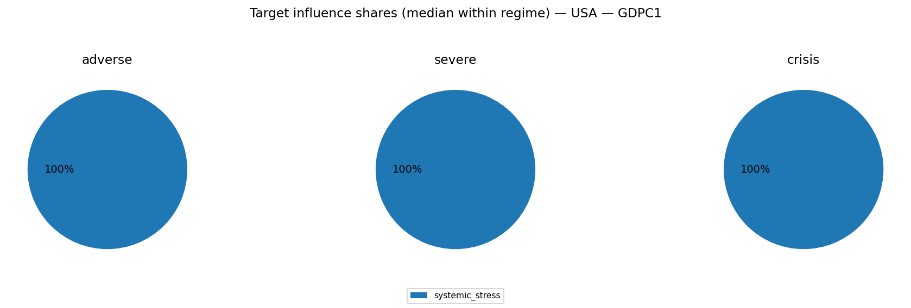
Breakdowns (full list; includes "Other"):
- [TARGET_INFLUENCE_BREAKDOWN__USA__GDPC1__adverse.csv](TARGET_INFLUENCE_BREAKDOWN__USA__GDPC1__adverse.csv)
- [TARGET_INFLUENCE_BREAKDOWN__USA__GDPC1__severe.csv](TARGET_INFLUENCE_BREAKDOWN__USA__GDPC1__severe.csv)
- [TARGET_INFLUENCE_BREAKDOWN__USA__GDPC1__crisis.csv](TARGET_INFLUENCE_BREAKDOWN__USA__GDPC1__crisis.csv)

#### CPIAUCSL
- transform=yoy_log_pct; features=daily_shortlist; test_r2=0.025; coef_coverage≈4.7%
- WARNING: Low test $R^2$: treat regime/attribution patterns as low confidence.
- Ignored non-simulated features (often AR lags): CPIAUCSL_lag1, GC.DOD.TOTL.GD.ZS_USA, DCOILBRENTEU, DFF, BIS_LBS_Household_Loans_USA, CPIAUCSL_lag2

Typical projected target impact (median with q10/q90; arbitrary units)
- baseline: -0.030 [-0.910, +0.903]
- adverse: +0.010 [-1.261, +1.265]
- severe: +0.006 [-1.728, +1.702]
- crisis: -0.281 [-2.357, +2.303]

Influence share decomposition by block (median share with q10/q90 within regime)
**adverse**
- systemic_stress: 100.0% [100.0%, 100.0%]

**severe**
- systemic_stress: 100.0% [100.0%, 100.0%]

**crisis**
- systemic_stress: 100.0% [100.0%, 100.0%]

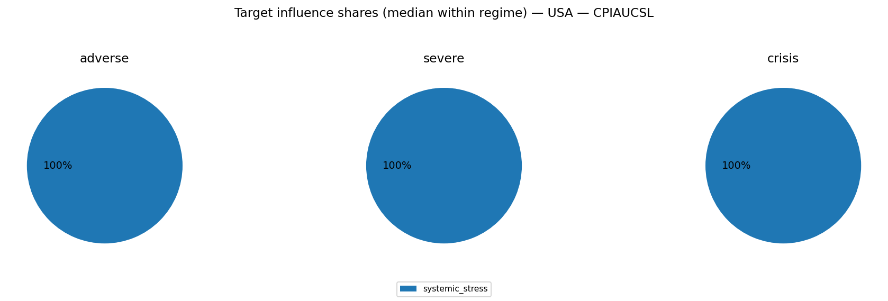
Breakdowns (full list; includes "Other"):
- [TARGET_INFLUENCE_BREAKDOWN__USA__CPIAUCSL__adverse.csv](TARGET_INFLUENCE_BREAKDOWN__USA__CPIAUCSL__adverse.csv)
- [TARGET_INFLUENCE_BREAKDOWN__USA__CPIAUCSL__severe.csv](TARGET_INFLUENCE_BREAKDOWN__USA__CPIAUCSL__severe.csv)
- [TARGET_INFLUENCE_BREAKDOWN__USA__CPIAUCSL__crisis.csv](TARGET_INFLUENCE_BREAKDOWN__USA__CPIAUCSL__crisis.csv)

#### UNRATE
- transform=level; features=daily_shortlist; test_r2=0.479; coef_coverage≈3.5%
- Ignored non-simulated features (often AR lags): UNRATE_lag1, GC.DOD.TOTL.GD.ZS_USA, UNRATE_lag3, UNRATE_lag2, BIS_LBS_Household_Loans_USA, DFF, DCOILBRENTEU

Typical projected target impact (median with q10/q90; arbitrary units)
- baseline: +0.017 [-0.518, +0.522]
- adverse: -0.006 [-0.725, +0.723]
- severe: -0.004 [-0.976, +0.991]
- crisis: +0.161 [-1.320, +1.351]

Influence share decomposition by block (median share with q10/q90 within regime)
**adverse**
- systemic_stress: 100.0% [100.0%, 100.0%]

**severe**
- systemic_stress: 100.0% [100.0%, 100.0%]

**crisis**
- systemic_stress: 100.0% [100.0%, 100.0%]

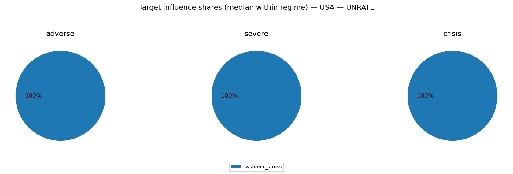
Breakdowns (full list; includes "Other"):
- [TARGET_INFLUENCE_BREAKDOWN__USA__UNRATE__adverse.csv](TARGET_INFLUENCE_BREAKDOWN__USA__UNRATE__adverse.csv)
- [TARGET_INFLUENCE_BREAKDOWN__USA__UNRATE__severe.csv](TARGET_INFLUENCE_BREAKDOWN__USA__UNRATE__severe.csv)
- [TARGET_INFLUENCE_BREAKDOWN__USA__UNRATE__crisis.csv](TARGET_INFLUENCE_BREAKDOWN__USA__UNRATE__crisis.csv)

### Severity share decomposition ("cake" slices)
Shares are fractions of $S_{L2}^2$ attributable to each block (using squared terminal cumulatives).
Interpretation: a large share means the block contributes more to the **simulation severity metric** used here.
This can happen because the block has larger tail dispersion / higher volatility / stronger cumulative drift over the horizon.
It does **not** by itself prove the block has larger causal impact on GDP/PD/LGD; for that, compute shares in propagated target space.
Reported as median share with quantile band q10/q90 within each regime.

**adverse**
- external_fx:  17.7% [  0.9%,  47.4%]
- systemic_stress:  17.3% [  1.7%,  41.6%]
- public_finance:  16.5% [  1.0%,  42.4%]
- commodities:   6.9% [  0.2%,  39.5%]
- financial_markets:   6.7% [  0.2%,  34.8%]
- banking_system:   5.3% [  0.2%,  24.7%]
- real_estate:   0.4% [  0.0%,   2.6%]
- macro:   0.3% [  0.0%,   2.0%]

**severe**
- systemic_stress:  24.0% [  8.4%,  41.5%]
- public_finance:  23.3% [  6.8%,  43.8%]
- external_fx:  22.8% [  3.8%,  47.6%]
- banking_system:   5.1% [  0.3%,  20.9%]
- commodities:   4.3% [  0.2%,  26.2%]
- financial_markets:   3.2% [  0.1%,  22.9%]
- real_estate:   0.2% [  0.0%,   1.3%]
- macro:   0.2% [  0.0%,   1.2%]

**crisis**
- systemic_stress:  28.7% [ 15.3%,  42.1%]
- external_fx:  28.4% [ 10.8%,  46.6%]
- public_finance:  26.6% [ 13.0%,  39.4%]
- banking_system:   4.3% [  0.5%,  14.6%]
- commodities:   2.5% [  0.1%,  12.2%]
- financial_markets:   2.3% [  0.1%,  11.0%]
- real_estate:   0.1% [  0.0%,   0.8%]
- macro:   0.1% [  0.0%,   0.5%]

Breakdowns (full list; includes "Other"):
- [SEVERITY_SHARE_BREAKDOWN__USA__adverse.csv](SEVERITY_SHARE_BREAKDOWN__USA__adverse.csv)
- [SEVERITY_SHARE_BREAKDOWN__USA__severe.csv](SEVERITY_SHARE_BREAKDOWN__USA__severe.csv)
- [SEVERITY_SHARE_BREAKDOWN__USA__crisis.csv](SEVERITY_SHARE_BREAKDOWN__USA__crisis.csv)

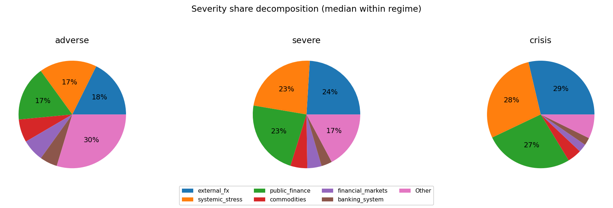

### Comovement snapshot (corr of terminal cumulative across draws)
Positive = blocks tend to move together across scenarios; negative = trade-offs.

- systemic_stress ↔ public_finance: corr=+0.83
- external_fx ↔ systemic_stress: corr=+0.76
- external_fx ↔ public_finance: corr=+0.73
- systemic_stress ↔ banking_system: corr=-0.58
- public_finance ↔ banking_system: corr=-0.55
- external_fx ↔ banking_system: corr=-0.45
- systemic_stress ↔ financial_markets: corr=+0.25
- public_finance ↔ commodities: corr=+0.24
- commodities ↔ financial_markets: corr=+0.22
- systemic_stress ↔ commodities: corr=+0.21
- public_finance ↔ financial_markets: corr=+0.16
- financial_markets ↔ macro: corr=+0.13
