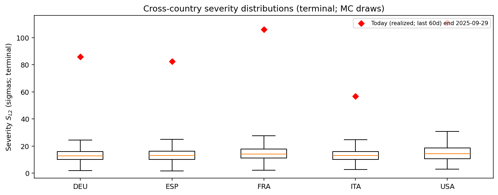
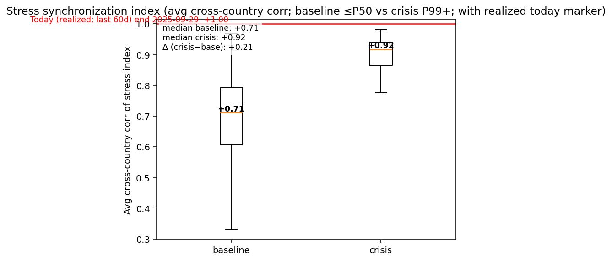
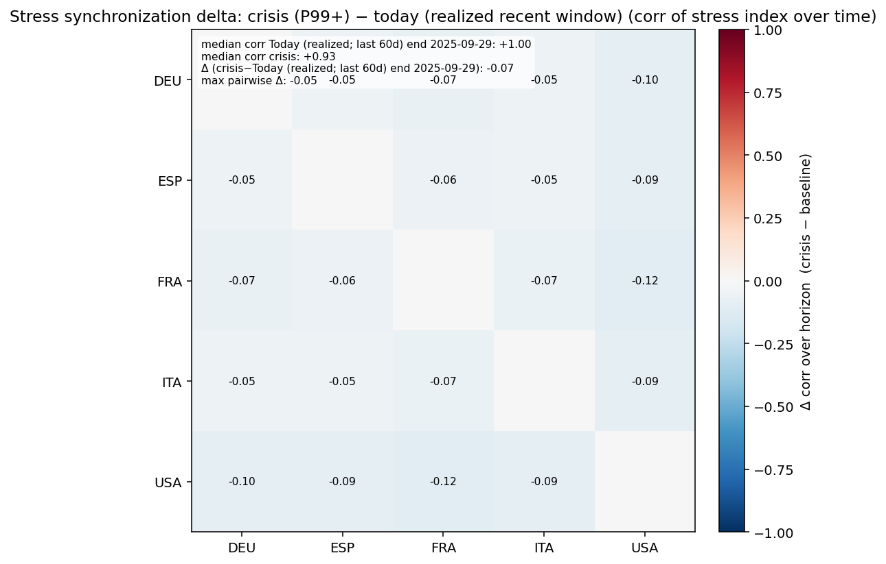

# Monte Carlo Cross-Country Executive Summary — latest_20260225

This is generated from existing Step 12 block-aggregate matrices (z-space).
It is tail-focused and designed for cross-country comparability.

## Tail severity ranking
(Median and P99 of $S_{L2}$ across draws; higher = more severe simulated stress.)

| ISO | Median | P99 |
|---|---:|---:|
| USA | 14.25 | 34.96 |
| FRA | 14.10 | 30.06 |
| DEU | 12.85 | 25.96 |
| ESP | 13.09 | 25.76 |
| ITA | 12.93 | 25.66 |

## Figures
- 
- 
- 
- 
- 

## Realized today marker
Computed over the last 60 days ending 2025-09-29: standardized residuals × Dt, then scaled by vol_t0, aggregated to blocks in z-space.

## Synchronization takeaway
Average cross-country synchronization (median) rises from **+0.71** (baseline ≤P50) to **+0.92** (crisis P99+).
