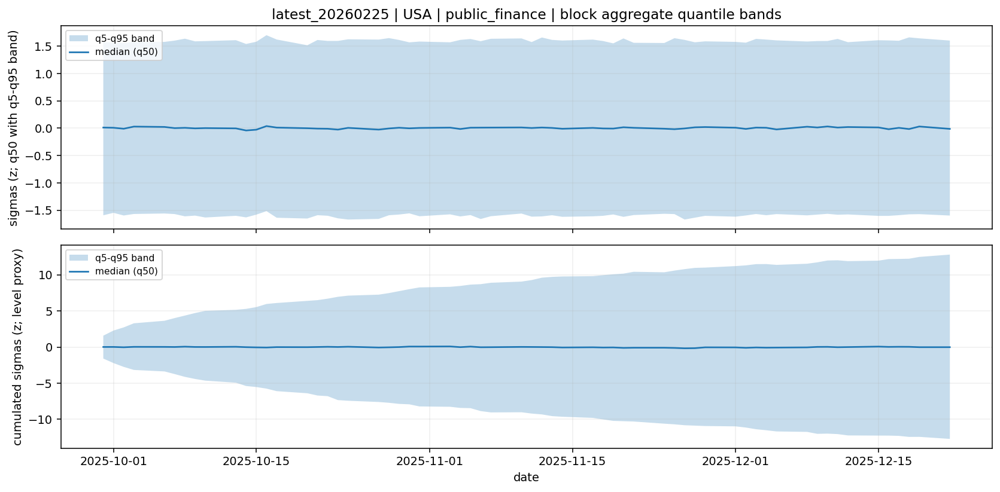

# Block plot: latest_20260225 | USA | public_finance

## What you are looking at
- **Top panel**: block aggregate impulse (mean across factors in **sigmas**; comparable across mixed units).
- **Bottom panel**: cumulative aggregate (a **level proxy**) in sigmas.

## How to interpret
- **Impulse dispersion** (colored lines spread) = scenario uncertainty about day-to-day shocks.
- **Cumulative drift** (paths trend away from 0) = persistent regime direction (scenario *state*).
- **Mean-reverting look** (wiggles around 0 with little drift) = stationary noise; impacts tend to wash out.

## Block context (economic transmission)
- Public finance: sovereign risk / fiscal conditions.
- Adverse moves here can interact with banking via sovereign-bank linkages.

## Practical consequence checklist
These are conditional interpretations (sign conventions vary by factor definition):
- **Rates/yields**: higher level proxy often implies tighter financial conditions and pressure on risk assets.
- **Credit spreads/systemic stress**: widening often implies risk-off, funding stress, and tighter credit supply.
- **FX**: depreciation/appreciation affects imported inflation, competitiveness, and FX liabilities.
- **Commodities**: higher energy/commodity prices feed inflation; lower prices can signal demand weakness.

## Notes
- Quantile bands are computed across all draws (q5/q50/q95).
- This plot summarizes distributional uncertainty rather than individual draw paths.
