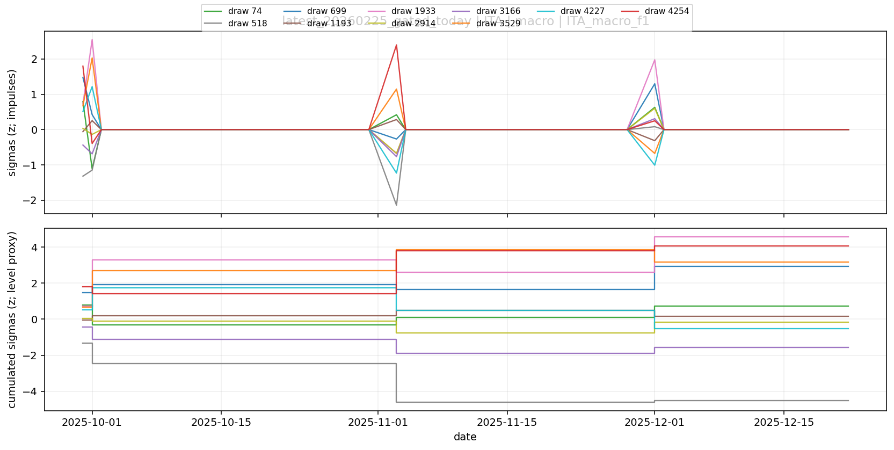

# Factor plot: latest_20260225_gated_today | ITA | macro | ITA_macro_f1

## What you are looking at
- **Top panel**: daily shocks in **sigmas** ($z$; standardized by $\sigma_{t0}$).
- **Bottom panel**: cumulative sum (a **level proxy**), in sigmas.
- **Low-frequency note**: the cumulative panel may be rendered as a step/LOCF-style path (release-day updates).

## How to interpret
- **Impulse dispersion** (colored lines spread) = scenario uncertainty about day-to-day shocks.
- **Cumulative drift** (paths trend away from 0) = persistent regime direction (scenario *state*).
- **Mean-reverting look** (wiggles around 0 with little drift) = stationary noise; impacts tend to wash out.

## Block context (economic transmission)
- Macro: broad activity/inflation/growth conditions.
- Large persistent cumulative moves suggest a regime shift rather than noise.

## Practical consequence checklist
These are conditional interpretations (sign conventions vary by factor definition):
- **Rates/yields**: higher level proxy often implies tighter financial conditions and pressure on risk assets.
- **Credit spreads/systemic stress**: widening often implies risk-off, funding stress, and tighter credit supply.
- **FX**: depreciation/appreciation affects imported inflation, competitiveness, and FX liabilities.
- **Commodities**: higher energy/commodity prices feed inflation; lower prices can signal demand weakness.
