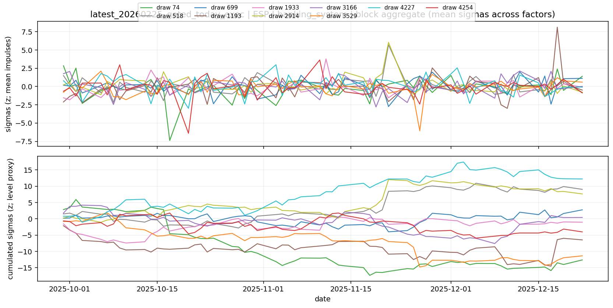

# Block plot: latest_20260225_gated_today_exec | ESP | banking_system

## What you are looking at
- **Top panel**: block aggregate impulse (mean across factors in **sigmas**; comparable across mixed units).
- **Bottom panel**: cumulative aggregate (a **level proxy**) in sigmas.

## How to interpret
- **Impulse dispersion** (colored lines spread) = scenario uncertainty about day-to-day shocks.
- **Cumulative drift** (paths trend away from 0) = persistent regime direction (scenario *state*).
- **Mean-reverting look** (wiggles around 0 with little drift) = stationary noise; impacts tend to wash out.

## Block context (economic transmission)
- Banking system: credit conditions / funding stress / banking-sector feedback loops.
- Sustained stress here can propagate to the real economy via tighter credit.

## Practical consequence checklist
These are conditional interpretations (sign conventions vary by factor definition):
- **Rates/yields**: higher level proxy often implies tighter financial conditions and pressure on risk assets.
- **Credit spreads/systemic stress**: widening often implies risk-off, funding stress, and tighter credit supply.
- **FX**: depreciation/appreciation affects imported inflation, competitiveness, and FX liabilities.
- **Commodities**: higher energy/commodity prices feed inflation; lower prices can signal demand weakness.

## Notes
- Block aggregate is the mean across factors in standardized space (sigmas).
- It is intended for comparability across mixed-unit series (bps, %, etc.).
