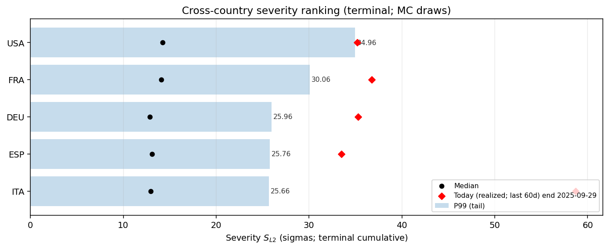
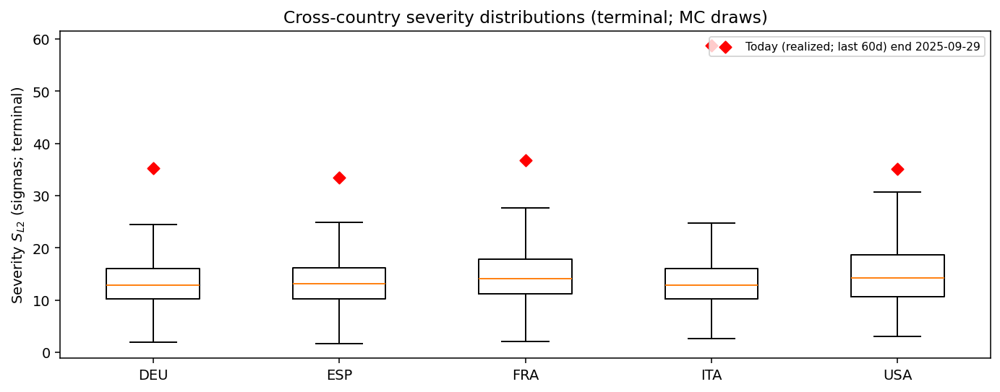
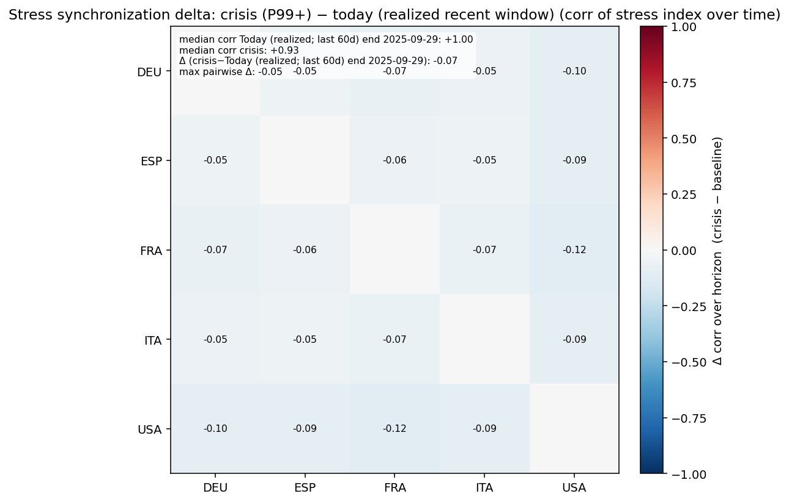

# Monte Carlo Cross-Country Executive Summary — latest_20260225_gated_today_exec

This is generated from existing Step 12 block-aggregate matrices (z-space).
It is tail-focused and designed for cross-country comparability.

## Tail severity ranking
(Median and P99 of $S_{L2}$ across draws; higher = more severe simulated stress.)

| ISO | Median | P99 |
|---|---:|---:|
| USA | 14.25 | 34.96 |
| FRA | 14.10 | 30.06 |
| DEU | 12.85 | 25.96 |
| ESP | 13.09 | 25.76 |
| ITA | 12.93 | 25.66 |

## Today vs simulated distribution
(Realized $S_{L2}$ computed from frozen inputs; percentile computed within each ISO’s MC draw distribution.)

| ISO | Today $S_{L2}$ | Today percentile | MC median | MC P99 |
|---|---:|---:|---:|---:|
| USA | 35.17 |  99.0% | 14.25 | 34.96 |
| FRA | 36.74 |  99.9% | 14.10 | 30.06 |
| DEU | 35.27 | 100.0% | 12.85 | 25.96 |
| ESP | 33.48 | 100.0% | 13.09 | 25.76 |
| ITA | 58.70 | 100.0% | 12.93 | 25.66 |

## Crisis driver concentration
(Computed from median crisis-regime shares of $S_{L2}^2$ by block; HHI near 1 = concentrated.)

| ISO | Top block | Top share | HHI |
|---|---|---:|---:|
| DEU | banking_system |  77.3% | 0.61 |
| ESP | banking_system |  63.9% | 0.44 |
| FRA | banking_system |  46.3% | 0.36 |
| ITA | banking_system |  64.0% | 0.44 |
| USA | systemic_stress |  31.6% | 0.28 |

## Figures
- 
- 
- 
- 
- 

## Realized today marker
Computed over the last 60 days ending 2025-09-29: standardized residuals × Dt, then scaled by vol_t0, aggregated to blocks in z-space.

## Synchronization takeaway
Average cross-country synchronization (median) rises from **+0.71** (baseline ≤P50) to **+0.92** (crisis P99+).
