# MC Block Comovements & Regimes — phase3_20260223_114251

This note summarizes how block aggregates co-move across Monte Carlo draws, and groups draws into coarse regime labels.

## Regime construction (simple, explainable)
- For each draw we compute each block’s **terminal cumulative block aggregate** (sigmas; z-space).
- We compute an economy-level severity score per draw: $S_{L2}=\sqrt{\sum_b (\text{cum}_b(T))^2}$. 
- Regimes are defined by severity quantiles: **baseline** (0–50%), **adverse** (50–80%), **severe** (80–95%), **crisis** (95–100%).

## All ISOs combined

Regime counts (draws):
- baseline: 100
- adverse: 60
- severe: 30
- crisis: 10

Top ISO/block columns by cross-draw variability:
- FRA/commodities, ESP/commodities, USA/commodities, ITA/commodities, DEU/financial_markets, ESP/financial_markets, DEU/commodities, ITA/financial_markets, FRA/financial_markets, USA/macro, USA/financial_markets, FRA/public_finance

### Typical terminal cumulative (median with q10/q90; sigmas)

**baseline**
- DEU/financial_markets: +1.57 [-9.04, +7.59]
- ITA/commodities: +1.15 [-8.12, +6.91]
- ESP/commodities: +0.97 [-8.14, +7.95]
- FRA/commodities: +0.65 [-7.96, +6.97]
- USA/macro: +0.58 [-7.75, +11.36]
- USA/commodities: +0.41 [-5.46, +8.02]
- FRA/public_finance: +0.38 [-2.25, +2.56]
- FRA/financial_markets: +0.36 [-7.40, +7.94]
- ITA/financial_markets: +0.35 [-6.84, +10.36]
- ESP/financial_markets: +0.26 [-7.75, +8.45]
**adverse**
- USA/financial_markets: -3.25 [-15.00, +8.31]
- ESP/commodities: +3.01 [-8.91, +13.96]
- FRA/financial_markets: -2.69 [-12.73, +13.30]
- ITA/commodities: +1.74 [-12.15, +11.85]
- ESP/financial_markets: -1.33 [-14.18, +13.47]
- USA/macro: +1.32 [-8.86, +13.66]
- DEU/commodities: +0.88 [-11.75, +13.08]
- DEU/financial_markets: +0.71 [-14.18, +13.28]
- FRA/commodities: -0.60 [-9.28, +13.05]
- ITA/financial_markets: -0.56 [-11.10, +9.05]
**severe**
- ESP/financial_markets: +4.26 [-12.61, +11.69]
- DEU/financial_markets: +3.45 [-13.40, +12.59]
- ESP/commodities: +3.17 [-17.46, +17.69]
- ITA/financial_markets: +3.07 [-11.67, +19.50]
- USA/macro: +2.95 [-9.44, +16.40]
- FRA/financial_markets: +1.95 [-11.91, +16.82]
- FRA/commodities: +1.77 [-18.24, +19.29]
- DEU/commodities: -1.43 [-15.77, +16.02]
- USA/commodities: +1.25 [-14.39, +18.51]
- ITA/commodities: +0.81 [-18.75, +16.67]
**crisis**
- USA/commodities: +14.62 [-24.40, +22.07]
- FRA/commodities: +12.53 [-22.17, +26.74]
- FRA/financial_markets: -11.85 [-26.61, +10.57]
- ITA/financial_markets: -10.68 [-27.04, +6.14]
- ESP/financial_markets: -10.56 [-24.84, +4.01]
- ESP/commodities: +8.88 [-24.26, +25.30]
- ITA/commodities: +8.24 [-17.01, +19.40]
- DEU/commodities: +7.18 [-21.96, +20.38]
- DEU/financial_markets: -6.22 [-25.42, +10.17]
- USA/macro: -5.10 [-11.84, +8.65]

### Severity share decomposition ("cake" slices; All ISOs combined)
Shares are fractions of $S_{L2}^2$ attributable to each block (using squared terminal cumulatives).
Interpretation: a large share means the block contributes more to the **simulation severity metric** used here.
This can happen because the block has larger tail dispersion / higher volatility / stronger cumulative drift over the horizon.
It does **not** by itself prove the block has larger causal impact on GDP/PD/LGD; for that, compute shares in propagated target space.
Reported as median share with quantile band q10/q90 within each regime.

**adverse**
- DEU/financial_markets:   8.6% [  0.8%,  25.5%]
- FRA/financial_markets:   8.0% [  0.5%,  20.9%]
- ESP/financial_markets:   7.4% [  0.4%,  32.9%]
- DEU/commodities:   6.9% [  0.1%,  21.0%]
- USA/commodities:   5.7% [  0.7%,  21.2%]
- ESP/commodities:   5.7% [  0.5%,  16.7%]
- ITA/commodities:   5.4% [  0.4%,  18.5%]
- FRA/commodities:   4.8% [  0.1%,  20.2%]
- USA/financial_markets:   4.6% [  0.3%,  23.3%]
- USA/macro:   4.5% [  0.2%,  25.8%]

**severe**
- FRA/commodities:  12.7% [  2.8%,  25.6%]
- ITA/commodities:  11.8% [  3.8%,  20.7%]
- ESP/commodities:  11.4% [  4.3%,  27.2%]
- USA/commodities:  10.4% [  3.1%,  20.3%]
- DEU/commodities:   8.9% [  3.3%,  17.1%]
- ITA/financial_markets:   5.1% [  0.6%,  29.0%]
- DEU/financial_markets:   4.2% [  0.2%,  16.3%]
- FRA/financial_markets:   3.9% [  0.1%,  20.7%]
- ESP/financial_markets:   3.6% [  1.2%,  11.2%]
- USA/macro:   3.5% [  0.1%,  14.8%]

**crisis**
- ESP/commodities:  15.8% [  5.6%,  24.1%]
- FRA/commodities:  12.5% [  5.3%,  29.1%]
- DEU/commodities:  11.9% [  3.5%,  18.1%]
- USA/commodities:  11.6% [  3.4%,  22.0%]
- ITA/commodities:   9.9% [  2.8%,  13.6%]
- ITA/financial_markets:   5.2% [  1.0%,  18.0%]
- ESP/financial_markets:   5.1% [  0.4%,  19.4%]
- FRA/financial_markets:   4.8% [  3.2%,  17.6%]
- DEU/financial_markets:   4.3% [  0.0%,  20.1%]
- USA/macro:   1.5% [  0.5%,   5.9%]

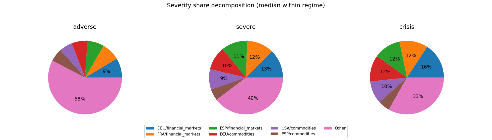

## DEU

Regime counts (draws):
- baseline: 100
- adverse: 60
- severe: 30
- crisis: 10

Top blocks by cross-draw variability (used for comovement summaries):
- financial_markets, commodities, public_finance, macro, banking_system

### Typical block terminal cumulative (median with q10/q90; sigmas)
(Signs depend on factor definitions; focus on magnitude + co-movement patterns.)

**baseline**
- financial_markets: +1.82 [-6.33, +7.29]
- commodities: +0.34 [-5.73, +7.57]
- macro: -0.15 [-1.99, +2.29]
- banking_system: +0.01 [-0.49, +0.62]
- public_finance: +0.00 [-2.23, +2.52]
**adverse**
- financial_markets: +1.57 [-11.63, +13.39]
- commodities: +0.81 [-11.12, +13.47]
- public_finance: -0.16 [-2.14, +2.00]
- macro: +0.05 [-1.94, +2.06]
- banking_system: -0.02 [-0.71, +0.50]
**severe**
- commodities: -1.08 [-16.54, +16.92]
- financial_markets: +0.98 [-18.91, +17.21]
- macro: +0.25 [-0.78, +1.59]
- banking_system: +0.10 [-0.65, +0.82]
- public_finance: +0.04 [-2.74, +1.97]
**crisis**
- financial_markets: -13.32 [-25.42, +13.46]
- commodities: -4.80 [-22.23, +21.27]
- macro: +0.78 [-0.93, +1.69]
- public_finance: -0.08 [-2.41, +4.82]
- banking_system: +0.06 [-0.53, +0.41]

### Outcome-space influence proxy (Step 4 targets)
This section projects simulated factor shocks into Step 4 targets using the stored linear coefficients.
Important: this is a **proxy** because Step 4 feature scaling may differ from the Step 12 simulation shock units.
We use **terminal cumulative standardized shocks** (sum of daily/monthly $z$ shocks) and ignore AR target lags when they are not simulated.

#### DEU_GDP_EUROSTAT
- transform=yoy_log_pct; features=daily_shortlist; test_r2=-0.155; coef_coverage≈56.6%
- WARNING: Low test $R^2$: treat regime/attribution patterns as low confidence.
- Ignored non-simulated features (often AR lags): DEU_GDP_EUROSTAT_lag1, DEU_GDP_EUROSTAT_lag3, DEU_GDP_EUROSTAT_lag2

Typical projected target impact (median with q10/q90; arbitrary units)
- baseline: -0.384 [-3.360, +2.711]
- adverse: -0.813 [-5.744, +4.367]
- severe: -0.024 [-5.711, +7.103]
- crisis: +4.682 [-5.776, +11.733]

Influence share decomposition by block (median share with q10/q90 within regime)
**adverse**
- financial_markets:  95.6% [ 34.7%,  99.3%]
- public_finance:   1.7% [  0.1%,  40.5%]
- macro:   1.5% [  0.1%,  17.8%]

**severe**
- financial_markets:  97.3% [ 66.3%,  99.7%]
- public_finance:   2.3% [  0.1%,  23.0%]
- macro:   0.4% [  0.0%,   2.4%]

**crisis**
- financial_markets:  95.4% [ 87.1%,  98.9%]
- public_finance:   3.3% [  0.4%,  12.2%]
- macro:   0.2% [  0.0%,   2.7%]

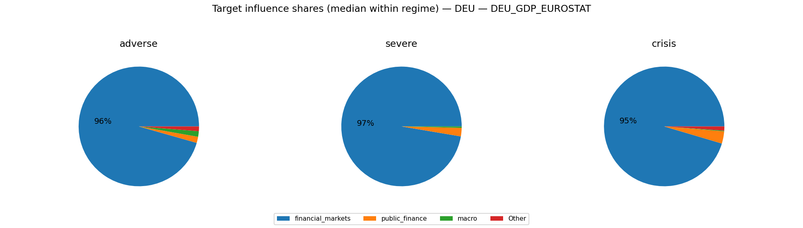

#### DEU_UNRATE_EUROSTAT
- transform=level; features=daily_shortlist; test_r2=0.869; coef_coverage≈8.7%
- Ignored non-simulated features (often AR lags): DEU_UNRATE_EUROSTAT_lag1

Typical projected target impact (median with q10/q90; arbitrary units)
- baseline: +0.014 [-0.303, +0.232]
- adverse: -0.054 [-0.514, +0.484]
- severe: -0.082 [-0.711, +0.735]
- crisis: -0.269 [-0.896, +0.912]

Influence share decomposition by block (median share with q10/q90 within regime)
**adverse**
- commodities:  78.9% [ 14.3%,  97.6%]
- financial_markets:  17.8% [  0.4%,  85.3%]
- macro:   1.0% [  0.1%,   7.0%]
- public_finance:   0.1% [  0.0%,   0.8%]
- banking_system:   0.0% [  0.0%,   0.0%]

**severe**
- commodities:  84.6% [ 47.0%,  98.2%]
- financial_markets:  15.3% [  1.6%,  51.4%]
- macro:   0.2% [  0.0%,   1.9%]
- public_finance:   0.0% [  0.0%,   0.4%]
- banking_system:   0.0% [  0.0%,   0.0%]

**crisis**
- commodities:  90.0% [ 55.7%,  94.5%]
- financial_markets:   9.8% [  4.0%,  43.8%]
- macro:   0.3% [  0.0%,   0.8%]
- public_finance:   0.1% [  0.0%,   0.5%]
- banking_system:   0.0% [  0.0%,   0.0%]

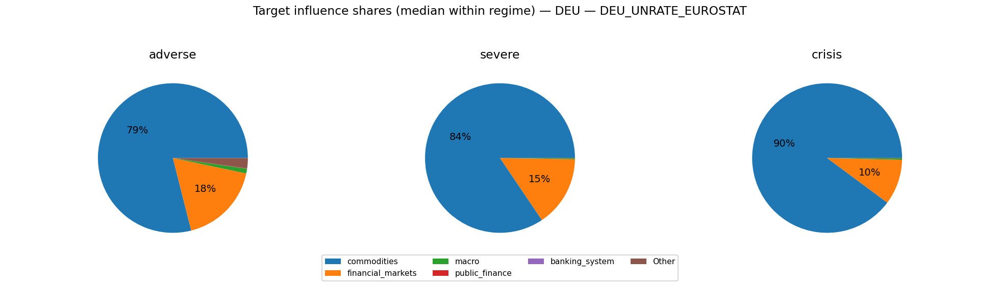

#### DEUCPIALLMINMEI
- transform=yoy_log_pct; features=daily_shortlist; test_r2=0.694; coef_coverage≈46.0%
- Ignored non-simulated features (often AR lags): DEUCPIALLMINMEI_lag1, DEUCPIALLMINMEI_lag2

Typical projected target impact (median with q10/q90; arbitrary units)
- baseline: +0.066 [-1.167, +1.283]
- adverse: +0.241 [-2.056, +2.106]
- severe: +0.456 [-2.944, +2.884]
- crisis: +1.212 [-3.578, +3.516]

Influence share decomposition by block (median share with q10/q90 within regime)
**adverse**
- commodities:  76.5% [ 15.2%,  96.5%]
- financial_markets:  14.9% [  0.4%,  72.6%]
- macro:   3.5% [  0.4%,  21.2%]
- banking_system:   0.1% [  0.0%,   0.8%]
- public_finance:   0.1% [  0.0%,   1.3%]

**severe**
- commodities:  85.2% [ 46.0%,  97.8%]
- financial_markets:  14.2% [  1.5%,  49.0%]
- macro:   0.7% [  0.0%,   6.4%]
- banking_system:   0.1% [  0.0%,   0.5%]
- public_finance:   0.1% [  0.0%,   0.7%]

**crisis**
- commodities:  90.0% [ 57.0%,  92.7%]
- financial_markets:   9.1% [  3.7%,  41.4%]
- macro:   1.2% [  0.1%,   2.9%]
- public_finance:   0.1% [  0.0%,   0.9%]
- banking_system:   0.0% [  0.0%,   0.1%]

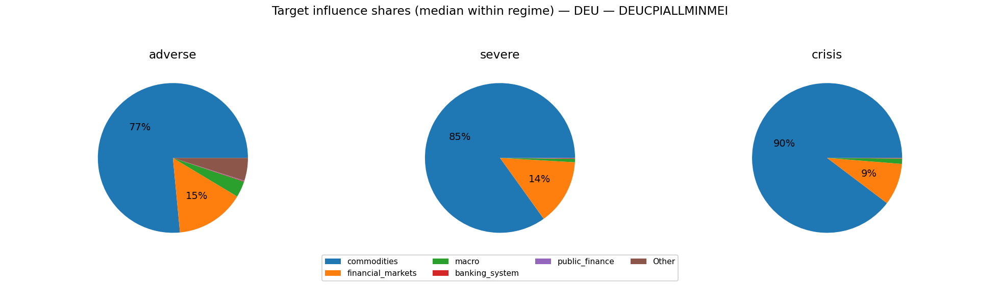

### Severity share decomposition ("cake" slices)
Shares are fractions of $S_{L2}^2$ attributable to each block (using squared terminal cumulatives).
Interpretation: a large share means the block contributes more to the **simulation severity metric** used here.
This can happen because the block has larger tail dispersion / higher volatility / stronger cumulative drift over the horizon.
It does **not** by itself prove the block has larger causal impact on GDP/PD/LGD; for that, compute shares in propagated target space.
Reported as median share with quantile band q10/q90 within each regime.

**adverse**
- financial_markets:  51.6% [  2.1%,  94.1%]
- commodities:  45.7% [  3.2%,  95.2%]
- macro:   0.6% [  0.1%,   3.5%]
- public_finance:   0.5% [  0.0%,   3.7%]
- banking_system:   0.0% [  0.0%,   0.5%]

**severe**
- commodities:  52.3% [ 15.5%,  91.0%]
- financial_markets:  47.5% [  7.4%,  83.0%]
- public_finance:   0.5% [  0.0%,   2.7%]
- macro:   0.1% [  0.0%,   0.7%]
- banking_system:   0.0% [  0.0%,   0.2%]

**crisis**
- commodities:  64.1% [ 21.5%,  75.4%]
- financial_markets:  34.5% [ 17.0%,  78.2%]
- public_finance:   0.8% [  0.0%,   3.9%]
- macro:   0.2% [  0.0%,   0.7%]
- banking_system:   0.0% [  0.0%,   0.1%]

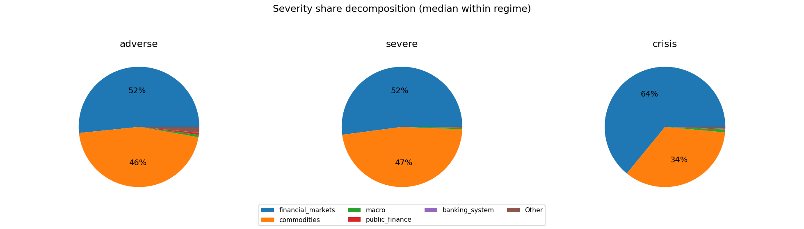

### Comovement snapshot (corr of terminal cumulative across draws)
Positive = blocks tend to move together across scenarios; negative = trade-offs.

- financial_markets ↔ commodities: corr=-0.32
- financial_markets ↔ public_finance: corr=+0.22
- financial_markets ↔ banking_system: corr=-0.14
- financial_markets ↔ macro: corr=-0.10
- public_finance ↔ banking_system: corr=-0.09
- commodities ↔ banking_system: corr=+0.07
- commodities ↔ macro: corr=+0.06
- public_finance ↔ macro: corr=-0.04
- commodities ↔ public_finance: corr=+0.03
- macro ↔ banking_system: corr=-0.00

## ESP

Regime counts (draws):
- baseline: 100
- adverse: 60
- severe: 30
- crisis: 10

Top blocks by cross-draw variability (used for comovement summaries):
- commodities, financial_markets, public_finance, macro, banking_system

### Typical block terminal cumulative (median with q10/q90; sigmas)
(Signs depend on factor definitions; focus on magnitude + co-movement patterns.)

**baseline**
- commodities: +0.97 [-6.72, +7.16]
- public_finance: +0.67 [-1.75, +2.83]
- financial_markets: -0.20 [-7.47, +7.46]
- macro: -0.11 [-1.92, +2.10]
- banking_system: +0.05 [-0.58, +0.82]
**adverse**
- financial_markets: +2.02 [-11.48, +12.89]
- commodities: +1.70 [-12.66, +13.91]
- public_finance: -0.39 [-2.46, +1.91]
- banking_system: -0.07 [-0.63, +0.50]
- macro: -0.04 [-2.27, +2.40]
**severe**
- commodities: +1.90 [-18.41, +17.57]
- financial_markets: -1.82 [-19.15, +17.48]
- public_finance: -1.02 [-2.47, +1.71]
- macro: +0.20 [-2.28, +2.33]
- banking_system: +0.14 [-0.51, +0.57]
**crisis**
- commodities: +20.48 [-20.02, +25.30]
- financial_markets: -6.97 [-25.44, +12.76]
- public_finance: -0.97 [-4.11, +0.40]
- macro: +0.41 [-0.35, +2.33]
- banking_system: -0.12 [-0.57, +0.28]

### Outcome-space influence proxy (Step 4 targets)
This section projects simulated factor shocks into Step 4 targets using the stored linear coefficients.
Important: this is a **proxy** because Step 4 feature scaling may differ from the Step 12 simulation shock units.
We use **terminal cumulative standardized shocks** (sum of daily/monthly $z$ shocks) and ignore AR target lags when they are not simulated.

#### ESP_GDP_EUROSTAT
- transform=yoy_log_pct; features=daily_shortlist; test_r2=0.009; coef_coverage≈68.5%
- WARNING: Low test $R^2$: treat regime/attribution patterns as low confidence.
- Ignored non-simulated features (often AR lags): ESP_GDP_EUROSTAT_lag1, ESP_GDP_EUROSTAT_lag3, ESP_GDP_EUROSTAT_lag2

Typical projected target impact (median with q10/q90; arbitrary units)
- baseline: +0.279 [-5.543, +6.240]
- adverse: -1.482 [-10.035, +8.228]
- severe: +0.340 [-12.548, +12.697]
- crisis: +3.819 [-14.677, +21.054]

Influence share decomposition by block (median share with q10/q90 within regime)
**adverse**
- financial_markets:  79.8% [ 23.1%,  97.6%]
- commodities:  17.0% [  0.5%,  58.5%]
- public_finance:   1.6% [  0.2%,  10.5%]
- macro:   0.2% [  0.0%,   2.0%]
- banking_system:   0.2% [  0.0%,   1.5%]

**severe**
- financial_markets:  87.5% [ 48.3%,  97.7%]
- commodities:   9.1% [  0.6%,  46.4%]
- public_finance:   1.1% [  0.0%,   4.5%]
- macro:   0.1% [  0.0%,   0.7%]
- banking_system:   0.0% [  0.0%,   0.2%]

**crisis**
- financial_markets:  78.9% [ 32.2%,  96.2%]
- commodities:  17.7% [  0.7%,  66.0%]
- public_finance:   0.7% [  0.0%,   5.1%]
- banking_system:   0.1% [  0.0%,   0.4%]
- macro:   0.0% [  0.0%,   0.2%]

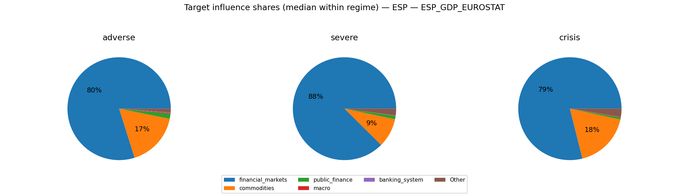

#### ESP_UNRATE_EUROSTAT
- transform=level; features=daily_shortlist; test_r2=0.966; coef_coverage≈36.3%
- Ignored non-simulated features (often AR lags): ESP_UNRATE_EUROSTAT_lag1

Typical projected target impact (median with q10/q90; arbitrary units)
- baseline: -0.166 [-1.443, +1.494]
- adverse: +0.267 [-2.361, +2.406]
- severe: +0.013 [-3.095, +3.320]
- crisis: +0.052 [-4.966, +4.467]

Influence share decomposition by block (median share with q10/q90 within regime)
**adverse**
- financial_markets:  57.0% [  8.7%,  93.7%]
- commodities:  38.6% [  1.4%,  80.6%]
- public_finance:   3.4% [  0.4%,  17.9%]
- macro:   0.2% [  0.0%,   1.7%]
- banking_system:   0.1% [  0.0%,   0.3%]

**severe**
- financial_markets:  69.3% [ 22.9%,  93.9%]
- commodities:  23.6% [  1.9%,  73.5%]
- public_finance:   2.5% [  0.0%,   7.0%]
- macro:   0.1% [  0.0%,   0.5%]
- banking_system:   0.0% [  0.0%,   0.1%]

**crisis**
- financial_markets:  57.9% [ 13.3%,  88.9%]
- commodities:  36.8% [  2.1%,  85.2%]
- public_finance:   1.1% [  0.1%,  10.6%]
- banking_system:   0.0% [  0.0%,   0.1%]
- macro:   0.0% [  0.0%,   0.2%]

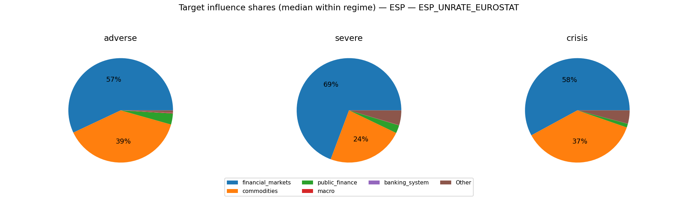

#### ESPCPIALLMINMEI
- transform=yoy_log_pct; features=daily_shortlist; test_r2=0.785; coef_coverage≈44.7%
- Ignored non-simulated features (often AR lags): ESPCPIALLMINMEI_lag1, ESPCPIALLMINMEI_lag2

Typical projected target impact (median with q10/q90; arbitrary units)
- baseline: -0.047 [-1.624, +1.365]
- adverse: -0.096 [-2.204, +2.263]
- severe: +0.954 [-3.021, +3.449]
- crisis: +2.249 [-0.433, +4.628]

Influence share decomposition by block (median share with q10/q90 within regime)
**adverse**
- financial_markets:  68.9% [ 15.1%,  95.4%]
- commodities:  21.2% [  0.7%,  60.9%]
- macro:   2.8% [  0.3%,  19.6%]
- public_finance:   1.3% [  0.2%,   8.5%]
- banking_system:   0.0% [  0.0%,   0.3%]

**severe**
- financial_markets:  83.5% [ 38.8%,  96.6%]
- commodities:  12.4% [  0.8%,  55.3%]
- public_finance:   1.0% [  0.0%,   3.4%]
- macro:   0.8% [  0.0%,   7.6%]
- banking_system:   0.0% [  0.0%,   0.0%]

**crisis**
- financial_markets:  74.1% [ 24.7%,  94.5%]
- commodities:  23.0% [  0.9%,  70.8%]
- public_finance:   0.6% [  0.0%,   4.8%]
- macro:   0.3% [  0.0%,   2.9%]
- banking_system:   0.0% [  0.0%,   0.1%]

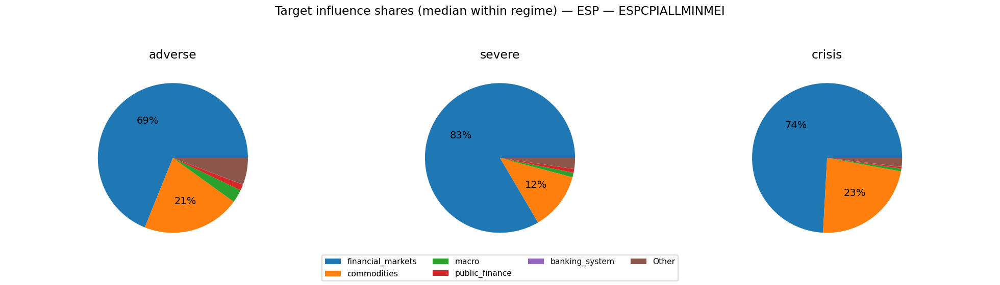

### Severity share decomposition ("cake" slices)
Shares are fractions of $S_{L2}^2$ attributable to each block (using squared terminal cumulatives).
Interpretation: a large share means the block contributes more to the **simulation severity metric** used here.
This can happen because the block has larger tail dispersion / higher volatility / stronger cumulative drift over the horizon.
It does **not** by itself prove the block has larger causal impact on GDP/PD/LGD; for that, compute shares in propagated target space.
Reported as median share with quantile band q10/q90 within each regime.

**adverse**
- commodities:  66.5% [  4.5%,  92.5%]
- financial_markets:  31.7% [  3.5%,  89.3%]
- macro:   0.7% [  0.1%,   5.8%]
- public_finance:   0.7% [  0.1%,   5.9%]
- banking_system:   0.1% [  0.0%,   0.2%]

**severe**
- commodities:  50.0% [  5.6%,  89.6%]
- financial_markets:  48.0% [  9.2%,  91.7%]
- public_finance:   0.5% [  0.0%,   2.9%]
- macro:   0.3% [  0.0%,   1.6%]
- banking_system:   0.0% [  0.0%,   0.1%]

**crisis**
- commodities:  62.9% [  6.3%,  94.3%]
- financial_markets:  36.0% [  4.8%,  90.5%]
- public_finance:   0.3% [  0.0%,   2.5%]
- macro:   0.0% [  0.0%,   0.9%]
- banking_system:   0.0% [  0.0%,   0.1%]

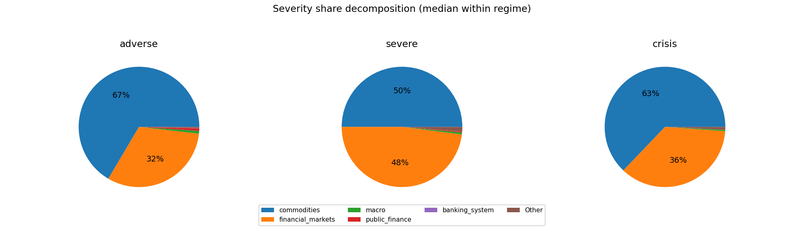

### Comovement snapshot (corr of terminal cumulative across draws)
Positive = blocks tend to move together across scenarios; negative = trade-offs.

- financial_markets ↔ public_finance: corr=-0.19
- financial_markets ↔ macro: corr=-0.18
- financial_markets ↔ banking_system: corr=-0.11
- public_finance ↔ macro: corr=-0.10
- public_finance ↔ banking_system: corr=+0.09
- commodities ↔ public_finance: corr=-0.03
- commodities ↔ financial_markets: corr=-0.03
- commodities ↔ macro: corr=+0.02
- macro ↔ banking_system: corr=+0.01
- commodities ↔ banking_system: corr=-0.01

## FRA

Regime counts (draws):
- baseline: 100
- adverse: 60
- severe: 30
- crisis: 10

Top blocks by cross-draw variability (used for comovement summaries):
- commodities, financial_markets, public_finance, macro, banking_system

### Typical block terminal cumulative (median with q10/q90; sigmas)
(Signs depend on factor definitions; focus on magnitude + co-movement patterns.)

**baseline**
- commodities: +0.80 [-6.20, +6.64]
- public_finance: +0.32 [-2.37, +2.45]
- financial_markets: -0.24 [-6.16, +6.57]
- macro: +0.11 [-1.47, +2.14]
- banking_system: +0.04 [-0.68, +0.55]
**adverse**
- public_finance: +0.95 [-1.90, +3.56]
- financial_markets: -0.41 [-12.73, +13.28]
- commodities: -0.37 [-11.07, +12.67]
- macro: +0.32 [-1.93, +2.47]
- banking_system: -0.07 [-0.64, +0.50]
**severe**
- financial_markets: +3.20 [-14.53, +17.54]
- commodities: +1.63 [-16.30, +19.38]
- macro: +0.41 [-2.10, +2.20]
- public_finance: +0.33 [-2.05, +3.68]
- banking_system: -0.06 [-0.70, +0.47]
**crisis**
- commodities: -16.98 [-24.94, +26.89]
- financial_markets: -10.85 [-26.61, +9.61]
- public_finance: -0.74 [-2.70, +1.43]
- macro: +0.17 [-1.71, +0.76]
- banking_system: +0.10 [-0.43, +0.80]

### Outcome-space influence proxy (Step 4 targets)
This section projects simulated factor shocks into Step 4 targets using the stored linear coefficients.
Important: this is a **proxy** because Step 4 feature scaling may differ from the Step 12 simulation shock units.
We use **terminal cumulative standardized shocks** (sum of daily/monthly $z$ shocks) and ignore AR target lags when they are not simulated.

#### FRA_GDP_EUROSTAT
- transform=yoy_log_pct; features=daily_shortlist; test_r2=-0.084; coef_coverage≈44.7%
- WARNING: Low test $R^2$: treat regime/attribution patterns as low confidence.
- Ignored non-simulated features (often AR lags): FRA_GDP_EUROSTAT_lag1, FRA_GDP_EUROSTAT_lag3, FRA_GDP_EUROSTAT_lag2

Typical projected target impact (median with q10/q90; arbitrary units)
- baseline: +0.213 [-2.947, +2.485]
- adverse: +0.033 [-5.095, +4.904]
- severe: -1.147 [-7.286, +5.909]
- crisis: +3.241 [-2.440, +9.073]

Influence share decomposition by block (median share with q10/q90 within regime)
**adverse**
- financial_markets:  98.0% [ 40.8%,  99.6%]
- commodities:   1.3% [  0.1%,  39.5%]
- public_finance:   0.8% [  0.0%,  11.1%]
- macro:   0.0% [  0.0%,   0.5%]
- banking_system:   0.0% [  0.0%,   0.5%]

**severe**
- financial_markets:  96.5% [ 39.8%,  99.6%]
- commodities:   2.5% [  0.1%,  51.8%]
- public_finance:   0.2% [  0.0%,   8.1%]
- macro:   0.0% [  0.0%,   0.4%]
- banking_system:   0.0% [  0.0%,   0.1%]

**crisis**
- financial_markets:  89.6% [ 67.1%,  98.1%]
- commodities:   9.8% [  1.9%,  32.3%]
- public_finance:   0.1% [  0.0%,   3.0%]
- macro:   0.0% [  0.0%,   0.0%]
- banking_system:   0.0% [  0.0%,   0.0%]

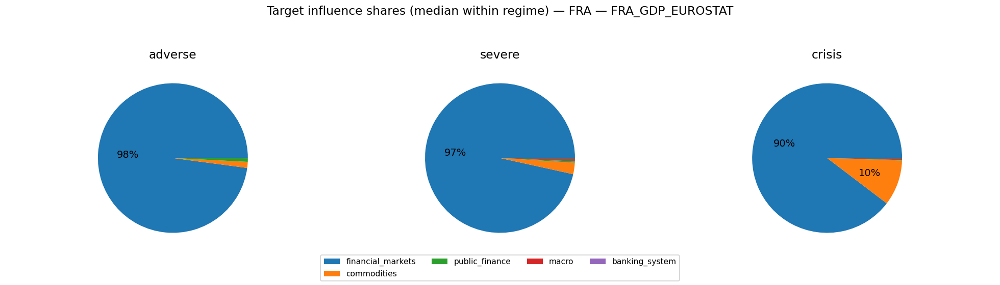

#### FRA_UNRATE_EUROSTAT
- transform=level; features=daily_shortlist; test_r2=0.797; coef_coverage≈15.1%
- Ignored non-simulated features (often AR lags): FRA_UNRATE_EUROSTAT_lag1

Typical projected target impact (median with q10/q90; arbitrary units)
- baseline: -0.041 [-0.293, +0.301]
- adverse: -0.032 [-0.476, +0.451]
- severe: +0.152 [-0.604, +0.579]
- crisis: -0.309 [-0.720, +0.333]

Influence share decomposition by block (median share with q10/q90 within regime)
**adverse**
- financial_markets:  74.4% [  4.6%,  98.2%]
- macro:  21.2% [  0.5%,  68.7%]
- public_finance:   0.9% [  0.0%,   5.3%]
- commodities:   0.7% [  0.0%,   6.5%]

**severe**
- financial_markets:  80.3% [  7.7%,  96.9%]
- macro:  16.9% [  1.1%,  72.7%]
- commodities:   1.6% [  0.0%,   8.7%]
- public_finance:   0.5% [  0.0%,   3.7%]

**crisis**
- financial_markets:  85.9% [ 57.1%,  95.8%]
- macro:   7.5% [  1.0%,  24.1%]
- commodities:   5.2% [  1.1%,  19.4%]
- public_finance:   0.2% [  0.1%,   5.2%]

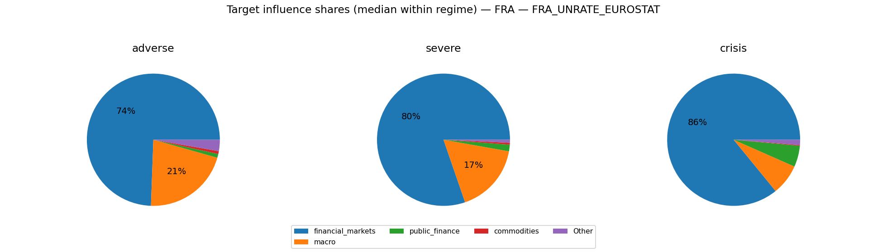

#### FRACPIALLMINMEI
- transform=yoy_log_pct; features=daily_shortlist; test_r2=0.652; coef_coverage≈41.9%
- Ignored non-simulated features (often AR lags): FRACPIALLMINMEI_lag1, FRACPIALLMINMEI_lag3

Typical projected target impact (median with q10/q90; arbitrary units)
- baseline: +0.162 [-1.022, +0.983]
- adverse: -0.088 [-1.880, +1.489]
- severe: +0.162 [-2.082, +2.473]
- crisis: -1.503 [-2.977, +3.633]

Influence share decomposition by block (median share with q10/q90 within regime)
**adverse**
- commodities:  90.2% [ 18.3%,  97.8%]
- public_finance:   4.5% [  0.1%,  40.5%]
- financial_markets:   3.3% [  0.0%,  24.7%]
- banking_system:   0.9% [  0.0%,   7.8%]
- macro:   0.1% [  0.0%,   1.0%]

**severe**
- commodities:  95.0% [ 36.5%,  98.7%]
- public_finance:   2.2% [  0.1%,  20.0%]
- financial_markets:   1.9% [  0.0%,  28.9%]
- banking_system:   0.4% [  0.0%,   3.5%]
- macro:   0.1% [  0.0%,   0.4%]

**crisis**
- commodities:  98.4% [ 95.3%,  99.5%]
- financial_markets:   0.5% [  0.1%,   2.8%]
- public_finance:   0.5% [  0.1%,   2.7%]
- banking_system:   0.0% [  0.0%,   0.2%]
- macro:   0.0% [  0.0%,   0.1%]

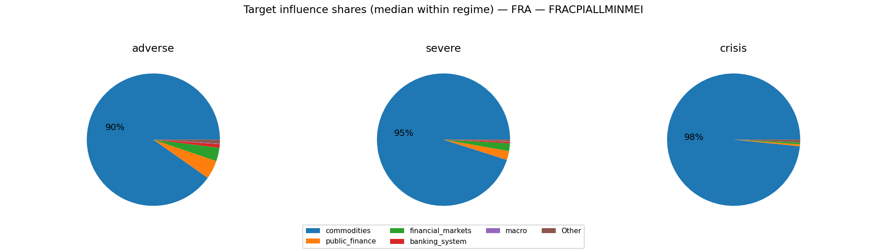

### Severity share decomposition ("cake" slices)
Shares are fractions of $S_{L2}^2$ attributable to each block (using squared terminal cumulatives).
Interpretation: a large share means the block contributes more to the **simulation severity metric** used here.
This can happen because the block has larger tail dispersion / higher volatility / stronger cumulative drift over the horizon.
It does **not** by itself prove the block has larger causal impact on GDP/PD/LGD; for that, compute shares in propagated target space.
Reported as median share with quantile band q10/q90 within each regime.

**adverse**
- financial_markets:  58.7% [  1.9%,  93.5%]
- commodities:  37.7% [  2.6%,  91.3%]
- public_finance:   1.3% [  0.1%,   9.7%]
- macro:   0.7% [  0.0%,   3.6%]
- banking_system:   0.0% [  0.0%,   0.3%]

**severe**
- commodities:  54.3% [  2.8%,  96.0%]
- financial_markets:  44.9% [  1.6%,  95.9%]
- public_finance:   0.7% [  0.0%,   3.7%]
- macro:   0.4% [  0.0%,   1.8%]
- banking_system:   0.0% [  0.0%,   0.2%]

**crisis**
- commodities:  81.9% [ 46.3%,  94.5%]
- financial_markets:  16.4% [  5.2%,  53.0%]
- public_finance:   0.2% [  0.0%,   1.1%]
- macro:   0.1% [  0.0%,   0.4%]
- banking_system:   0.0% [  0.0%,   0.1%]

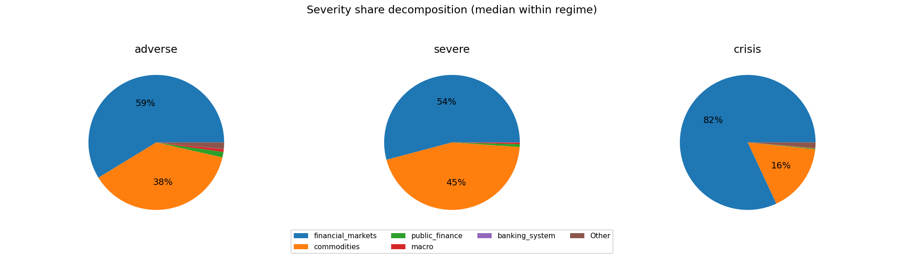

### Comovement snapshot (corr of terminal cumulative across draws)
Positive = blocks tend to move together across scenarios; negative = trade-offs.

- commodities ↔ financial_markets: corr=+0.17
- commodities ↔ public_finance: corr=+0.16
- public_finance ↔ banking_system: corr=+0.15
- financial_markets ↔ banking_system: corr=+0.12
- macro ↔ banking_system: corr=-0.12
- commodities ↔ banking_system: corr=-0.10
- commodities ↔ macro: corr=+0.08
- public_finance ↔ macro: corr=+0.08
- financial_markets ↔ macro: corr=-0.07
- financial_markets ↔ public_finance: corr=+0.03

## ITA

Regime counts (draws):
- baseline: 100
- adverse: 60
- severe: 30
- crisis: 10

Top blocks by cross-draw variability (used for comovement summaries):
- commodities, financial_markets, public_finance, macro, banking_system

### Typical block terminal cumulative (median with q10/q90; sigmas)
(Signs depend on factor definitions; focus on magnitude + co-movement patterns.)

**baseline**
- commodities: +0.39 [-6.66, +6.49]
- public_finance: +0.38 [-1.51, +2.55]
- macro: +0.15 [-2.02, +2.08]
- financial_markets: -0.07 [-6.09, +7.09]
- banking_system: -0.02 [-0.74, +0.59]
**adverse**
- commodities: +5.55 [-12.18, +14.42]
- financial_markets: +1.38 [-10.94, +12.12]
- macro: +0.17 [-2.10, +2.78]
- public_finance: +0.07 [-2.89, +2.54]
- banking_system: -0.07 [-0.69, +0.60]
**severe**
- financial_markets: +3.06 [-13.47, +17.06]
- public_finance: +1.04 [-3.30, +3.47]
- banking_system: -0.11 [-0.48, +0.40]
- macro: -0.03 [-1.52, +2.19]
- commodities: +0.02 [-18.87, +19.02]
**crisis**
- financial_markets: -15.31 [-27.64, +25.64]
- commodities: -7.66 [-19.26, +6.50]
- macro: +0.31 [-0.30, +1.58]
- public_finance: +0.27 [-1.91, +1.89]
- banking_system: -0.23 [-0.74, +0.72]

### Outcome-space influence proxy (Step 4 targets)
This section projects simulated factor shocks into Step 4 targets using the stored linear coefficients.
Important: this is a **proxy** because Step 4 feature scaling may differ from the Step 12 simulation shock units.
We use **terminal cumulative standardized shocks** (sum of daily/monthly $z$ shocks) and ignore AR target lags when they are not simulated.

#### ITA_GDP_EUROSTAT
- transform=yoy_log_pct; features=daily_shortlist; test_r2=0.233; coef_coverage≈53.7%
- Ignored non-simulated features (often AR lags): ITA_GDP_EUROSTAT_lag1, ITA_GDP_EUROSTAT_lag3

Typical projected target impact (median with q10/q90; arbitrary units)
- baseline: +0.146 [-3.430, +2.937]
- adverse: -0.357 [-6.083, +5.063]
- severe: -1.733 [-8.291, +6.125]
- crisis: +7.768 [-12.437, +13.428]

Influence share decomposition by block (median share with q10/q90 within regime)
**adverse**
- financial_markets:  99.5% [ 93.9%, 100.0%]
- macro:   0.3% [  0.0%,   5.2%]
- commodities:   0.0% [  0.0%,   0.4%]
- banking_system:   0.0% [  0.0%,   0.4%]

**severe**
- financial_markets:  99.6% [ 93.7%,  99.9%]
- macro:   0.2% [  0.0%,   4.1%]
- commodities:   0.0% [  0.0%,   1.3%]
- banking_system:   0.0% [  0.0%,   0.6%]

**crisis**
- financial_markets: 100.0% [ 99.8%, 100.0%]
- macro:   0.0% [  0.0%,   0.1%]
- banking_system:   0.0% [  0.0%,   0.1%]
- commodities:   0.0% [  0.0%,   0.0%]

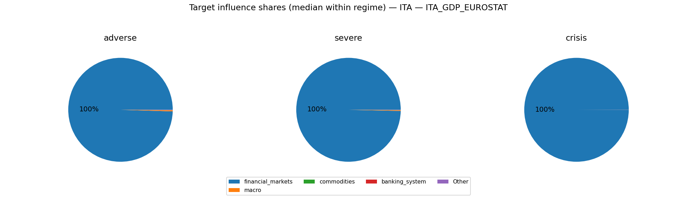

#### ITA_UNRATE_EUROSTAT
- transform=level; features=daily_shortlist; test_r2=0.924; coef_coverage≈15.1%
- Ignored non-simulated features (often AR lags): ITA_UNRATE_EUROSTAT_lag1

Typical projected target impact (median with q10/q90; arbitrary units)
- baseline: -0.012 [-0.406, +0.438]
- adverse: +0.383 [-0.858, +0.842]
- severe: +0.161 [-1.026, +1.286]
- crisis: -0.710 [-1.765, +0.887]

Influence share decomposition by block (median share with q10/q90 within regime)
**adverse**
- commodities:  74.0% [ 10.9%,  95.3%]
- financial_markets:  22.3% [  2.4%,  85.3%]
- macro:   0.6% [  0.0%,   5.1%]
- public_finance:   0.1% [  0.0%,   0.5%]
- banking_system:   0.0% [  0.0%,   0.3%]

**severe**
- commodities:  76.6% [ 16.5%,  98.3%]
- financial_markets:  22.8% [  0.8%,  81.0%]
- macro:   0.4% [  0.0%,   1.5%]
- public_finance:   0.1% [  0.0%,   0.3%]
- banking_system:   0.0% [  0.0%,   0.1%]

**crisis**
- financial_markets:  73.8% [ 23.1%,  98.7%]
- commodities:  26.0% [  0.8%,  76.8%]
- macro:   0.0% [  0.0%,   0.4%]
- public_finance:   0.0% [  0.0%,   0.0%]
- banking_system:   0.0% [  0.0%,   0.2%]

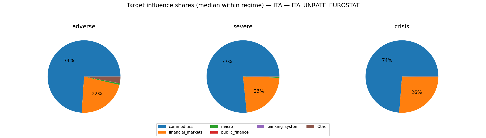

#### ITACPIALLMINMEI
- transform=yoy_log_pct; features=daily_shortlist; test_r2=0.874; coef_coverage≈27.1%
- Ignored non-simulated features (often AR lags): ITACPIALLMINMEI_lag1, ITACPIALLMINMEI_lag3

Typical projected target impact (median with q10/q90; arbitrary units)
- baseline: -0.037 [-0.548, +0.437]
- adverse: +0.332 [-0.879, +1.072]
- severe: -0.111 [-1.418, +1.388]
- crisis: -0.218 [-1.178, +0.857]

Influence share decomposition by block (median share with q10/q90 within regime)
**adverse**
- commodities:  77.1% [ 18.5%,  94.9%]
- public_finance:   5.1% [  0.2%,  22.9%]
- financial_markets:   4.4% [  0.4%,  30.7%]
- macro:   4.0% [  0.1%,  26.7%]
- banking_system:   0.0% [  0.0%,   0.1%]

**severe**
- commodities:  84.3% [ 39.2%,  96.5%]
- financial_markets:   4.7% [  0.2%,  32.6%]
- public_finance:   4.6% [  0.3%,  27.8%]
- macro:   1.8% [  0.0%,   8.5%]
- banking_system:   0.0% [  0.0%,   0.1%]

**crisis**
- commodities:  63.0% [  3.9%,  92.6%]
- financial_markets:  33.6% [  5.2%,  90.5%]
- public_finance:   1.9% [  0.5%,   8.2%]
- macro:   0.4% [  0.0%,   3.4%]
- banking_system:   0.0% [  0.0%,   0.2%]

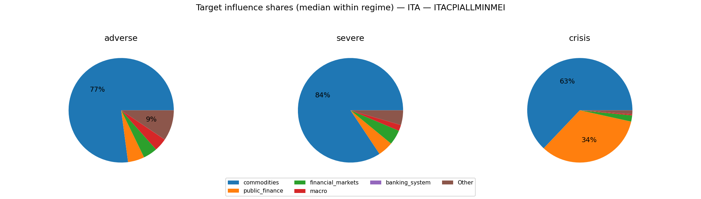

### Severity share decomposition ("cake" slices)
Shares are fractions of $S_{L2}^2$ attributable to each block (using squared terminal cumulatives).
Interpretation: a large share means the block contributes more to the **simulation severity metric** used here.
This can happen because the block has larger tail dispersion / higher volatility / stronger cumulative drift over the horizon.
It does **not** by itself prove the block has larger causal impact on GDP/PD/LGD; for that, compute shares in propagated target space.
Reported as median share with quantile band q10/q90 within each regime.

**adverse**
- commodities:  62.2% [  6.5%,  90.0%]
- financial_markets:  31.5% [  3.7%,  86.4%]
- public_finance:   0.8% [  0.1%,   6.0%]
- macro:   0.6% [  0.0%,   5.1%]
- banking_system:   0.1% [  0.0%,   0.3%]

**severe**
- commodities:  65.1% [ 10.6%,  95.0%]
- financial_markets:  32.3% [  1.4%,  85.8%]
- public_finance:   1.0% [  0.1%,   3.8%]
- macro:   0.4% [  0.0%,   1.4%]
- banking_system:   0.0% [  0.0%,   0.1%]

**crisis**
- financial_markets:  82.0% [ 33.2%,  99.2%]
- commodities:  17.4% [  0.5%,  66.1%]
- public_finance:   0.4% [  0.0%,   0.6%]
- macro:   0.0% [  0.0%,   0.4%]
- banking_system:   0.0% [  0.0%,   0.1%]

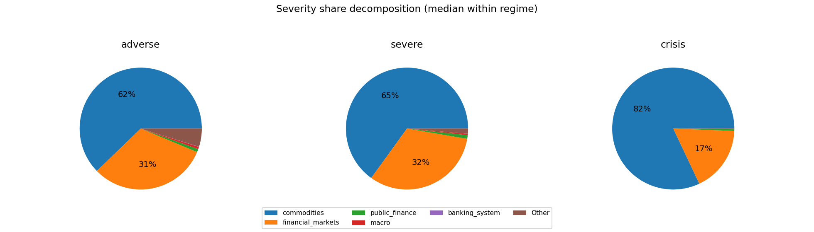

### Comovement snapshot (corr of terminal cumulative across draws)
Positive = blocks tend to move together across scenarios; negative = trade-offs.

- commodities ↔ public_finance: corr=-0.13
- financial_markets ↔ macro: corr=-0.09
- macro ↔ banking_system: corr=+0.08
- commodities ↔ financial_markets: corr=-0.06
- commodities ↔ banking_system: corr=+0.05
- public_finance ↔ macro: corr=-0.04
- commodities ↔ macro: corr=+0.04
- financial_markets ↔ banking_system: corr=-0.03
- financial_markets ↔ public_finance: corr=-0.02
- public_finance ↔ banking_system: corr=-0.01

## USA

Regime counts (draws):
- baseline: 100
- adverse: 60
- severe: 30
- crisis: 10

Top blocks by cross-draw variability (used for comovement summaries):
- commodities, macro, financial_markets, public_finance, banking_system

### Typical block terminal cumulative (median with q10/q90; sigmas)
(Signs depend on factor definitions; focus on magnitude + co-movement patterns.)

**baseline**
- commodities: +0.41 [-8.34, +8.16]
- financial_markets: +0.16 [-9.20, +8.72]
- public_finance: -0.11 [-2.01, +2.31]
- macro: +0.10 [-7.62, +7.15]
- banking_system: +0.01 [-0.65, +0.69]
**adverse**
- macro: +1.42 [-12.50, +13.24]
- financial_markets: +0.89 [-11.29, +11.71]
- commodities: +0.11 [-13.58, +15.33]
- public_finance: +0.08 [-2.54, +2.54]
- banking_system: +0.05 [-0.74, +0.71]
**severe**
- macro: +8.61 [-17.81, +19.21]
- financial_markets: -3.99 [-19.41, +6.93]
- commodities: -0.45 [-15.75, +18.00]
- public_finance: -0.20 [-2.55, +3.22]
- banking_system: +0.10 [-0.41, +0.59]
**crisis**
- financial_markets: -14.31 [-23.10, +15.17]
- macro: +9.96 [-14.29, +19.45]
- commodities: +1.15 [-14.71, +21.78]
- public_finance: +0.34 [-2.20, +2.76]
- banking_system: -0.03 [-0.42, +0.75]

### Outcome-space influence proxy (Step 4 targets)
This section projects simulated factor shocks into Step 4 targets using the stored linear coefficients.
Important: this is a **proxy** because Step 4 feature scaling may differ from the Step 12 simulation shock units.
We use **terminal cumulative standardized shocks** (sum of daily/monthly $z$ shocks) and ignore AR target lags when they are not simulated.

#### GDPC1
- transform=yoy_log_pct; features=daily_shortlist; test_r2=0.054; coef_coverage≈68.1%
- WARNING: Low test $R^2$: treat regime/attribution patterns as low confidence.
- Ignored non-simulated features (often AR lags): GDPC1_lag1, GDPC1_lag3, GDPC1_lag2

Typical projected target impact (median with q10/q90; arbitrary units)
- baseline: -0.311 [-4.698, +5.331]
- adverse: -0.468 [-7.861, +8.780]
- severe: +6.585 [-9.068, +12.906]
- crisis: +9.522 [-10.179, +15.073]

Influence share decomposition by block (median share with q10/q90 within regime)
**adverse**
- financial_markets:  51.7% [  4.2%,  87.4%]
- macro:  17.3% [  0.3%,  65.7%]
- commodities:   6.1% [  0.4%,  39.3%]
- public_finance:   4.8% [  0.2%,  26.3%]
- banking_system:   0.7% [  0.0%,   5.7%]

**severe**
- macro:  45.2% [  0.9%,  70.1%]
- financial_markets:  38.0% [  4.1%,  95.4%]
- commodities:   5.6% [  0.2%,  32.7%]
- public_finance:   3.1% [  0.3%,  14.6%]
- banking_system:   0.3% [  0.0%,   2.2%]

**crisis**
- financial_markets:  73.2% [ 40.1%,  87.0%]
- macro:  16.4% [  6.8%,  33.8%]
- public_finance:   3.8% [  0.1%,   9.0%]
- commodities:   2.4% [  0.3%,  29.0%]
- banking_system:   0.3% [  0.0%,   1.7%]

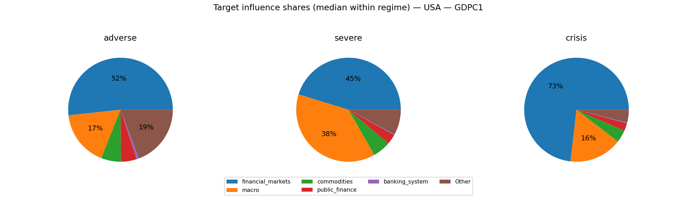

#### CPIAUCSL
- transform=yoy_log_pct; features=daily_shortlist; test_r2=0.025; coef_coverage≈62.2%
- WARNING: Low test $R^2$: treat regime/attribution patterns as low confidence.
- Ignored non-simulated features (often AR lags): CPIAUCSL_lag1, CPIAUCSL_lag2

Typical projected target impact (median with q10/q90; arbitrary units)
- baseline: +0.090 [-3.690, +4.267]
- adverse: +1.083 [-5.566, +5.147]
- severe: +1.626 [-5.884, +8.379]
- crisis: +3.213 [-8.448, +8.595]

Influence share decomposition by block (median share with q10/q90 within regime)
**adverse**
- commodities:  73.0% [  9.3%,  94.6%]
- public_finance:   5.3% [  0.2%,  34.0%]
- macro:   5.0% [  0.2%,  54.9%]
- financial_markets:   3.5% [  0.1%,  29.1%]
- banking_system:   0.1% [  0.0%,   0.7%]

**severe**
- commodities:  69.3% [  7.9%,  94.0%]
- macro:  11.5% [  0.8%,  59.6%]
- public_finance:   4.7% [  0.1%,  19.5%]
- financial_markets:   2.2% [  0.1%,  36.9%]
- banking_system:   0.0% [  0.0%,   0.2%]

**crisis**
- commodities:  66.7% [ 15.7%,  94.6%]
- macro:  13.7% [  1.9%,  35.5%]
- financial_markets:  12.9% [  1.3%,  25.2%]
- public_finance:   2.0% [  0.1%,  32.6%]
- banking_system:   0.1% [  0.0%,   0.2%]

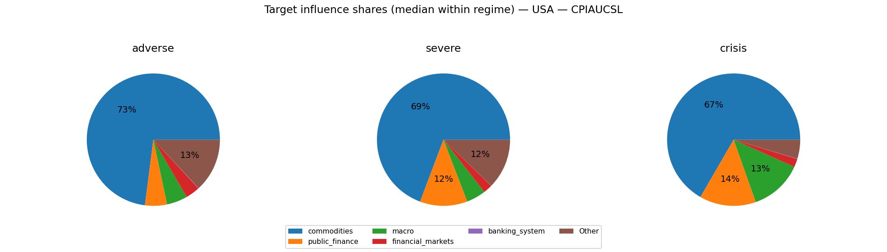

#### UNRATE
- transform=level; features=daily_shortlist; test_r2=0.479; coef_coverage≈27.9%
- Ignored non-simulated features (often AR lags): UNRATE_lag1, UNRATE_lag3, UNRATE_lag2

Typical projected target impact (median with q10/q90; arbitrary units)
- baseline: -0.011 [-0.972, +0.868]
- adverse: -0.036 [-1.653, +1.433]
- severe: -0.764 [-2.179, +1.190]
- crisis: -1.351 [-2.789, +1.614]

Influence share decomposition by block (median share with q10/q90 within regime)
**adverse**
- financial_markets:  27.2% [  1.1%,  67.1%]
- macro:  22.2% [  0.7%,  68.8%]
- public_finance:  14.5% [  0.9%,  49.3%]
- commodities:   8.1% [  0.3%,  34.6%]
- banking_system:   0.5% [  0.0%,   4.8%]

**severe**
- macro:  45.1% [  2.6%,  79.8%]
- financial_markets:  15.2% [  1.1%,  87.9%]
- public_finance:   9.9% [  1.4%,  40.7%]
- commodities:   7.0% [  0.3%,  35.4%]
- banking_system:   0.2% [  0.0%,   1.3%]

**crisis**
- financial_markets:  45.6% [ 18.2%,  70.4%]
- macro:  27.1% [ 13.5%,  46.9%]
- public_finance:  12.9% [  0.3%,  26.2%]
- commodities:   4.5% [  0.5%,  35.9%]
- banking_system:   0.3% [  0.0%,   1.4%]

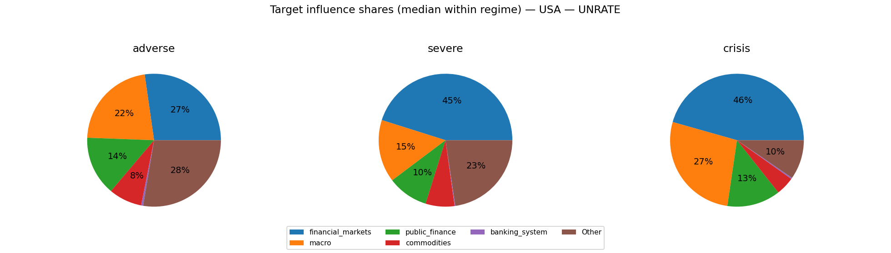

### Severity share decomposition ("cake" slices)
Shares are fractions of $S_{L2}^2$ attributable to each block (using squared terminal cumulatives).
Interpretation: a large share means the block contributes more to the **simulation severity metric** used here.
This can happen because the block has larger tail dispersion / higher volatility / stronger cumulative drift over the horizon.
It does **not** by itself prove the block has larger causal impact on GDP/PD/LGD; for that, compute shares in propagated target space.
Reported as median share with quantile band q10/q90 within each regime.

**adverse**
- commodities:  37.7% [  2.8%,  82.8%]
- financial_markets:  24.2% [  1.0%,  71.8%]
- macro:  18.1% [  0.5%,  81.8%]
- public_finance:   0.7% [  0.0%,   3.8%]
- banking_system:   0.0% [  0.0%,   0.3%]

**severe**
- macro:  36.3% [  1.8%,  81.3%]
- commodities:  28.3% [  1.9%,  73.7%]
- financial_markets:  12.6% [  1.0%,  82.0%]
- public_finance:   0.5% [  0.0%,   2.7%]
- banking_system:   0.0% [  0.0%,   0.1%]

**crisis**
- financial_markets:  36.1% [ 11.1%,  74.4%]
- macro:  23.7% [  8.4%,  43.8%]
- commodities:  19.7% [  3.4%,  77.0%]
- public_finance:   0.4% [  0.0%,   1.6%]
- banking_system:   0.0% [  0.0%,   0.1%]

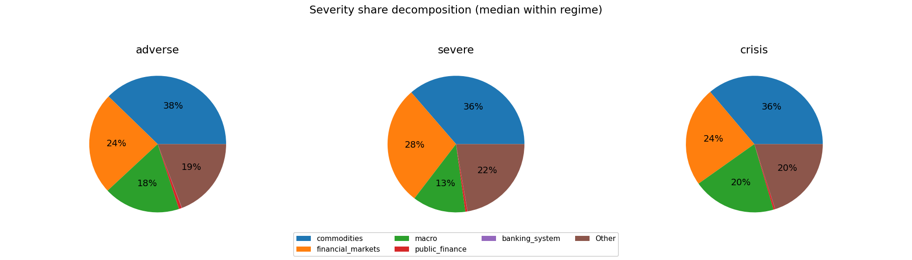

### Comovement snapshot (corr of terminal cumulative across draws)
Positive = blocks tend to move together across scenarios; negative = trade-offs.

- macro ↔ financial_markets: corr=-0.32
- macro ↔ banking_system: corr=+0.30
- macro ↔ public_finance: corr=+0.29
- commodities ↔ financial_markets: corr=+0.21
- public_finance ↔ banking_system: corr=+0.21
- commodities ↔ public_finance: corr=-0.14
- financial_markets ↔ public_finance: corr=-0.10
- commodities ↔ macro: corr=+0.09
- financial_markets ↔ banking_system: corr=+0.01
- commodities ↔ banking_system: corr=-0.00
